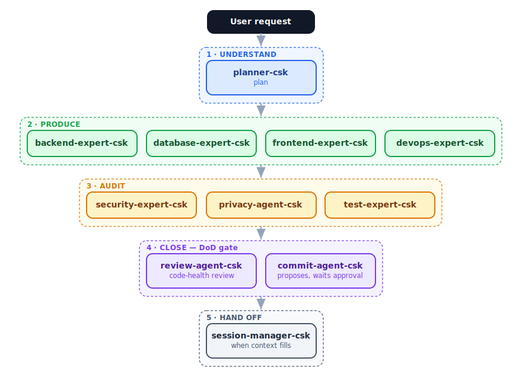
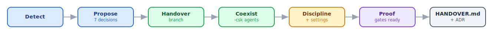

<div align="center">

# 🛠️ Claude Starter Kit

**An agentic working kit for Claude Code** — a reusable scaffold that drives any project, at any stage, with the same engineering discipline.

*plan → build → review → commit, where every critical rule is a **gate**, not a reminder.*


🇬🇧 English · [🇹🇷 Türkçe](README.tr.md)

</div>

---

## Why this kit?

Most "agent setups" are a pile of suggestions — the rules sit in a file, and whether they're honored is left to the model. This kit is different: it drops a **disciplined engineering team** into Claude Code, where **the rules that matter are gates, not reminders** — it doesn't just tell the agent the rules, it makes breaking the critical ones impossible, and it installs safely onto the repo you already have.

| | |
|---|---|
| 👥 | **A team, not a prompt** — 11 specialist agents auto-chain across plan → build → audit → ship; you don't wire them, the main thread does. |
| 🛡️ | **Security & privacy are gates, not options** — risk-critical changes must clear the security/privacy audit before they can close. |
| 🚦 | **Every commit is yours to approve** — no `commit`/`push` runs without your explicit OK, enforced at the tool level even in auto/bypass mode. |
| 🌿 | **Safe on an existing repo** — `adopt` hands the kit over on a branch; `main` is never touched, and you review before you keep it. |

---

## 🧠 The agents — the heart of the kit

**11 agents**, each a **thin trigger** — it says only *who* and *when*, and delegates the *how* to a skill. The main thread selects and chains them across **five stages**, escalating quality before anything is committed:

<div align="center">
  

  🧭 **Understand** &nbsp;→&nbsp; 🔨 **Produce** &nbsp;→&nbsp; 🔍 **Audit** &nbsp;→&nbsp; ✅ **Close** &nbsp;→&nbsp; 🤝 **Hand off**

</div>

| Agent | Stage | Fires when | Model |
|:--|:--|:--|:--:|
| **planner-csk** | 🧭 Understand | scope is ambiguous | `inherit` |
| **backend-expert-csk** | 🔨 Produce | server / API / business logic | `inherit` |
| **database-expert-csk** | 🔨 Produce | schema, migration, index, cache | `inherit` |
| **frontend-expert-csk** | 🔨 Produce | UI, component, client work | `inherit` |
| **devops-expert-csk** | 🔨 Produce | deployment, CI pipeline, incident | `inherit` |
| **security-expert-csk** | 🔍 Audit | auth / IDOR / injection / secret · **mandatory if security-critical** | `sonnet` |
| **privacy-agent-csk** | 🔍 Audit | personal data (KVKK / GDPR) | `sonnet` |
| **test-expert-csk** | 🔍 Audit | tests, coverage, regression | `inherit` |
| **review-agent-csk** | ✅ Close | pre-commit code-health review | `haiku` |
| **commit-agent-csk** | ✅ Close | proposes the commit, waits for approval | `haiku` |
| **session-manager-csk** | 🤝 Hand off | context fills / phase boundary | `haiku` |

> Agent names carry a `-csk` suffix (Claude Starter Kit) so they never collide with the host project's own agents. Each agent is thin; the real method lives in a **skill** — the single source of truth.

---

## Three principles

1. **Agent = thin trigger.** An agent only says "who, when"; it stays short and leaves the "how" to a skill.
2. **Skill = single source of truth.** The actual method and rule live in the skill; they are not copied into the agent.
3. **Rule → gate.** The rule that matters is enforced at the tool level (hook · permission · eval). The model is not expected to remember it.

---

## Install & run

**Two entry points:** `start.sh` sets up a **fresh** project; **`adopt`** (`adopt.sh`) hands the kit over to an **existing** one. Pick any channel — each runs the same two commands.

**npx** — nothing to install:
```bash
npx @byerlikaya/claude-starter-kit          # fresh project
npx @byerlikaya/claude-starter-kit adopt    # existing project
```

**Homebrew:**
```bash
brew install byerlikaya/tap/claude-starter-kit
claude-starter-kit          # fresh project
claude-starter-kit adopt    # existing project
```

**Release tarball** — no package manager:
```bash
gh release download --repo byerlikaya/claude-starter-kit -p '*.tgz' && tar xzf claude-starter-kit-*.tgz
bash start.sh               # fresh project
bash adopt.sh              # existing project
```

> Just want the agents & skills inside your existing Claude Code (no scaffolding)? `/plugin marketplace add byerlikaya/claude-starter-kit` then `/plugin install claude-starter-kit@byerlikaya`.

> **Windows:** the kit is bash-based — run it inside **Git Bash** (from [git-scm.com](https://git-scm.com)) for the smoothest experience; WSL works as a fallback.

### 🌱 Fresh project — `start.sh`

```bash
bash start.sh [--backend|--frontend|--mobile|--fullstack] [--dotnet|--generic] [-h]
```

An install wizard. With no flags it walks each step (profile → backend stack → summary and approval); the flags are for silent/CI use, and `-h` / `--help` prints usage. Every choice shows what it will install **before** installing it.

> After install, paste **`.claude/FIRST_PROMPT.md`** as your first Claude Code message — an optional kickoff that verifies the agents/skills and plans the first sprint. (`CLAUDE.md` loads the discipline every session regardless, so this is a one-time convenience, not a requirement.)

| Profile | Expert agents | Highlighted skills |
|---|---|---|
| `--backend` | backend · database | db-migration · api-design · observability |
| `--frontend` | frontend | frontend · a11y · i18n-integrity |
| `--mobile` | frontend (+ React Native/Expo layer) | frontend-rn-expo · a11y |
| `--fullstack` | all of them | all skills |

The backend stack is asked only for `--backend`/`--fullstack`: **`--dotnet`** brings the .NET / DevArchitecture pattern (MediatR CQRS · IResult · AOP) behind an approval gate; **`--generic`** installs a stack-agnostic backend expert for Node, Go, Python, and the like.

> **.NET — start proven, not from scratch.** `--dotnet` clones the production-ready **[DevArchitecture](https://github.com/DevArchitecture/DevArchitecture)** foundation (CQRS · IResult · AOP · auth) *and* installs agents that already know it — so you **skip the tokens an agent would burn regenerating a standard architecture**; they go to your business logic, not boilerplate. Opinionated by design; `--generic` stays stack-agnostic.

> On **`--fullstack` + `--dotnet`** the DevArchitecture backend is placed in `./backend`, `./frontend` is reserved for your frontend, and the solution file is renamed to your project's name — so the project root stays clean instead of looking like a bare backend.

### 🔄 Existing project — `adopt.sh`

```bash
bash adopt.sh          # at the root of the target project
```

Applies the kit to a project already in motion, like **one team handing a project over to another** — the project is not broken, decisions already made are not lost, and the kit does not stay passive.

<div align="center">
  
</div>

All changes land on a separate git branch **staged, not committed** — so every added and changed file shows up in your editor's Source Control / Changes panel; you review it there, then `git commit` to accept (or reset to discard). `main` stays untouched. Kit agents install side-by-side (never colliding), the discipline is bound via a single `@import`, `settings.json` is merged schema-aware, and existing husky/lefthook chains run alongside the kit via a shim. It closes with a durable `docs/HANDOVER.md` and an ADR, so decisions live in version control, not in a chat.

---

## What's inside

- **11 agents** — see the table above.
- **27 skills** — the single source of "how": code review, security scan, migration, deployment, observability, performance, accessibility, translation integrity, versioning, incident response, and more.
- **5 slash commands** — `/plan` · `/review` · `/ship` · `/handoff` · `/simplify`.
- **Hooks** — `guard-bash.sh` (tool-level gate), `pre-commit` + `commit-msg` (trace + secret scan), `context-usage.sh` and `session-guard.sh` (session measurement).
- **CLAUDE.md** — behavior, the three principles, workflow, Definition of Done, token discipline, and prohibitions.

---

## Session & token management

An assistant cannot run `/context` itself, so most setups **guess** the session fill. This kit measures it. `context-usage.sh` reads the real token count from the last turn's API usage in the transcript — the same figure `/context` shows. The `UserPromptSubmit` hook injects it every turn; the `Stop` hook (`session-guard.sh`) forces the handover recommendation to the surface once fill exceeds **75%**. The session-health line rests on a measurement, not a guess.

---

## Rule → gate

| Rule | Enforcing mechanism |
|---|---|
| Commit/push only with approval — even in auto/bypass mode | `guard-bash.sh` (PreToolUse); opened with `CLAUDE_GIT_OK` |
| Destructive op (reset --hard · force push · rm -rf · --no-verify) | `guard-bash.sh` (blocked at the tool level) |
| No AI-authorship trace or external vendor name in a commit | `pre-commit` + `commit-msg` git hook (trace scan) |
| No API key / token / private key committed | `pre-commit` secret scan (`secret-blocklist.txt` + `.secret-allowlist.txt`) |
| Session threshold | `context-usage.sh` + `session-guard.sh` (Stop hook) |
| Quality gate (SonarQube projects — language-agnostic) | `sonarqube-check` + `/ship` |

The gates are armed via `settings.json` and git `core.hooksPath`; `smoke-test.sh` verifies they are ready after every change.

---

## Verification

```bash
bash .claude/eval/smoke-test.sh      # structure, frontmatter, gate integrity
bash .claude/eval/routing-eval.sh    # does an example prompt route to the right agent/skill
```

## Workflow

`/plan` (ambiguous scope) → expert agents build → `/review` (security · quality · test) → `/ship` (DoD gate; proposes the commit, waits for approval) → when context fills up, `/handoff` → `/clear`.

## Extending

When you add an agent or skill, follow the `AGENT_TEMPLATE.md` contract: frontmatter (name · description + Trigger phrases · least-privilege tools · model tier) and body (When → Expertise stance → How/skill → Coordination → DoD → Output & context → Errors/escalation → Example → Constraints).

## License & attribution

MIT — see [LICENSE](LICENSE). The discipline layer builds on these upstream sources:

- **[DevArchitecture](https://github.com/DevArchitecture/DevArchitecture)** — the backend pattern (MediatR CQRS / IResult / AOP), referenced as a pattern only.
- **[multica-ai/andrej-karpathy-skills](https://github.com/multica-ai/andrej-karpathy-skills)** — the four working principles at the core of the discipline.
- **[google/eng-practices](https://github.com/google/eng-practices)** — the `code-review` skill, distilled and restated (CC-BY 3.0).
