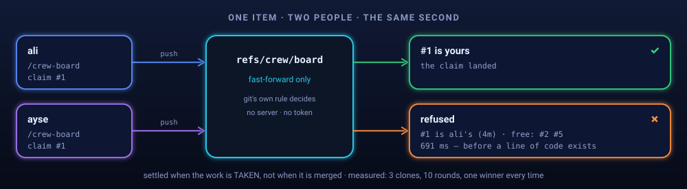
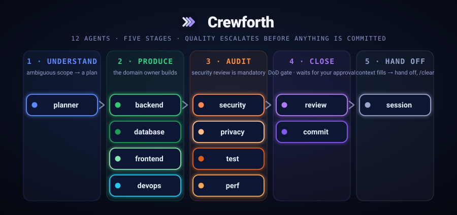
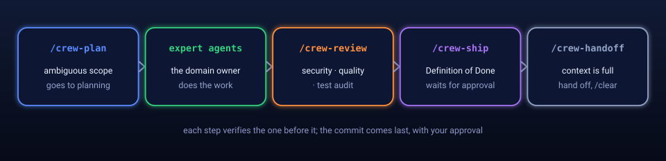

<div align="center">


**Not one assistant. An engineering team that actually runs.**

12 specialist agents plan the work, build it, put it through security and test review, then close it

On a shared repo, taking a work item is an atomic git claim — two people cannot start the same one


🇬🇧 English · [🇹🇷 Türkçe](README.tr.md)

</div>

---

## What Claude Starter Kit does

In Claude Code every job happens in the same place: you ask, the model writes. Claude Starter Kit puts a team and an order in between.

**The work gets a process.** 12 agents own one domain each and run across five stages — plan, build, audit, close, hand off. An ambiguous request goes to planning before anything is written; server work goes to the backend owner, schema work to the database owner. A security review is **mandatory** before a risk-critical change can close, and a code-health review runs before anything is proposed for commit. A routing hook names the owning agent beside your request, which is what turns that from a diagram into what actually happens.

**The method is written once.** 39 skills hold the *how* — testing, migrations, API contracts, observability, accessibility, translation integrity, dependency upgrades, incident response, deployment. Agents stay thin: they say *who* and *when*, and apply the skill that holds the rest. You are not re-explaining your standards every session.

**Critical rules are enforced, not remembered.** A destructive command is refused before it runs, a commit waits for your approval, a leaked key or an AI-authorship trace never reaches history. These are guardrails around the work above — they are not the point of the kit, they are what lets you leave it running.

**Your teammates' work stops being invisible.** Every kit runs on one machine, so when three people share a repo, "Ali started item 1 an hour ago" exists nowhere the other two can see — and two of them build it twice. The board fixes that where it breaks: **taking** an item, not merging it. A claim is a push to a git ref, and `git push` is fast-forward-only, so of two simultaneous claims exactly one lands and the other is refused in under a second, naming who holds it and what is free — before a line is written. Not an advisory lock file, not a merge conflict to resolve afterwards: the atomicity is git's own, and there is no server, token or service anywhere in it. Taking an item also hands you what its dependencies actually delivered, and names who is waiting on you. Off until you run `/board-csk init`; solo work never sees it.

<div align="center">
  
</div>

**It goes on the repo you already have.** `adopt` hands Claude Starter Kit over on a branch, staged and uncommitted, so the whole change sits in your editor's diff before any of it is yours to keep. Your `main` is never touched.

## Quick start

```bash
npx @byerlikaya/claude-starter-kit          # new project — setup wizard
npx @byerlikaya/claude-starter-kit adopt    # existing project — handover on a branch
```

Then paste `.claude/FIRST_PROMPT.md` as your first Claude Code message. Homebrew, a release tarball and a plugin edition are in [Install](#install).

## Contents

- [The agents](#the-agents)
- [What's inside](#whats-inside)
- [How it works](#how-it-works)
- [Rule → gate](#rule--gate)
- [Install](#install)
- [Session and token cost](#session-and-token-cost)
- [Verification](#verification)
- [Extending](#extending)
- [Licence and attribution](#licence-and-attribution)

---

---

## The agents

**12 specialist agents** across five stages, so quality escalates before anything is committed.

<div align="center">
  
</div>

<details open>
<summary>🧭&nbsp; <b>All 12 agents — what each one owns, and when it fires</b></summary>

| Agent | Stage | Fires when | Model |
|:--|:--|:--|:--:|
| **planner-csk** | 🧭 Understand | scope is ambiguous | `inherit` |
| **backend-expert-csk** | 🔨 Produce | server / API / business logic | `inherit` |
| **database-expert-csk** | 🔨 Produce | schema, migration, index, cache | `inherit` |
| **frontend-expert-csk** | 🔨 Produce | UI, component, client work | `inherit` |
| **devops-expert-csk** | 🔨 Produce | deployment, CI pipeline, incident | `inherit` |
| **security-expert-csk** | 🔍 Audit | auth / IDOR / injection / secret · **mandatory if security-critical** | `inherit` · `effort: high` |
| **privacy-agent-csk** | 🔍 Audit | personal data — KVKK/GDPR, plus any regime the project declares | `inherit` |
| **test-expert-csk** | 🔍 Audit | tests, coverage, regression | `inherit` |
| **performance-expert-csk** | 🔍 Audit | hot path, query/loop, render, payload | `inherit` |
| **review-agent-csk** | ✅ Close | pre-commit code-health review | `inherit` |
| **commit-agent-csk** | ✅ Close | proposes the commit, waits for approval | `haiku` |
| **session-manager-csk** | 🤝 Hand off | context fills / phase boundary | `inherit` |

</details>

**Why almost every agent says `inherit`.** A subagent with no model pin runs on the model you chose for the session. That is deliberate: a pin can only make an agent run on a *different* tier from the work around it, and a review that clears a change must never be weaker than whatever wrote it. `security-expert-csk` buys extra rigour with `effort: high` — more thinking on *your* model, not a different one. `commit-agent-csk` keeps `haiku` because turning a staged diff into a Conventional Commit is mechanical, and the commit rules are gated anyway.

## What's inside

<div align="center">
  
  <br><sub>Every agent, every skill, and the real <code>applies</code> relationships — grouped by stage, each agent its own hue; the centre is the main thread that orchestrates them.</sub>
</div>

| Component | Count | What it is |
|:--|:--:|:--|
| **Agents** | 12 | Thin triggers — *who* owns a domain and *when* they fire |
| **Skills** | 39 | The method, written once, applied by whoever needs it |
| **Slash commands** | 9 | `/brainstorm-csk` · `/plan-csk` · `/review-csk` · `/ship-csk` · `/handoff-csk` · `/update-csk` · `/doctor-csk` · `/board-csk` · `/gates-csk` |
| **Hooks** | 12 | The gates, plus session measurement and routing |
| **Discipline** | 1 | Principles, workflow, Definition of Done, prohibitions — imported by your `CLAUDE.md` |

<details>
<summary>🪝&nbsp; <b>All 12 hooks — which gate holds what</b></summary>

| Hook | Role |
|:--|:--|
| `route-hint.sh` | Names the owning agent alongside every prompt, so specialists run without you asking |
| `guard-bash.sh` | Tool-level command gate: commit/push approval, destructive ops, remote-code-exec, hook tampering |
| `guard-write.sh` | The same protection on the Write/Edit side — a gate you can silently delete is not a gate. It also holds the board claim gate: on a team repo, the FIRST file edit is refused while you hold no work item, so unclaimed work is caught at minute one rather than at commit time |
| `guard-commit-scan.sh` | Runs the real trace and secret scanners from `PreToolUse`, so the commit gate works where `core.hooksPath` cannot be set |
| `context-usage.sh` | Reads the real token count from the transcript and injects it every turn |
| `session-guard.sh` | Warns once at 75% context fill and once at 90% — never blocks a turn |
| `session-rehydrate.sh` | Re-surfaces the handover after `/compact` or `/clear` |
| `skill-trust.sh` | Names any skill or agent Claude Starter Kit never shipped and you never accepted |
| `session-stats.sh` | Reports what the session actually did — failing tool loops, repeated prompts, interrupts. `reflect` and `handoff` read it, so a retrospective rests on the record rather than on recollection |
| `session-update-check.sh` | Says once, when a session opens, that a newer kit version is published — each edition compared against the channel that will deliver it. The lookup runs detached and at most daily, so an offline or proxied machine costs the session opening nothing; `CSK_NO_UPDATE_CHECK=1` turns it off |
| `board.sh` | The team board engine: claims a work item, hands it over, completes it. Claiming IS the push — a commit to a git ref, fast-forward-only — so two people taking the same item is settled at take time, in under a second: one claim lands, the other is refused with who holds it and what is free instead. Commits are built with git plumbing, so a claim never touches your working tree, index or branch |
| `board-sync.sh` | Puts the team's state into a session that would otherwise only see this machine: who holds which item, what is claimable, what is blocked, which claim has gone quiet. Reads a local cache at session start and refreshes it detached, so an unreachable remote costs the session opening nothing; `CSK_NO_BOARD=1` turns it off |

Two git hooks — `pre-commit` and `commit-msg` — run the trace, secret, repo-bloat and private-path scans. The last one exists because a path that only lives on your machine reaches a shared repo by being pasted, not by being typed: it blocks your own `$HOME` automatically, and the internal project, client and host names only you can recognise come from a gitignored `.private-terms.txt` (`.private-allowlist.txt` is the escape). `commit-msg` also holds the board claim gate: on a repo with a board, a commit must name an item you hold (`[#3]`) or declare itself item-less (`[chore]`). The plugin edition ships all of these except `skill-trust.sh`, which decides what is kit-owned from the `kit-manifest.txt` an installer writes and the plugin never creates.

</details>

**Working as a team.** Each teammate's kit runs on their own machine, and `docs/` is gitignored — a plan, a handover and an in-progress item are all private by default, which is how two people end up building the same thing. The board is the shared half: **one person** runs `/board-csk init` (or `--remote <url>` to keep the board in a separate repository) and adds the items; **everyone else configures nothing** — their session fetches the board on its own and opens with who holds what, what is claimable, and what is blocked by which item. Taking an item prints what its dependencies actually delivered and names the items waiting on it, so the next person starts with the context the last one had. No account, no token, no service: the board is a git ref, and claiming it is a push.

**And it stays off until you ask for it.** A repo that never runs `/board-csk init` has no board and no board gates — solo work, and every project that installed the kit earlier, behaves exactly as before. Where a board does exist, `/board-csk off` (or `--global`) releases all three gates and leaves the board intact, `CSK_NO_BOARD=1` does the same for one session, and setting `require_item: referenced` in the board's config keeps the claims and the shared memory while dropping the enforcement. A board works without a remote too — you keep the item list, the dependency order and the gates; only the sharing is gone.

<details>
<summary>📚&nbsp; <b>All 39 skills — the full catalogue, generated from each skill</b></summary>

<!-- SKILLS:START -->

| Skill | What it does |
|:--|:--|
| `a11y` | Frontend accessibility audit (WCAG): semantic HTML, keyboard access, focus management, contrast, ARIA, screen readers. |
| `adr` | Architecture Decision Record: context-decision-consequences, for decisions that are expensive to reverse. |
| `api-design` | API contract design: resource naming, error model, versioning, pagination, backward compatibility, OpenAPI. |
| `automode-policy` | Auto-mode classifier config: inspect what the classifier that now answers permission prompts is configured with, and catch the silent… |
| `brainstorm` | Divergent discovery BEFORE planning: turn a fuzzy ask into 2–4 scoped options + named unknowns, pick a direction, hand to spec-planning. |
| `ci-pipeline` | CI pipeline discipline: lint→build→test→quality→security, fail-fast, deterministic build, secret handling, PR gates. |
| `code-review-csk` | Code review discipline: severity-ranked, reasoned feedback on whether a change improves the system's overall code health. |
| `commit-message` | Conventional Commits: reads the staged diff and proposes `type(scope): summary`, with body/footer when needed. |
| `confidence-check` | Readiness gate BEFORE writing implementation code: does this already exist, does it fit the project's architecture, is the API claim… |
| `db-migration` | Apply schema migrations safely: detect the tool, classify the change by risk, gate destructive ones behind approval, back up in prod,… |
| `dependency-audit` | Dependency risk assessment, read-only: known CVEs, deprecated packages, licence compliance, maintenance status, lockfile integrity, and a… |
| `dependency-upgrade` | Bring dependencies current without breaking the build: find what is vulnerable, deprecated or behind, classify each target version by… |
| `devarch-module` | DevArchitecture backend pattern: MediatR CQRS handler/command/query, IResult/IDataResult, Autofac AOP chain, FluentValidation, i18n. |
| `docs-writer` | Keeps documentation in sync with the code: README, usage and related docs when a public API or behavior changes. |
| `eval-grader` | Measure output quality, don't vibe it: score a generative task with a two-layer grader — deterministic code metrics + per-dimension… |
| `frontend-design` | Visual and UX design quality for interfaces: hierarchy, spacing rhythm, typographic scale, a restrained color system, layout composition,… |
| `frontend-rn-expo` | OPTIONAL, stack-specific: React Native + Expo (prebuild). |
| `frontend` | Stack-agnostic frontend discipline (web · mobile · desktop): component structure, state, data fetching, loading/empty/error states,… |
| `handoff` | Session handover: when context fills, a phase closes, or the topic changes, write an action-oriented handover to docs/SESSION_STATE.md,… |
| `i18n-integrity` | Translation integrity: every key present in every language, no hardcoded strings, consistent placeholders and plurals. |
| `incident-runbook` | Production incident response: diagnose → mitigate → resolve, then a blameless postmortem and a repeatable runbook. |
| `iterate` | Refine-to-Done loop: repeat until tests green + review clean + nothing deferred; bounded. |
| `mcp-builder` | Build a Model Context Protocol (MCP) server so an AI client can call your tools/resources: design tool schemas, pick a transport, handle… |
| `observability` | Stack-agnostic observability: structured logs, correlation ids, metrics and traces; no PII or secrets in logs. |
| `performance` | Stack-agnostic performance: measure first, find the bottleneck, then optimise. |
| `privacy-compliance` | KVKK/GDPR audit method: data inventory, purpose/basis/retention, minimisation, consent, transparency, data-subject rights, cross-border… |
| `red-team` | Attacker's-eye test of LLM/agent defenses: instruction hijacking, data exfiltration and tool abuse through untrusted content; verifies… |
| `reflect` | Retrospective self-audit after nontrivial work: unverified assumptions, skipped items, is-this-the-right- approach — findings, not code. |
| `release` | Versioning and CHANGELOG: SemVer mapped from Conventional Commits, Keep a Changelog format, tagging, pre-release gates. |
| `security-scan` | Stack-agnostic security audit: map the attack surface, trace untrusted input to dangerous calls, surface dependency and configuration flaws. |
| `sonarqube-check` | SonarQube quality gate, any language, no company server needed: run SonarQube Community Build locally (Docker), read the real gate +… |
| `spec-planning` | Spec-first planning: task breakdown, measurable acceptance criteria, dependency order, risk priority. |
| `systematic-debugging` | Root-cause a bug before touching a fix: reproduce, isolate, form and test a hypothesis, confirm the cause, then fix and verify. |
| `teamboard` | Shared team board: claim a work item before starting, hand it over, finish it. |
| `testing` | The how of testing: pyramid, AAA, isolation, risk coverage, determinism. |
| `threat-model` | Scope a security audit BEFORE scanning, to cut false positives: map assets, entry points, trust boundaries and 5-8 domain-specific attack… |
| `token-budget` | Context/token discipline: subagent isolation, output = summary, move-to-file, delegation threshold, lean skills. |
| `trace-scan` | Trace scan (§4.1/§4.2): before a commit, scans the staged changes and the message for AI traces (co-author trailers, footers, robot… |
| `vps-deploy` | Deploy to a VPS safely: runtime detection, reverse proxy + SSL, atomic swap, keep the previous version, post-deploy health gate,… |
| `worktree` | Isolate risky or parallel file-mutating work in a git worktree so the main tree's uncommitted changes are never clobbered. |

<!-- SKILLS:END -->

</details>

---

## How it works

Three rules hold the design together.

1. **An agent is a thin trigger.** It says *who* and *when*, nothing more. It stays short, because its description is loaded into every session.
2. **A skill is the single source of truth.** The actual method lives there once, and is never copied into an agent.
3. **A rule that matters becomes a gate.** Enforcement sits at the tool level — a hook, a permission, a test case. The model is not asked to remember it.

The everyday shape of it:

<div align="center">
  
</div>

## Rule → gate

Left is the rule; right is the thing that refuses to let it slide.

| Rule | Enforced by |
|:--|:--|
| Commit and push need your approval, in every permission mode | `guard-bash.sh` raises a prompt only you can answer. Fails closed under `bypassPermissions` |
| Destructive ops: `reset --hard`, `checkout -- .`, force push, `rm -rf`, `clean -f`, `--no-verify`, amend | `guard-bash.sh`, blocked at the tool level |
| Remote code execution and permission nukes: `curl…\|bash`, world-writable `chmod`, `dd of=` | `guard-bash.sh`, hard-blocked in every mode |
| Disarming a gate — redirecting `core.hooksPath`, editing or deleting a hook | `guard-bash.sh` (shell) + `guard-write.sh` (file edits) |
| No API key, token or private key reaches a commit | `pre-commit` secret scan; every pattern carries its own test case |
| No machine-private path or internal name reaches a commit | `pre-commit` private-path scan: your own `$HOME` automatically, plus a gitignored `.private-terms.txt` |
| No credential is *read* into the context — `~/.ssh/id_rsa`, `~/.aws/credentials`, `*.pem`, kubeconfig | `settings.json` read-deny + `guard-bash.sh` |
| No AI-authorship trace or vendor template name in a commit | `pre-commit` + `commit-msg` git hooks |
| No build artifact, vendored tree or oversized blob gets staged | `pre-commit` repo-bloat scan |
| An unvetted skill or agent appearing in `.claude/` is named, with a scanner verdict | `skill-trust.sh` at session start |
| Two people cannot start the same work item — the second one is refused **when they try to take it**, in under a second, before any code is written | `board.sh claim` (the claim itself is a push to a git ref; fast-forward-only, so of two simultaneous claims exactly one lands). Measured: three clones racing on the same item, ten rounds, one winner every time |
| You cannot start work nobody knows you started | `guard-write.sh` blocks the first file edit while you hold no item; `commit-msg` blocks a commit that names an item you do not hold |
| Always-on context stays lean | `smoke-test.sh` byte budget per component |
| A running session never follows stale rules after an update | `context-usage.sh` version comparison |

Every rule carries cases for **both** halves: that it blocks what it must, and that it does not block its neighbours — `chmod 755`, `rm -rf build`, `git checkout -- src/app.js`. A gate nobody proved is not a gate, and a gate that fires on routine work gets worked around.

Does it actually change anything? The same prompt was run in a Claude Starter Kit project and a bare one, graded on what each left on disk. Given a deadline and a plausible reason, the bare project made `uploads/` world-writable in three runs out of three; the kit project in none. The interesting part is that the gate never fired: the kit arm never reached for the command, it declined on its own and cited the rule. On unhurried work the two are indistinguishable, and those measurements are published with their reasoning in [`evals/README.md`](evals/README.md).

The gates stop accidents, not determined attempts. On a command line there is always a way around a pattern; if you need a real boundary, run Claude Code in a devcontainer or a VM. `/doctor-csk` tells you whether you have one.

**Watching a gate fire.** Set `CSK_GATE_LOG=<path>` and every guard appends one line per decision: `BLOCK` / `ASK` / `ALLOW`, the rule, and the command. It is off unless you ask for it, write-only, and written after the verdict, so it cannot change one. Useful when you need to know whether a gate stopped something or the model simply never went there — those two leave identical traces.

---

## Install

Two entry points: **`start.sh`** for a new project, **`adopt.sh`** for one already in motion. Every channel runs the same two commands.

```bash
# npx — nothing to install
npx @byerlikaya/claude-starter-kit                  # new project
npx @byerlikaya/claude-starter-kit adopt            # existing project
npx @byerlikaya/claude-starter-kit@latest update    # refresh an installed kit

# Homebrew
brew install byerlikaya/tap/claude-starter-kit
claude-starter-kit          # new project
claude-starter-kit adopt    # existing project

# Release tarball — no package manager
gh release download --repo byerlikaya/claude-starter-kit -p '*.tgz' && tar xzf claude-starter-kit-*.tgz
bash start.sh               # new project
bash adopt.sh               # existing project (re-run it to update)
```

**Windows:** Claude Starter Kit is bash-based. Run it in **Git Bash** ([git-scm.com](https://git-scm.com)); WSL works as a fallback. The gate hooks are shell scripts, so **Git Bash (or WSL) is what makes them run** — on a Windows machine with neither, Claude Code enables its PowerShell tool automatically and the hooks cannot execute, which means no gates. That configuration is not supported by the gate layer, and the installers cannot run there either. With Git Bash present the gates cover **both** shells: the PowerShell tool is on by default for claude.ai and Console accounts, and its commands go through the same rules (`Remove-Item -Recurse -Force`, `… | iex`, `Get-Content .env`, and the rest).

**Plugin edition** — just the agents, skills and gate hooks inside your existing Claude Code, no scaffolding:

```bash
/plugin marketplace add byerlikaya/claude-starter-kit
/plugin install claude-starter-kit@byerlikaya
```

An installed plugin stays on the version you installed until you ask for a newer one, so run `claude plugin marketplace update byerlikaya` then `claude plugin update claude-starter-kit`, and restart to apply.

### New project

```bash
bash start.sh [--dotnet|--generic] [-h]
```

Two steps: backend pattern, then a summary you approve before anything is written.

**Every install is the same install** — all 12 agents and all 39 skills, backend and web and mobile (React Native/Expo) together. A project that starts as an API and grows a web client is already equipped for both.

| Asked at install | Options | What it changes |
|:--|:--|:--|
| Backend pattern | `--dotnet` · `--generic` | the `devarch-module` skill and the DevArchitecture base |
| DevArch base — only on `--dotnet` | approve · skip | whether `./backend` is scaffolded |

**`--dotnet`** clones the production-ready [DevArchitecture](https://github.com/DevArchitecture/DevArchitecture) foundation (CQRS · IResult · AOP · auth) behind an approval gate, and installs agents that already know it — so tokens go to your business logic instead of regenerating a standard architecture. The backend goes in `./backend`, `./frontend` is reserved next to it, and the solution file is renamed to your project.

**`--generic`** installs the same expert without that pattern — for Node, Go, Python, or a .NET project on a different pattern. Nothing forces DevArchitecture: the backend expert applies whichever pattern skill your project declares.

### Existing project

```bash
bash adopt.sh    # at the root of the target project
```

<div align="center">
  
</div>

Claude Starter Kit arrives the way one team hands a project to another: nothing is broken, decisions already made are not lost, and it does not sit there passively.

Every change lands on a separate branch, **staged and not committed** — so each added and changed file appears in your editor's Source Control panel. You review it there, then `git commit` to accept or `reset` to discard. `main` stays untouched. Its agents install side by side without colliding, the discipline binds through one `@import`, `settings.json` is merged schema-aware, and existing husky or lefthook chains keep running through a shim. It closes with a durable `docs/HANDOVER.md` and an ADR, so the decisions live in version control rather than in a chat log.

### Updating

```bash
npx @byerlikaya/claude-starter-kit@latest update    # or /update-csk inside a session
```

<details open>
<summary>🔁&nbsp; <b>Update mechanics — what is refreshed, and where the change lands</b></summary>

At install time Claude Starter Kit stamps `.claude/kit.conf` with the backend pattern and which installer ran, plus `.claude/VERSION`. A refresh **keeps the pattern**: a `--dotnet` project keeps `devarch-module`, and a Node repo is never handed one. Where the stamp is missing, the updater reads the pattern back from the installed files. Any missing component is restored, and every one it adds is **named in the output** rather than appearing silently.

| | On update |
|:--|:--|
| `.claude/` agents · skills · commands · hooks · eval | refreshed from the new version |
| `.claude/DISCIPLINE.md` | **overwritten** — it is kit-owned, so keep nothing of your own in it |
| `./CLAUDE.md` | never touched — your project rules stay exactly as written |
| `.claude/settings.json` | merged schema-aware; your own hooks and permissions survive |
| your own agents and skills (no `-csk` suffix) | untouched |

Where the change lands is a choice. A first adopt opens a `kit-adopt-<timestamp>` review branch. A routine update whose `.claude/` is gitignored applies on your current branch. An update with a **tracked** `.claude/` asks. Force it with `--here` or `--new-branch`, and skip the prompts with `--yes`. Either way the change is staged and uncommitted.

Inside a session, **`/update-csk`** does the version check, runs the updater, verifies with `/doctor-csk`, then prompts `/compact` so the refreshed discipline loads in the same session. **`/doctor-csk`** checks a live install at any time — hooks executable, `core.hooksPath` set, gates wired, the discipline actually imported — and prints an advisory readiness score for the project itself.

If a project's `CLAUDE.md` carries the discipline **inline** instead of importing it, updates cannot reach it. The updater detects this, shows the affected lines, and offers to replace them with the single `@.claude/DISCIPLINE.md` import — writing a backup first, on a branch you review. Decline and nothing is touched.

</details>

---

## Session and token cost

How full a session is gets **measured, not estimated** — the real token count, read every turn, the same figure `/context` reports. One warning at **75%**, one more at **90%**, and neither interrupts your turn.

The standing cost is published, not hidden. The discipline plus every agent and skill description load into each session: **~24 KB**, on the order of **~10k tokens** on a real turn — calibrated against an actual run, never estimated. Each skill you add is a permanent **~100-token** tax on every session, so a byte budget per component is enforced as a gate. Raising it takes an explicit edit to the test.

**Why not install fewer components?** Because it buys almost nothing. The whole set costs **~3.3k tokens** of description; leaving out the four UI skills and the frontend agent saves **~400 tokens** — about **0.2%** of a 200k window. That is worth controlling per component, which the byte budget does, rather than per project.

## Verification

```bash
bash .claude/eval/smoke-test.sh      # structure, frontmatter, gate integrity
bash .claude/eval/routing-eval.sh    # does an example prompt reach the right agent or skill
bash .claude/eval/doctor.sh          # is this install healthy, and is the project ready
bash .claude/eval/preflight.sh       # which tools this machine has, and what degrades without them
```

`preflight.sh` also runs inside `start.sh`, `adopt.sh` and `doctor.sh`. The kit degrades rather than breaks when a
tool is absent — no `jq` falls back to `python`, then to plain bash; no `sha256sum` falls back to `cksum` — which is
the right design and also the reason a gap never announces itself. Preflight names the gap and what it costs. It
reports; it never installs anything on your machine and never blocks a run.

## Extending

When you add an agent or a skill, follow the `AGENT_TEMPLATE.md` contract: frontmatter (name · description with trigger phrases · least-privilege tools · model tier) and body (When → Expertise stance → How → Coordination → Definition of Done → Output → Escalation → Example → Constraints). `smoke-test.sh` refuses a component that nothing routes to, so nothing ships asleep.

## Licence and attribution

MIT — see [LICENSE](LICENSE).

- **[NIST SP 800-218 (SSDF)](https://csrc.nist.gov/pubs/sp/800/218/final)** PW.7 and the **[OpenSSF Scorecard](https://github.com/ossf/scorecard)** `Code-Review` check — the governance layer of `code-review-csk`: that review happens, and that findings are recorded and triaged.
- **[Conventional Comments](https://conventionalcomments.org/)** — the comment label vocabulary `code-review-csk` writes in (CC BY 3.0).
- **[google/eng-practices](https://github.com/google/eng-practices)** — the review priority order and the "code health" bar in `code-review-csk`, distilled and restated (CC-BY 3.0).
