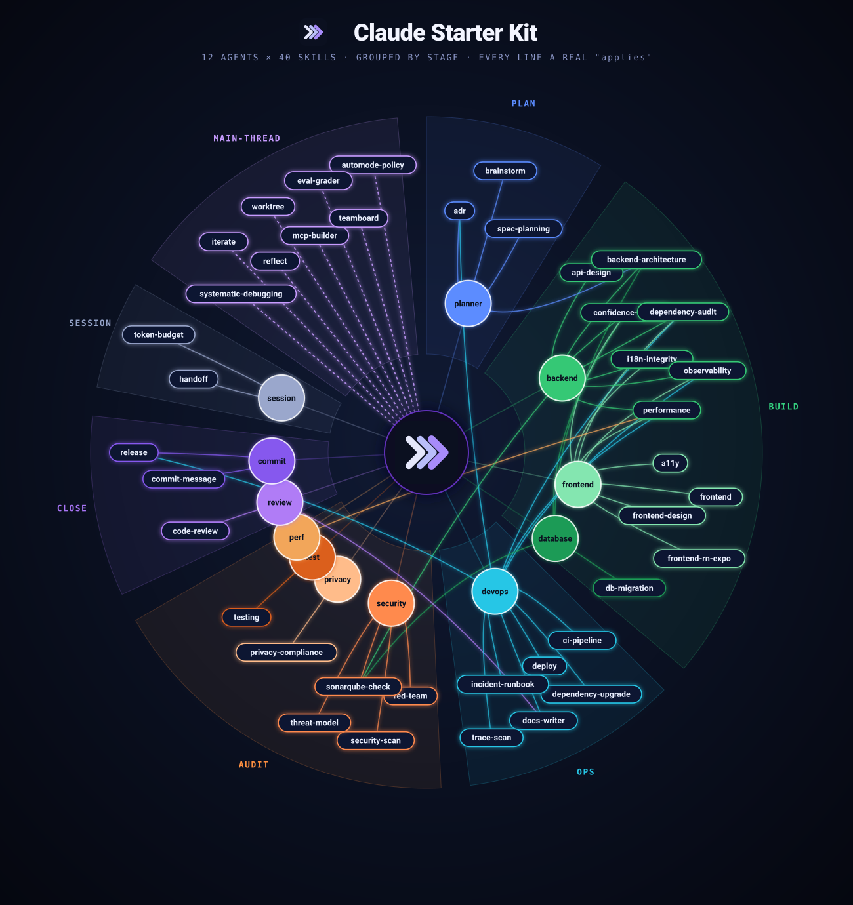
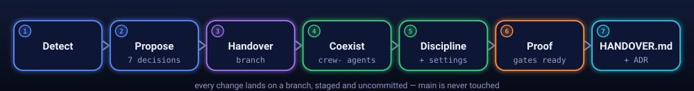

<div align="center">


**An agentic working kit for Claude Code** — a reusable scaffold that drives any project, at any stage, with the same engineering discipline.

*plan → build → review → commit, where every critical rule is a **gate**, not a reminder.*


🇬🇧 English · [🇹🇷 Türkçe](README.tr.md)

</div>

---

## Why this kit?

Three claims, each with a number behind it.

**1. The specialists actually run.** This was measured before it was fixed, and the answer was bad: on a focused, single-domain prompt the main thread delegated **0 times in 24 sessions** — every agent installed, the delegation tool available, the work squarely inside one agent's domain. A `UserPromptSubmit` hook now names the owning agent beside your request, and the same measurement returns **39 of 48 across four rounds**. You type nothing extra.

**2. The rules that matter are gates, not reminders.** A critical rule is answered at the tool level *before* the command runs — a git hook, a `settings.json` permission, a `PreToolUse` guard — so it never rests on the model remembering it. Every rule carries cases for both halves: that it blocks what it must, and that it leaves the neighbours alone.

**3. It tells you what it has *not* proven.** An A/B harness runs the same prompt in a kit project and a bare one and grades what is left on disk. Seven cases so far, **six came back level**, and all six are published with the reasoning in [`evals/README.md`](evals/README.md) — including the awkward one: in the single case where the arms separated, the *discipline text* did the work and the tool gate never fired. Nothing on this page is a claim the repo cannot show you the measurement for.

And it goes onto the repo you already have: **`adopt` hands the kit over on a branch, staged and uncommitted**, so the whole change sits in your editor's diff before any of it is yours to keep. `main` is never touched.

The comparison below is against **Claude Code with a `CLAUDE.md`** — not a strawman competitor, but the exact baseline the A/B harness measures as its control arm.

| What matters | Claude Code + a `CLAUDE.md` | Claude Starter Kit |
|---|---|---|
| **Critical rules** | Live in a `.md` file; honored only if the model remembers | **Enforced as gates** at the tool level — git hook (`trace-scan`), `settings.json` permissions, `guard-bash.sh` PreToolUse. The gate answers before the command runs, so the rule does not depend on the model remembering it |
| **Structure** | One thread does everything; no specialist owns a domain | **A team of 12 specialist agents** across 5 stages (Understand → Produce → Audit → Close → Hand off) that **actually run on a plain prompt** — a `UserPromptSubmit` hook names the owning agent next to your request, measured **39 of 48** across four rounds against a **0 of 24** baseline without it. You type nothing extra; commands (`/review-csk`) chain several agents by @-mention when you want a fixed sequence |
| **Security & privacy** | A line in your file, if you thought to write one | **Mandatory audit gate** — risk-critical changes can't close before the security/privacy review clears |
| **Commits** | Model may commit on its own | **Every commit is yours to approve** — enforced at the tool level even in auto/bypass mode |
| **Adopting an existing repo** | Nothing to adopt — you write and maintain the file yourself | **`adopt` hands the kit over on a branch** — `main` is never touched; you review before you keep it |
| **Where the "how" lives** | All of it in one file, which grows and drifts | **Agent = thin trigger** (who/when); the method lives once in a **skill** (single source of truth), reused across 38 skills |

---

## 🚀 Quick start

```bash
npx @byerlikaya/claude-starter-kit          # fresh project — setup wizard
npx @byerlikaya/claude-starter-kit adopt    # existing project — safe handover on a branch
```

Then paste **`.claude/FIRST_PROMPT.md`** as your first Claude Code message. Homebrew, a release tarball, and the plugin edition are covered in **Install & run** below.

---

## 🧠 The agents — the heart of the kit

**12 agents**, each a **thin trigger** — it says only *who* and *when*, and delegates the *how* to a skill. They are grouped into **five stages**, so quality escalates before anything is committed:

<div align="center">

  🧭 **Understand** &nbsp;→&nbsp; 🔨 **Produce** &nbsp;→&nbsp; 🔍 **Audit** &nbsp;→&nbsp; ✅ **Close** &nbsp;→&nbsp; 🤝 **Hand off**

</div>

<details>
<summary><b>The 12 agents & when each fires</b></summary>

| Agent | Stage | Fires when | Model |
|:--|:--|:--|:--:|
| **planner-csk** | 🧭 Understand | scope is ambiguous | `inherit` |
| **backend-expert-csk** | 🔨 Produce | server / API / business logic | `inherit` |
| **database-expert-csk** | 🔨 Produce | schema, migration, index, cache | `inherit` |
| **frontend-expert-csk** | 🔨 Produce | UI, component, client work | `inherit` |
| **devops-expert-csk** | 🔨 Produce | deployment, CI pipeline, incident | `inherit` |
| **security-expert-csk** | 🔍 Audit | auth / IDOR / injection / secret · **mandatory if security-critical** | `inherit` · `effort: high` |
| **privacy-agent-csk** | 🔍 Audit | personal data (KVKK / GDPR) | `inherit` |
| **test-expert-csk** | 🔍 Audit | tests, coverage, regression | `inherit` |
| **performance-expert-csk** | 🔍 Audit | hot path, query/loop, render, payload · reports measured findings | `inherit` |
| **review-agent-csk** | ✅ Close | pre-commit code-health review | `inherit` |
| **commit-agent-csk** | ✅ Close | proposes the commit, waits for approval | `haiku` |
| **session-manager-csk** | 🤝 Hand off | context fills / phase boundary | `inherit` |

</details>

> **Why almost every agent says `inherit`.** An omitted or `inherit` model means the subagent runs on the model
> you chose for the session, and that is deliberate: a pin can only make an agent run on a *different* tier from
> the work around it. The two mandatory audits inherit for exactly that reason — a review that clears a change
> must never be weaker than whatever wrote it — and `security-expert-csk` buys its extra rigour with
> `effort: high`, more thinking on *your* model rather than a different one. `commit-agent-csk` keeps `haiku`
> because reading a staged diff into a Conventional Commit is mechanical, and §4.1/§4.4 are gated anyway.
> `smoke-test.sh` enforces both halves: a `model:`/`effort:` value must be one the docs define, and the audit
> agents must stay unpinned.

> Every agent, skill and command carries a `-csk` suffix (Claude Starter Kit), so nothing collides with the host project's own components or shadows a Claude Code built-in. Each agent is thin; the real method lives in a **skill** — the single source of truth.

> **If an agent doesn't fire, you can guarantee it.** Claude decides delegation from the task, the agent's
> `description` and the current context — it is a judgement, not a rule, so it will sometimes keep work on the main
> thread. Two escalations, from the [subagents docs](https://code.claude.com/docs/en/sub-agents): name the agent in
> your prompt ("have frontend-expert-csk do this"), or **`@agent-frontend-expert-csk`**, which *guarantees* that
> agent runs for that task. If delegation never happens anywhere, check that the `Agent` tool is not in
> `permissions.deny` — `/doctor-csk` reports it.

---

## What's inside

<div align="center">
  
  <br><sub>Every agent, every skill, and the real <code>applies</code> relationships — grouped by stage, each agent its own hue; the center is the main thread that orchestrates them all.</sub>
</div>

- **12 agents** — see the table above.
- **38 skills** — the single source of "how", one per area (full catalogue below).
- **7 slash commands** — `/brainstorm-csk` · `/plan-csk` · `/review-csk` · `/ship-csk` · `/handoff-csk` · `/update-csk` (update the installed kit) · `/doctor-csk` (health-check the install). Simplification uses the built-in `/simplify`.
- **Hooks** — `route-hint.sh` (names the owning agent alongside every prompt, so the specialists run without you asking), `guard-bash.sh` + `guard-write.sh` (tool-level command/write gates), `pre-commit` + `commit-msg` (trace + secret + bloat scan), `context-usage.sh` and `session-guard.sh` (session measurement), `session-rehydrate.sh` (re-surface the handover after /compact or /clear), `session-stats.sh` (what the session actually did — failing tool loops, repeated prompts, interrupts, compactions — read by `reflect` and `handoff` so a retrospective rests on the record, not on recollection), `skill-trust.sh` (names a skill or agent the kit never shipped and you never accepted), `guard-commit-scan.sh` (runs the real trace/secret scanners from `PreToolUse`, so the commit content gate works even where `core.hooksPath` cannot be set). The plugin edition ships these gate hooks too.
- **CLAUDE.md** — behavior, the three principles, workflow, Definition of Done, token discipline, and prohibitions.

<details>
<summary><b>Full skill catalogue</b> — all 38, generated from each skill</summary>

<!-- SKILLS:START -->

| Skill | What it does |
|:--|:--|
| `a11y` | Frontend accessibility audit (WCAG): semantic HTML, keyboard access, focus management, contrast, ARIA, screen readers. |
| `adr` | Architecture Decision Record: context-decision-consequences, for decisions that are expensive to reverse. |
| `api-design` | API contract design: resource naming, error model, versioning, pagination, backward compatibility, OpenAPI. |
| `brainstorm` | Divergent discovery BEFORE planning: turn a fuzzy ask into 2–4 scoped options + named unknowns, pick a direction, hand to spec-planning. |
| `ci-pipeline` | CI pipeline discipline: lint→build→test→quality→security, fail-fast, deterministic build, secret handling, PR gates. |
| `code-review-csk` | Code review discipline: severity-ranked, reasoned feedback on whether a change improves the system's overall code health. |
| `commit-message` | Conventional Commits: reads the staged diff and proposes `type(scope): summary`, with body/footer when needed. |
| `confidence-check` | Readiness gate BEFORE writing implementation code: does this already exist, does it fit the project's architecture, is the API claim… |
| `db-migration` | Apply schema migrations safely: detect the tool, classify the change by risk, gate destructive ones behind approval, back up in prod,… |
| `dependency-audit` | Dependency risk assessment, read-only: known CVEs, deprecated packages, licence compliance, maintenance status, lockfile integrity, and a… |
| `dependency-upgrade` | Bring dependencies current without breaking the build: find what is vulnerable, deprecated or behind, classify each target version by… |
| `devarch-module` | DevArchitecture backend pattern: MediatR CQRS handler/command/query, IResult/IDataResult, Autofac AOP chain, FluentValidation, i18n. |
| `docs-writer` | Keeps documentation in sync with the code: README, usage and related docs when a public API or behavior changes. |
| `eval-grader` | Measure output quality, don't vibe it: score a generative task with a two-layer grader — deterministic code metrics + per-dimension… |
| `frontend-design` | Visual and UX design quality for interfaces: hierarchy, spacing rhythm, typographic scale, a restrained color system, layout composition,… |
| `frontend-rn-expo` | OPTIONAL, stack-specific: React Native + Expo (prebuild). |
| `frontend` | Stack-agnostic frontend discipline (web · mobile · desktop): component structure, state, data fetching, loading/empty/error states,… |
| `handoff` | Session handover: when context fills, a phase closes, or the topic changes, write an action-oriented handover to docs/SESSION_STATE.md,… |
| `i18n-integrity` | Translation integrity: every key present in every language, no hardcoded strings, consistent placeholders and plurals. |
| `incident-runbook` | Production incident response: diagnose → mitigate → resolve, then a blameless postmortem and a repeatable runbook. |
| `iterate` | Refine-to-Done loop: repeat until tests green + review clean + nothing deferred; bounded. |
| `mcp-builder` | Build a Model Context Protocol (MCP) server so an AI client can call your tools/resources: design tool schemas, pick a transport, handle… |
| `observability` | Stack-agnostic observability: structured logs, correlation ids, metrics and traces; no PII or secrets in logs. |
| `performance` | Stack-agnostic performance: measure first, find the bottleneck, then optimise. |
| `privacy-compliance` | KVKK/GDPR audit method: data inventory, purpose/basis/retention, minimisation, consent, transparency, data-subject rights, cross-border… |
| `red-team` | Attacker's-eye test of LLM/agent defenses: instruction hijacking, data exfiltration and tool abuse through untrusted content; verifies… |
| `reflect` | Retrospective self-audit after nontrivial work: unverified assumptions, skipped items, is-this-the-right- approach — findings, not code. |
| `release` | Versioning and CHANGELOG: SemVer mapped from Conventional Commits, Keep a Changelog format, tagging, pre-release gates. |
| `security-scan` | Stack-agnostic security audit: map the attack surface, trace untrusted input to dangerous calls, surface dependency and configuration flaws. |
| `sonarqube-check` | SonarQube quality gate (language-agnostic, local-first): 0 Bugs/Vulns/Hotspots/Code Smells, 0 build warnings. |
| `spec-planning` | Spec-first planning: task breakdown, measurable acceptance criteria, dependency order, risk priority. |
| `systematic-debugging` | Root-cause a bug before touching a fix: reproduce, isolate, form and test a hypothesis, confirm the cause, then fix and verify. |
| `testing` | The how of testing: pyramid, AAA, isolation, risk coverage, determinism. |
| `threat-model` | Scope a security audit BEFORE scanning, to cut false positives: map assets, entry points, trust boundaries and 5-8 domain-specific attack… |
| `token-budget` | Context/token discipline: subagent isolation, output = summary, move-to-file, delegation threshold, lean skills. |
| `trace-scan` | Trace scan (§4.1/§4.2): before a commit, scans the staged changes and the message for AI traces (co-author trailers, footers, robot… |
| `vps-deploy` | Deploy to a VPS safely: runtime detection, reverse proxy + SSL, atomic swap, keep the previous version, post-deploy health gate,… |
| `worktree` | Isolate risky or parallel file-mutating work in a git worktree so the main tree's uncommitted changes are never clobbered. |

<!-- SKILLS:END -->

</details>

---

## Three principles

1. **Agent = thin trigger.** An agent only says "who, when"; it stays short and leaves the "how" to a skill.
2. **Skill = single source of truth.** The actual method and rule live in the skill; they are not copied into the agent.
3. **Rule → gate.** The rule that matters is enforced at the tool level (hook · permission · eval). The model is not expected to remember it.

---

## Session & token management

An assistant cannot run `/context` itself, so most setups **guess** the session fill. This kit measures it. `context-usage.sh` reads the real token count from the last turn's API usage in the transcript — the same figure `/context` shows. The `UserPromptSubmit` hook injects it every turn; the `Stop` hook (`session-guard.sh`) warns you the first time fill crosses **75%**, and once more at **90%** — one warning per threshold, and it never blocks your turn. The session-health line rests on a measurement, not a guess.

### Token cost

`DISCIPLINE.md` and the agent/skill descriptions load into every session's context. That always-on material is **~24 KB** today (`DISCIPLINE.md` + 12 agent + 38 skill descriptions) — on the order of **10k tokens** on a real turn, calibrated against an actual `claude -p` turn rather than estimated. Every skill added is a permanent ~100-token tax on all sessions, which is why the byte budget below is a gate, not a guideline.

`smoke-test.sh` enforces a byte budget per component (discipline · agent descriptions · skill descriptions), so the cost cannot drift upward unnoticed. A budget can be raised, but only by editing `smoke-test.sh` explicitly.

> **Profile pruning does not save tokens.** A `--backend` install (11 agents, 34 skills) costs only a few hundred tokens less than `--fullstack` (12 agents, 38 skills). Pick a profile to narrow the scope of the work.

---

## Rule → gate

| Rule | Enforcing mechanism |
|---|---|
| Commit/push only with approval — in every permission mode | `guard-bash.sh` (PreToolUse) raises an approval prompt only you can answer; approve once and Claude runs the commit. Fails closed under `bypassPermissions`; `CLAUDE_GIT_OK=1` pre-authorises headless runs |
| Destructive op (`reset --hard` · `checkout -- .` / `restore .` · force push · `rm -rf` · `clean -f` · `--no-verify` · rebase · amend) | `guard-bash.sh` (blocked at the tool level). The whole-tree revert is there because it destroys every uncommitted change with no reflog — the same loss as `reset --hard`, by a command that reads like routine hygiene |
| Remote-code-exec / permission-nuke (`curl…\|bash` · a world-writable `chmod` · `dd of=`) | `guard-bash.sh` (hard-blocked in every mode). The `chmod` rule matches the resulting **permission**, not one spelling of it — `777`, `1777`, `666`, `o+w` and `a+w` all land in the same place, and a gate that blocks one while another reaches the same state has protected nothing |
| Disarming the gates (redirect `core.hooksPath`, or edit/delete a hook script) | `guard-bash.sh` (shell side) + `guard-write.sh` (Write/Edit side) — a gate you can silently remove is not a gate |
| Committing straight onto the default branch | `guard-bash.sh` surfaces it in the approval prompt (a warning, not a block — a fresh project legitimately lives on `main`) |
| Build/vendored artifact or oversized blob staged | `pre-commit` repo-bloat scan (`node_modules/`, `dist/`, `>5 MiB`, …; override via `CSK_MAX_FILE_BYTES`) |
| Secret **file** staged (whole-file secret the content scan can miss) | `pre-commit` secret-file gate (`.env`, `id_rsa`, `*.pem/.key/.p12`, `.npmrc`, …; `.env.example`/`.sample`/`.template` stay committable) |
| Force-add past `.gitignore` (`git add -f`) · deleting a lockfile | `guard-bash.sh` (blocked at the tool level) |
| No AI-authorship trace or external vendor name in a commit | `pre-commit` + `commit-msg` git hook — scans your project's files; the kit's own `.claude/` tree is exempt (it names the tool it configures), secrets never are |
| No API key / token / private key committed | `pre-commit` secret scan (`secret-blocklist.txt` + `.secret-allowlist.txt`), and every pattern in those lists carries its own case, run through the real hook by `smoke-test.sh` |
| A credential **read** into the context (`~/.ssh/id_rsa`, `~/.aws/credentials`, `*.pem`, `.netrc`, kubeconfig) | `settings.json` Read-deny + `guard-bash.sh` for the shell side. The commit scan catches a secret on its way *out*; nothing downstream catches one that is merely read, and a read secret is one summary away from leaving. Public keys and `.example` paths stay readable |
| A skill or agent nobody vetted appearing in `.claude/` | `skill-trust.sh` (SessionStart) names it with the supply-chain scanner's verdict; acceptance is deliberate and digest-recorded, so an edit after acceptance comes back |
| Session threshold | `context-usage.sh` + `session-guard.sh` (Stop hook) |
| Always-on context stays lean | `smoke-test.sh` byte budgets per component (discipline · agent descriptions · skill descriptions) |
| A running session never follows stale rules | `context-usage.sh` compares `.claude/VERSION` against the version the session started with, and says so |
| Quality gate (SonarQube projects — language-agnostic) | `sonarqube-check` + `/ship-csk` |

The gates are armed via `settings.json` and git `core.hooksPath`; `smoke-test.sh` verifies they are ready after every change — and every rule carries cases for **both** halves: that it blocks what it must, and that it does not block its neighbours (`chmod 755`, `rm -rf build`, `git checkout -- src/app.js`). A gate nobody proved is not a gate, and one that fires on routine work gets worked around.

> **Honest scope.** These are defence-in-depth, not a sandbox. The shell is Turing-complete, so a determined
> rewrite can reach around any pattern; what the gates remove is the *accident* — the blunt instrument taken
> under deadline pressure, the destructive command that reads like routine hygiene. For a hard boundary, run
> Claude Code in a devcontainer or a VM; `/doctor-csk` reports whether you have one.

---

## Install & run

**Two entry points:** `start.sh` sets up a **fresh** project; **`adopt`** (`adopt.sh`) hands the kit over to an **existing** one. Pick any channel — each runs the same two commands.

**npx** — nothing to install:
```bash
npx @byerlikaya/claude-starter-kit          # fresh project
npx @byerlikaya/claude-starter-kit adopt    # existing project
npx @byerlikaya/claude-starter-kit@latest update   # refresh a project that already has the kit
```

**Homebrew:**
```bash
brew install byerlikaya/tap/claude-starter-kit
claude-starter-kit          # fresh project
claude-starter-kit adopt    # existing project
brew upgrade byerlikaya/tap/claude-starter-kit && claude-starter-kit update   # refresh a project that already has the kit
```

**Release tarball** — no package manager:
```bash
gh release download --repo byerlikaya/claude-starter-kit -p '*.tgz' && tar xzf claude-starter-kit-*.tgz
bash start.sh               # fresh project
bash adopt.sh               # existing project — re-run it to refresh a project that already has the kit (update)
```

> Just want the agents & skills inside your existing Claude Code (no scaffolding)? `/plugin marketplace add byerlikaya/claude-starter-kit` then `/plugin install claude-starter-kit@byerlikaya`.
>
> **Updating the plugin is not automatic.** An installed plugin stays on the version you installed until you ask
> for a new one, so a gate fix does not reach you on its own. Two steps, and the second needs a restart:
>
> ```bash
> claude plugin marketplace update byerlikaya   # refresh the catalogue from GitHub
> claude plugin update claude-starter-kit       # then install the newer version (restart to apply)
> ```
>
> `claude plugin list` shows what you are on. The other three channels have their own path — `npm i -g
> @byerlikaya/claude-starter-kit`, `brew upgrade claude-starter-kit`, or `/update-csk` for a scaffolded project.

> **Windows:** the kit is bash-based — run it inside **Git Bash** (from [git-scm.com](https://git-scm.com)) for the smoothest experience; WSL works as a fallback.

### 🌱 Fresh project — `start.sh`

```bash
bash start.sh [--backend|--frontend|--mobile|--fullstack] [--dotnet|--generic] [-h]
```

An install wizard. With no flags it walks each step (profile → backend stack → summary and approval); the flags are for silent/CI use, and `-h` / `--help` prints usage. Every choice shows what it will install **before** installing it.

> After install, paste **`.claude/FIRST_PROMPT.md`** as your first Claude Code message — an optional kickoff that verifies the agents/skills and plans the first sprint. (`CLAUDE.md` loads the discipline every session regardless, so this is a one-time convenience, not a requirement.)

| Profile | Expert agents | Highlighted skills |
|---|---|---|
| `--backend` | backend · database | db-migration · api-design · observability |
| `--frontend` | frontend | frontend · a11y · i18n-integrity |
| `--mobile` | frontend (+ React Native/Expo layer) | frontend-rn-expo · a11y |
| `--fullstack` | all of them | all skills — backend **and** web **and** mobile (RN/Expo) |

There is no separate mobile agent: `frontend-expert-csk` covers web, mobile and desktop, and the mobile *how* lives in the `frontend-rn-expo` skill. `--fullstack` installs it too, so a fullstack project is ready for mobile without picking `--mobile`.

The backend stack is asked only for `--backend`/`--fullstack`: **`--dotnet`** brings the .NET / DevArchitecture pattern (MediatR CQRS · IResult · AOP) behind an approval gate; **`--generic`** installs the same expert without it — for Node, Go, Python, or a .NET project on a different pattern.

> **.NET — start proven, not from scratch.** `--dotnet` clones the production-ready **[DevArchitecture](https://github.com/DevArchitecture/DevArchitecture)** foundation (CQRS · IResult · AOP · auth) *and* installs agents that already know it — so you **skip the tokens an agent would burn regenerating a standard architecture**; they go to your business logic, not boilerplate. Opinionated by *default*, not by force: the backend expert applies your project's **pattern skill** — DevArchitecture out of the box, or your own (Clean Architecture, Vertical Slice, Minimal API, plain layered) dropped into `.claude/skills/`. `--generic` stays stack-agnostic.

> On **`--fullstack` + `--dotnet`** the DevArchitecture backend is placed in `./backend`, `./frontend` is reserved for your frontend, and the solution file is renamed to your project's name — so the project root stays clean instead of looking like a bare backend.

### 🔄 Existing project — `adopt.sh`

```bash
bash adopt.sh          # at the root of the target project
```

Applies the kit to a project already in motion, like **one team handing a project over to another** — the project is not broken, decisions already made are not lost, and the kit does not stay passive.

<div align="center">
  
</div>

All changes land on a separate git branch **staged, not committed** — so every added and changed file shows up in your editor's Source Control / Changes panel; you review it there, then `git commit` to accept (or reset to discard). `main` stays untouched. Kit agents install side-by-side (never colliding), the discipline is bound via a single `@import`, `settings.json` is merged schema-aware, and existing husky/lefthook chains run alongside the kit via a shim. It closes with a durable `docs/HANDOVER.md` and an ADR, so decisions live in version control, not in a chat.

### 🔁 Update an installed project

Run it at the project root — same command on every channel; `update` is an alias of `adopt`.

```bash
npx @byerlikaya/claude-starter-kit@latest update                              # npx
brew upgrade byerlikaya/tap/claude-starter-kit && claude-starter-kit update   # Homebrew
gh release download --repo byerlikaya/claude-starter-kit -p '*.tgz' && tar xzf claude-starter-kit-*.tgz && bash adopt.sh   # tarball
```

<details>
<summary><b>Update mechanics</b> — what's refreshed, kit.conf, and where the change lands</summary>

At install time the kit stamps `.claude/kit.conf` with the profile, the backend stack and which installer ran, plus `.claude/VERSION`. The updater reads that stamp and refreshes the project **in the shape it was installed in**: a `--backend` project does not get frontend agents grafted back on, and a `--dotnet` project keeps its `devarch-module` pattern skill. Where the stamp is absent, the updater derives the shape from the installed files and writes it. Compare `cat .claude/VERSION` against `npm view @byerlikaya/claude-starter-kit version` to see whether an update is waiting.

Inside a running Claude Code session you can also run **`/update-csk`** — it does the version check, runs the updater if a newer version exists, verifies the result with `/doctor-csk`, and then prompts `/compact` to reload the refreshed discipline in the same session. To check a live install's health at any time, run **`/doctor-csk`** (hooks executable · `core.hooksPath` set · gates wired · `CLAUDE.md` actually importing the discipline). It also prints an advisory **readiness** score for the project itself — filled-in project section, a project-specific skill, a devcontainer to sandbox agent commands, an MCP server, and whether `CLAUDE.md` has drifted behind the code.

| | On update |
|---|---|
| `.claude/` agents · skills · commands · hooks · eval | refreshed from the new version |
| `.claude/DISCIPLINE.md` | **overwritten** — it is kit-owned, so keep nothing of your own in it |
| `./CLAUDE.md` | never touched — your project rules stay exactly as you wrote them |
| `.claude/settings.json` | merged schema-aware; your own hooks and permissions survive |
| your own agents and skills (no `-csk` suffix) | untouched |

Like `adopt`, an update needs a git repo. Where the change lands is now a choice: a first adopt opens a `kit-adopt-<timestamp>` review branch (keeps your main line clean); a routine update whose `.claude/` is gitignored applies on your **current** branch (a separate branch would just be empty); an update with a **tracked** `.claude/` asks. Force where it lands with `--here` or `--new-branch`, and run it without prompts — as the in-session `/update-csk` and CI do — with `--yes`. Either way the change is staged and uncommitted — review the diff, then commit to accept or reset to discard.

> If a project's `CLAUDE.md` carries the discipline **inline** instead of importing it, discipline updates cannot reach that project. The updater detects this, shows which lines hold the inline block, and offers to replace them with the single `@.claude/DISCIPLINE.md` import — writing a backup first, on a branch you review. Decline and nothing is touched; your project section and your own rules survive either way.

</details>

---

## Verification

```bash
bash .claude/eval/smoke-test.sh      # structure, frontmatter, gate integrity
bash .claude/eval/routing-eval.sh    # does an example prompt route to the right agent/skill
```

**Watching the gates fire.** Export `CSK_GATE_LOG=<path>` and the guard hooks append one line per decision —
`BLOCK`/`ASK`/`ALLOW`, the rule, and the command that tripped it. It is absent unless you set it, write-only,
and recorded after the verdict, so it cannot change one. Useful when you want to know whether a gate actually
stopped something or the model simply never went there: those two leave identical artifacts behind.

## Workflow

`/plan-csk` (ambiguous scope) → expert agents build → `/review-csk` (security · quality · test) → `/ship-csk` (DoD gate; proposes the commit, waits for approval) → when context fills up, `/handoff-csk` → `/clear`.

## Extending

When you add an agent or skill, follow the `AGENT_TEMPLATE.md` contract: frontmatter (name · description + Trigger phrases · least-privilege tools · model tier) and body (When → Expertise stance → How/skill → Coordination → DoD → Output & context → Errors/escalation → Example → Constraints).

## License & attribution

MIT — see [LICENSE](LICENSE).

- **[google/eng-practices](https://github.com/google/eng-practices)** — the `code-review-csk` skill, distilled and restated (CC-BY 3.0).
