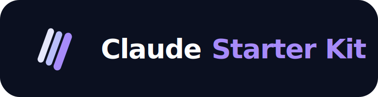
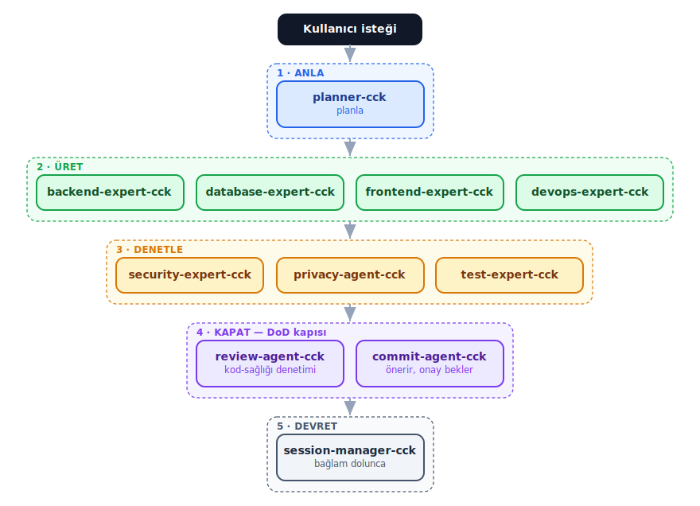
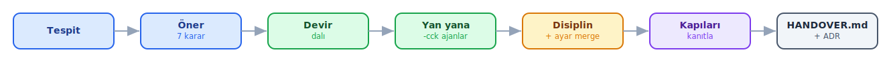

<div align="center">



**Claude Code için agentic çalışma kiti** — bir projeyi, hangi aşamada olursa olsun aynı mühendislik disipliniyle ilerleten, yeniden kullanılabilir bir iskelet.

*planla → üret → denetle → commit; her kritik kural bir hatırlatma değil, bir **kapı**.*


[🇬🇧 English](README.md) · 🇹🇷 Türkçe

</div>

---

## Neden bu kit?

Çoğu "agent kurulumu" aslında bir öneri yığınıdır — kurallar bir dosyada durur, uyulup uyulmayacağı modele kalır. Bu kit farklı çalışır: Claude Code'un içine **disiplinli bir mühendislik ekibi** yerleştirir ve burada **önemli kurallar hatırlatma değil, kapıdır** — ajana kuralları söylemekle yetinmez, kritik olanları çiğnemeyi baştan imkânsız kılar; üstelik zaten elindeki repo'ya güvenle kurulur.

| | |
|---|---|
| 👥 | **Bir prompt değil, bir ekip** — 11 uzman ajan, planla → üret → denetle → gönder hattı boyunca kendiliğinden zincirlenir; onları sen bağlamazsın, ana thread halleder. |
| 🛡️ | **Güvenlik ve gizlilik bir seçenek değil, kapıdır** — risk taşıyan değişiklikler kapanmadan önce güvenlik/gizlilik denetiminden geçmek zorundadır. |
| 🚦 | **Her commit senin onayından geçer** — `commit`/`push`, sen açıkça onaylamadan çalışmaz; otomatik/bypass modda bile bu, araç seviyesinde zorunlu tutulur. |
| 🌿 | **Mevcut repo'da güvenli** — `adopt`, kiti ayrı bir dala devreder; `main`'e asla dokunulmaz, sen inceleyip onaylamadan hiçbir şey kalıcı olmaz. |

---

## 🚀 Hızlı başlangıç

```bash
npx @byerlikaya/claude-starter-kit          # sıfırdan proje — kurulum sihirbazı
npx @byerlikaya/claude-starter-kit adopt    # mevcut proje — bir dalda güvenli devir
```

Ardından ilk Claude Code mesajın olarak **`.claude/FIRST_PROMPT.md`**'i yapıştır. Homebrew, release tarball ve plugin edisyonu aşağıdaki **Kurulum ve çalıştırma** bölümünde.

---

## 🧠 Ajanlar — kitin kalbi

**11 ajan** var; her biri bir **ince tetikleyici** — yalnızca *kim* ve *ne zaman* sorusunu yanıtlar, *nasıl* kısmını bir skill'e devreder. Ana thread onları **beş aşamada** seçip zincirler ve commit'ten önce kaliteyi kademe kademe yükseltir:

<div align="center">
  

  🧭 **Anla** &nbsp;→&nbsp; 🔨 **Üret** &nbsp;→&nbsp; 🔍 **Denetle** &nbsp;→&nbsp; ✅ **Kapat** &nbsp;→&nbsp; 🤝 **Devret**

</div>

<details>
<summary><b>11 ajan ve her birinin ne zaman devreye girdiği</b></summary>

| Ajan | Aşama | Ne zaman devreye girer | Model |
|:--|:--|:--|:--:|
| **planner-csk** | 🧭 Anla | kapsam belirsiz olduğunda | `inherit` |
| **backend-expert-csk** | 🔨 Üret | sunucu / API / iş mantığı | `inherit` |
| **database-expert-csk** | 🔨 Üret | şema, migration, index, cache | `inherit` |
| **frontend-expert-csk** | 🔨 Üret | UI, bileşen, istemci tarafı işi | `inherit` |
| **devops-expert-csk** | 🔨 Üret | dağıtım, CI hattı, olay müdahalesi | `inherit` |
| **security-expert-csk** | 🔍 Denetle | auth / IDOR / injection / secret · **güvenlik açısından kritikse zorunlu** | `sonnet` |
| **privacy-agent-csk** | 🔍 Denetle | kişisel veri (KVKK / GDPR) | `sonnet` |
| **test-expert-csk** | 🔍 Denetle | test, kapsam, regresyon | `inherit` |
| **review-agent-csk** | ✅ Kapat | commit öncesi kod sağlığı denetimi | `inherit` |
| **commit-agent-csk** | ✅ Kapat | commit'i önerir, onay bekler | `haiku` |
| **session-manager-csk** | 🤝 Devret | bağlam dolduğunda / faz sınırında | `haiku` |

</details>

> Ajan adları `-csk` ekiyle (Claude Starter Kit) biter; böylece kurulduğu projenin kendi ajanlarıyla asla çakışmaz. Her ajan incedir; asıl yöntem bir **skill**'de yaşar — tek bilgi kaynağı orasıdır.

---

## Üç ilke

1. **Ajan = ince tetikleyici.** Bir ajan yalnızca "kim, ne zaman" der; kısa kalır ve işin nasıl yapılacağını skill'e bırakır.
2. **Skill = tek bilgi kaynağı.** Asıl yöntem ve kural skill'de yaşar; ajana kopyalanmaz.
3. **Kural → kapı.** Önemli olan kural araç seviyesinde zorunlu kılınır (hook · permission · eval). Modelin bunu aklında tutması beklenmez.

---

## Bu kit nasıl farklı?

Claude Code için çıkan çoğu "agent kurulumu" iki gruba düşer: kuralların yazılı olduğu **büyük bir prompt dosyası**, ya da kendin birleştirdiğin bir **agent/skill koleksiyonu**. İkisi de asıl zor kısmı — *disiplini gerçekten uygulatmayı* — modelin iyi niyetine bırakır. Bu kit bırakmaz.

| Önemli olan | Tipik agent kiti / prompt koleksiyonu | Claude Starter Kit |
|---|---|---|
| **Kritik kurallar** | Bir `.md` dosyasında durur; yalnız model hatırlarsa uygulanır | **Kapı olarak zorlanır** — araç seviyesinde: git hook (`trace-scan`), `settings.json` izinleri, `guard-bash.sh` PreToolUse. Kırmak *imkânsız*, "tavsiye edilmez" değil |
| **Yapı** | Tek bir dev prompt ya da senin yönettiğin gevşek bir agent listesi | **11 uzman agent'lık bir ekip**, 5 aşamada kendiliğinden zincirlenir (Anla → Üret → Denetle → Kapat → Devret) — sen bağlamazsın, ana thread bağlar |
| **Güvenlik & gizlilik** | İsteğe bağlı tavsiye, atlaması kolay | **Zorunlu audit kapısı** — risk-kritik değişiklik, güvenlik/gizlilik denetimi geçmeden kapanamaz |
| **Commit'ler** | Model kendi başına commit atabilir | **Her commit senin onayına bağlı** — auto/bypass modda bile araç seviyesinde zorlanır |
| **Mevcut repoya uyarlama** | "Sıfırdan başla" varsayımı; elle taşıma | **`adopt` kiti bir branch'te devreder** — `main`'e dokunulmaz; sen inceleyip tutmaya karar verirsin |
| **"Nasıl" bilgisi nerede** | Kural + yöntem her agent prompt'una kopyalanır → çoğalma & tutarsızlık | **Agent = ince tetik** (kim/ne zaman); yöntem tek yerde, bir **skill**'te yaşar (tek doğruluk kaynağı), 34 skill'e yayılır |

**Tek cümlede:** benzer projeler sana *bir öneri yığını* verir; bu kit Claude Code'a *disiplinli bir mühendislik ekibi* yerleştirir — önemli kuralların **hatırlatma değil, kapı** olduğu yerde.

---

## Kurulum ve çalıştırma

**İki giriş noktası var:** `start.sh` **sıfırdan** bir projeyi kurar; **`adopt`** (`adopt.sh`) ise kiti **mevcut** bir projeye devreder. Hangi kanalı seçersen seç, hepsi aynı iki komutu çalıştırır.

**npx** — kurulum gerektirmez:
```bash
npx @byerlikaya/claude-starter-kit          # sıfırdan proje
npx @byerlikaya/claude-starter-kit adopt    # mevcut proje
npx @byerlikaya/claude-starter-kit@latest update   # kit'in kurulu olduğu projeyi tazele
```

**Homebrew:**
```bash
brew install byerlikaya/tap/claude-starter-kit
claude-starter-kit          # sıfırdan proje
claude-starter-kit adopt    # mevcut proje
brew upgrade byerlikaya/tap/claude-starter-kit && claude-starter-kit update   # kit'in kurulu olduğu projeyi tazele
```

**Release tarball** — paket yöneticisi olmadan:
```bash
gh release download --repo byerlikaya/claude-starter-kit -p '*.tgz' && tar xzf claude-starter-kit-*.tgz
bash start.sh               # sıfırdan proje
bash adopt.sh               # mevcut proje — kurulu bir projeyi tazelemek için tekrar çalıştır (update)
```

> Sadece ajan ve skill'leri mevcut Claude Code'una eklemek mi istiyorsun (iskele kurmadan)? `/plugin marketplace add byerlikaya/claude-starter-kit` ardından `/plugin install claude-starter-kit@byerlikaya`.

> **Windows:** kit bash tabanlıdır — en sorunsuz deneyim için **Git Bash** ([git-scm.com](https://git-scm.com)) içinde çalıştır; WSL de yedek olarak çalışır.

### 🌱 Sıfırdan proje — `start.sh`

```bash
bash start.sh [--backend|--frontend|--mobile|--fullstack] [--dotnet|--generic] [-h]
```

Bir kurulum sihirbazıdır. Bayrak vermezsen her adımı tek tek sorar (profil → backend yığını → özet ve onay); bayraklar sessiz/CI kullanımı içindir, `-h` / `--help` ise kullanım bilgisini basar. Her seçenek, ne kuracağını **kurmadan önce** gösterir.

> Kurulumdan sonra ilk Claude Code mesajın olarak **`.claude/FIRST_PROMPT.md`**'yi yapıştır — ajanları/skilleri doğrulayan ve ilk sprint'i planlayan opsiyonel bir başlatıcı. (`CLAUDE.md` her oturumda zaten yüklendiği için bu tek seferlik bir kolaylık, zorunluluk değil.)

| Profil | Uzman ajanlar | Öne çıkan skiller |
|---|---|---|
| `--backend` | backend · database | db-migration · api-design · observability |
| `--frontend` | frontend | frontend · a11y · i18n-integrity |
| `--mobile` | frontend (+ React Native/Expo katmanı) | frontend-rn-expo · a11y |
| `--fullstack` | hepsi | tüm skiller — backend **ve** web **ve** mobil (RN/Expo) |

Ayrı bir mobil ajanı yok: web'i de mobili de masaüstünü de `frontend-expert-csk` üstlenir, mobilin "nasıl"ı ise `frontend-rn-expo` skill'inde durur. `--fullstack` bu skill'i de kurar; yani `--mobile` seçmene gerek kalmadan fullstack bir proje mobile hazırdır.

Backend yığını yalnızca `--backend`/`--fullstack` için sorulur: **`--dotnet`**, .NET / DevArchitecture kalıbını (MediatR CQRS · IResult · AOP) bir onay kapısının ardından getirir; **`--generic`** ise aynı uzmanı onsuz kurar — Node, Go, Python ya da farklı bir kalıp kullanan bir .NET projesi için.

> **.NET'te sıfırdan değil, kanıtlanmışla başla.** `--dotnet`, üretime hazır **[DevArchitecture](https://github.com/DevArchitecture/DevArchitecture)** temelini (CQRS · IResult · AOP · auth) klonlar *ve* bu temeli zaten bilen ajanları kurar — böylece **bir ajanın standart bir mimariyi yeniden üretirken yakacağı token'ları boşa harcamazsın**; o token'lar boilerplate'e değil, senin iş mantığına gider. Varsayılan olarak opinionated, zorla değil: backend uzmanı projenin **kalıp skill'ini** uygular — kutudan DevArchitecture, ya da kendi kalıbın (Clean Architecture, Vertical Slice, Minimal API, düz katmanlı) `.claude/skills/`'e bırakılır. `--generic` yığından bağımsız kalır.

> **`--fullstack` + `--dotnet`** seçildiğinde DevArchitecture backend'i `./backend` altına konur, `./frontend` senin frontend'ine ayrılır ve çözüm dosyası projenin adıyla yeniden adlandırılır — böylece proje kökü, çıplak bir backend gibi görünmek yerine tertemiz kalır.

### 🔄 Mevcut projeye devir — `adopt.sh`

```bash
bash adopt.sh          # hedef projenin kökünde
```

Kiti, hâlihazırda ilerleyen bir projeye, tıpkı **bir ekibin projeyi başka bir ekibe devretmesi** gibi uygular — proje bozulmaz, verilmiş kararlar kaybolmaz, kit de kenarda pasif durmaz.

<div align="center">
  
</div>

Tüm değişiklikler ayrı bir git dalına **staged olarak (commit'lenmeden)** düşer — yani eklenen ve değişen her dosya, editörünün Source Control / Changes panelinde görünür; oradan inceler, sonra `git commit` ile kabul edersin (ya da reset ile geri alırsın). `main` el değmeden kalır. Kit ajanları yan yana, hiç çakışmadan kurulur; disiplin tek bir `@import` ile bağlanır; `settings.json` şema farkındalığıyla birleştirilir; mevcut husky/lefthook zincirleri de bir shim üzerinden kitle birlikte çalışmaya devam eder. İşin sonunda kalıcı bir `docs/HANDOVER.md` ve bir ADR bırakır — böylece kararlar bir sohbette değil, versiyon kontrolünde yaşar.

### 🔁 Kurulu bir projeyi güncelleme

Projenin kökünde çalıştır — her kanalda aynı iş; `update`, `adopt`'ın takma adıdır.

```bash
npx @byerlikaya/claude-starter-kit@latest update                              # npx
brew upgrade byerlikaya/tap/claude-starter-kit && claude-starter-kit update   # Homebrew
gh release download --repo byerlikaya/claude-starter-kit -p '*.tgz' && tar xzf claude-starter-kit-*.tgz && bash adopt.sh   # tarball
```

Kit, kurulum anında `.claude/kit.conf` dosyasına profili, backend yığınını ve hangi kurucunun çalıştığını damgalar; yanına da `.claude/VERSION` düşer. Güncelleyici bu damgayı okur ve projeyi **kurulduğu biçimde** tazeler: `--backend` bir projeye frontend ajanları geri yapıştırılmaz, `--dotnet` bir proje `devarch-module` kalıp skill'ini korur. Damga yoksa güncelleyici şekli kurulu dosyalardan çıkarsar ve yazar. Güncelleme var mı diye bakmak için `cat .claude/VERSION` çıktısını `npm view @byerlikaya/claude-starter-kit version` ile karşılaştır.

Çalışan bir Claude Code oturumunun içinde **`/update-csk`** de çalıştırabilirsin — sürüm kontrolünü yapar, yeni sürüm varsa güncelleyiciyi koşar, sonucu `/doctor-csk` ile doğrular ve tazelenmiş disiplini aynı oturumda yeniden yüklemen için `/compact` önerir. Canlı bir kurulumun sağlığını dilediğin an **`/doctor-csk`** ile bak (hook'lar çalıştırılabilir mi · `core.hooksPath` kurulu mu · kapılar bağlı mı).

| | Güncellemede |
|---|---|
| `.claude/` ajanlar · skiller · komutlar · hook'lar · eval | yeni sürümden tazelenir |
| `.claude/DISCIPLINE.md` | **üzerine yazılır** — kite ait bir dosyadır, kendi kurallarını buraya koyma |
| `./CLAUDE.md` | hiç dokunulmaz — proje kuralların yazdığın gibi kalır |
| `.claude/settings.json` | şema farkındalığıyla birleştirilir; kendi hook ve izinlerin korunur |
| kendi ajan ve skill'lerin (`-csk` eki olmayanlar) | el değmeden kalır |

`adopt` gibi güncelleme de bir git deposu ister. Değişikliğin nereye ineceği artık bir seçim: ilk devir `kit-adopt-<zaman damgası>` inceleme dalı açar (ana hattın temiz kalır); `.claude/` gitignore'lu rutin bir güncelleme **mevcut** dalına uygulanır (ayrı dal boş olurdu); `.claude/` **izlenen** bir güncelleme sorar. Nereye ineceğini `--here` ya da `--new-branch` ile zorla; oturum-içi `/update-csk` ve CI'nin yaptığı gibi `--yes` ile de sormadan koştur. Her hâlükârda değişiklik staged ve commit'siz — diff'i incele, sonra commit'le ya da reset'le.

> Bir projenin `CLAUDE.md`'si disiplini import etmek yerine **içinde taşıyorsa**, disiplin güncellemeleri o projeye ulaşamaz. Güncelleyici bunu tespit eder, gömülü bloğun hangi satırlar olduğunu gösterir ve onu tek satırlık `@.claude/DISCIPLINE.md` import'uyla değiştirmeyi teklif eder — önce yedek alarak, incelediğin bir dalın üzerinde. Reddedersen hiçbir şeye dokunulmaz; her iki durumda da proje bölümün ve kendi kuralların yerinde kalır.

---

## İçinde ne var?

- **11 ajan** — yukarıdaki tabloya bak.
- **34 skill** — "nasıl" sorusunun tek kaynağı, her alan için bir tane (tüm katalog aşağıda).
- **8 slash komut** — `/brainstorm` · `/plan` · `/review` · `/ship` · `/handoff` · `/simplify` · `/update-csk` (kurulu kiti güncelle) · `/doctor-csk` (kurulumu sağlık-kontrolü).
- **Hook'lar** — `guard-bash.sh` + `guard-write.sh` (araç seviyesi komut/yazma kapıları), `pre-commit` + `commit-msg` (iz + secret + bloat taraması), `context-usage.sh` ve `session-guard.sh` (oturum ölçümü), `session-rehydrate.sh` (/compact ya da /clear sonrası devir-notunu yeniden yüzeye çıkarır). Plugin edisyonu bu kapı hook'larını da taşır.
- **CLAUDE.md** — davranış, üç ilke, iş akışı, tamamlanma tanımı (DoD), token disiplini ve yasaklar.

<details>
<summary><b>Tüm skill kataloğu</b> — 34 skill, her birinden üretilir</summary>

<!-- SKILLS:START -->

| Beceri | Ne yapar |
|:--|:--|
| `a11y` | Frontend erişilebilirlik denetimi (WCAG): anlamsal HTML, klavye erişimi, odak yönetimi, kontrast, ARIA, ekran okuyucular. |
| `adr` | Mimari Karar Kaydı: bağlam-karar-sonuç; geri dönüşü pahalı kararlar için. |
| `api-design` | API sözleşme tasarımı: kaynak adlandırma, hata modeli, sürümleme, sayfalama, geriye dönük uyumluluk, OpenAPI. |
| `brainstorm` | Planlamadan ÖNCE ıraksak keşif: bulanık isteği 2–4 kapsamlı seçenek + adlandırılmış bilinmezlere çevir, bir yön seç, spec-planning'e devret. |
| `ci-pipeline` | CI hattı disiplini: lint→build→test→kalite→güvenlik, hızlı-başarısızlık, deterministik derleme, secret yönetimi, PR kapıları. |
| `code-review` | Kod inceleme disiplini: önem sırasına dizili, gerekçeli geri bildirim — değişiklik sistemin genel kod sağlığını iyileştiriyor mu. |
| `commit-message` | Conventional Commits: staged diff'i okur, `type(scope): özet` önerir; gerektiğinde gövde/footer ekler. |
| `db-migration` | Şema göçlerini güvenle uygula: aracı sapta, değişikliği riske göre sınıfla, yıkıcı olanları onaya bağla, prod'da yedekle, önizle-uygula-doğrula, hatada geri al. |
| `dependency-audit` | Bağımlılık denetimi: bilinen CVE'ler, lisans uyumu, terk edilmiş/eski paketler, lockfile bütünlüğü ve her yeni bağımlılık için gerekçe. |
| `devarch-module` | DevArchitecture backend deseni: MediatR CQRS handler/command/query, IResult/IDataResult, Autofac AOP zinciri, FluentValidation, i18n. |
| `docs-writer` | Dokümantasyonu kodla eşzamanlı tutar: public API veya davranış değişince README, kullanım ve ilgili dokümanlar. |
| `frontend-design` | Arayüzler için görsel ve UX tasarım kalitesi: hiyerarşi, boşluk ritmi, tipografik ölçek, ölçülü renk sistemi, düzen ve cilalı durumlar. Mimari ve a11y üstündeki zevk katmanı. |
| `frontend-rn-expo` | OPSİYONEL, yığına özel: React Native + Expo (prebuild). |
| `frontend` | Yığından bağımsız frontend disiplini (web · mobil · masaüstü): bileşen yapısı, state, veri çekme, loading/empty/error durumları, i18n, erişilebilirlik, performans. |
| `handoff` | Oturum devri: bağlam dolunca, bir faz kapanınca veya konu değişince docs/SESSION_STATE.md'ye eyleme dönük devir yaz, sonra /clear öner. |
| `i18n-integrity` | Çeviri bütünlüğü: her anahtar her dilde mevcut, hardcoded metin yok, tutarlı yer tutucular ve çoğullar. |
| `incident-runbook` | Prod olay müdahalesi: teşhis → hafiflet → çöz, ardından suçlamasız postmortem ve tekrarlanabilir runbook. |
| `iterate` | Bitene-kadar-iyileştir döngüsü: testler yeşil + inceleme temiz + ertelenen yok olana dek tekrarla; sınırlı. |
| `mcp-builder` | Model Context Protocol (MCP) sunucusu kur: araç şemaları tasarla, taşıma seç, hataları yönet ve test et. Bir API/veritabanı/servisi Claude ve diğer istemcilere aç. |
| `observability` | Yığından bağımsız gözlemlenebilirlik: yapılandırılmış loglar, korelasyon id'leri, metrikler ve trace'ler; loglarda PII/secret yok. |
| `performance` | Yığından bağımsız performans: önce ölç, darboğazı bul, sonra optimize et. |
| `privacy-compliance` | KVKK/GDPR denetim yöntemi: veri envanteri, amaç/dayanak/saklama, minimizasyon, açık rıza, şeffaflık, ilgili kişi hakları, sınır ötesi aktarım. |
| `red-team` | LLM/ajan savunmalarına saldırgan gözüyle test: talimat ele geçirme, veri sızdırma ve güvenilmez içerikle araç istismarı; savunmanın gerçekten tutup tutmadığını doğrular. |
| `reflect` | Önemli işten sonra retrospektif öz-denetim: doğrulanmamış varsayımlar, atlanan maddeler, doğru-yaklaşım-mı — kod değil, bulgular. |
| `release` | Sürümleme ve CHANGELOG: Conventional Commits'ten türetilen SemVer, Keep a Changelog biçimi, etiketleme, ön-sürüm kapıları. |
| `security-scan` | Yığından bağımsız güvenlik denetimi: saldırı yüzeyini haritala, güvenilmez girdiyi tehlikeli çağrılara kadar izle, bağımlılık ve yapılandırma açıklarını çıkar. |
| `sonarqube-check` | SonarQube kalite kapısı (dilden bağımsız): 0 Bug · 0 Zafiyet · 0 Güvenlik Hotspot · 0 Code Smell, 0 uyarı / 0 hata ile derleme. |
| `spec-planning` | Spec-öncelikli planlama: görev ayrıştırma, ölçülebilir kabul kriterleri, bağımlılık sırası, risk önceliği. |
| `systematic-debugging` | Bir hatayı düzeltmeden önce kök nedeni bul: yeniden üret, izole et, hipotez kurup test et, nedeni doğrula, sonra düzelt ve doğrula. Tahmine dayalı yamayı durdurur. |
| `testing` | Testin nasıl'ı: piramit, AAA, izolasyon, risk kapsamı, determinizm. |
| `token-budget` | Bağlam/token disiplini: subagent izolasyonu, çıktı = özet, dosyaya-taşı, delege eşiği, yalın skill'ler. |
| `trace-scan` | İz taraması (§4.1/§4.2): commit'ten önce staged değişiklikleri ve mesajı AI izlerine (co-author trailer, footer, robot emoji, araç adları) ve vendor şablon adlarına karşı tarar. |
| `vps-deploy` | Bir VPS'e güvenli dağıtım: runtime saptama, ters proxy + SSL, atomik geçiş, önceki sürümü koru, dağıtım sonrası sağlık kapısı, hatada otomatik geri alma. |
| `worktree` | Riskli ya da paralel dosya-değiştiren işi bir git worktree'de izole et; ana ağacın commit'lenmemiş değişiklikleri asla ezilmez. Fan-out ajanlar, tek-kullanımlık deneyler için. |

<!-- SKILLS:END -->

</details>

---

## Oturum ve token yönetimi

Bir asistan `/context` komutunu kendisi çalıştıramaz; bu yüzden çoğu kurulum oturum doluluğunu **tahmin eder**. Bu kit ise ölçer. `context-usage.sh`, transcript'teki son turun API kullanımından gerçek token sayısını okur — `/context`'in gösterdiği değerin tam olarak aynısını. `UserPromptSubmit` hook'u bu değeri her tur enjekte eder; `Stop` hook'u (`session-guard.sh`) ise doluluk **%75'i ilk aştığında**, bir kez daha da **%90'da** seni uyarır — eşik başına tek uyarı, ve turunu asla bloklamaz. Oturum sağlığı satırı bir tahmine değil, bir ölçüme dayanır.

### Token maliyeti

`DISCIPLINE.md` ile ajan ve skill tarifleri her oturumun bağlamına yüklenir. Bu sabit yük bugün **~24 KB** (`DISCIPLINE.md` + 11 ajan + 34 skill tarifi) — gerçek bir turda **~9 bin token** mertebesinde. Eklenen her skill tüm oturumlara kalıcı ~100 token vergisidir; bu yüzden aşağıdaki bayt bütçesi bir kılavuz değil, kapıdır.

`smoke-test.sh` bileşen başına byte bütçesi uygular (disiplin · ajan tarifleri · skill tarifleri); maliyet fark edilmeden yukarı kaymaz. Bütçe yükseltilebilir, ama `smoke-test.sh` içinde açıkça düzenlenerek.

> **Profil budaması token kazandırmaz.** `--backend` (10 ajan, 30 skill), `--fullstack`'ten (11 ajan, 34 skill) yalnızca birkaç yüz token ucuz. Profili işin kapsamını daraltmak için seç.

---

## Kural → kapı

| Kural | Zorlayan mekanizma |
|---|---|
| Commit/push yalnızca onayla — her izin modunda | `guard-bash.sh` (PreToolUse), yalnız senin cevaplayabileceğin bir onay istemi çıkarır; bir kez onayla, commit'i Claude atar. `bypassPermissions`'ta kapalı tarafa düşer; `CLAUDE_GIT_OK=1` headless koşuları önceden yetkilendirir |
| Yıkıcı işlem (reset --hard · force push · rm -rf · --no-verify) | `guard-bash.sh` (araç seviyesinde bloklanır) |
| Uzaktan-kod-çalıştırma / izin-yıkımı (`curl…\|bash` · `chmod 777` · `dd of=`) | `guard-bash.sh` (her modda sert blok) |
| Kapıları sökme (`core.hooksPath` yönlendirme ya da bir hook script'ini düzenleme/silme) | `guard-bash.sh` (shell tarafı) + `guard-write.sh` (Write/Edit tarafı) — sökülebilen kapı, kapı değildir |
| Doğrudan varsayılan branch'e commit | `guard-bash.sh` bunu onay istemine yazar (blok değil, uyarı — sıfırdan proje meşru olarak `main`'de yaşar) |
| Build/vendored çıktı ya da aşırı büyük dosya stage'lenmiş | `pre-commit` repo-şişme taraması (`node_modules/`, `dist/`, `>5 MiB`, …; `CSK_MAX_FILE_BYTES` ile ayarlanır) |
| Sır **dosyası** stage'lenmiş (içerik taramasının kaçırabileceği tüm-dosya sırrı) | `pre-commit` sır-dosyası kapısı (`.env`, `id_rsa`, `*.pem/.key/.p12`, `.npmrc`, …; `.env.example`/`.sample`/`.template` commit'lenebilir kalır) |
| `.gitignore`'u atlayan zorla-ekleme (`git add -f`) · lockfile silme | `guard-bash.sh` (araç seviyesinde bloklanır) |
| Commit'te yapay zekâ izi ya da dış vendor adı bulunmaz | `pre-commit` + `commit-msg` git hook — senin proje dosyalarını tarar; kitin kendi `.claude/` ağacı muaftır (yapılandırdığı aracın adını taşır), sırlar asla muaf değildir |
| Commit'e API key / token / private key girmez | `pre-commit` secret taraması (`secret-blocklist.txt` + `.secret-allowlist.txt`) |
| Oturum eşiği | `context-usage.sh` + `session-guard.sh` (Stop hook) |
| Sabit bağlam yükü şişmesin | `smoke-test.sh` bileşen başına byte bütçesi (disiplin · ajan tarifleri · skill tarifleri) |
| Çalışan oturum bayat kurala uymasın | `context-usage.sh`, `.claude/VERSION`'ı oturumun başladığı sürümle karşılaştırır ve söyler |
| Kalite kapısı (SonarQube kullanan projeler — dilden bağımsız) | `sonarqube-check` + `/ship` |

Kapılar `settings.json` ve git `core.hooksPath` üzerinden devreye alınır; `smoke-test.sh` her değişiklikten sonra hazır olduklarını doğrular.

---

## Doğrulama

```bash
bash .claude/eval/smoke-test.sh      # yapı, frontmatter, kapı bütünlüğü
bash .claude/eval/routing-eval.sh    # örnek bir prompt doğru ajana/skill'e gidiyor mu
```

## İş akışı

`/plan` (belirsiz kapsam) → uzman ajanlar üretir → `/review` (güvenlik · kalite · test) → `/ship` (DoD kapısı; commit'i önerir, onay bekler) → bağlam dolduğunda `/handoff` → `/clear`.

## Genişletme

Yeni bir ajan ya da skill eklerken `AGENT_TEMPLATE.md` sözleşmesini izle: frontmatter (name · description + Trigger phrases · en az yetki ilkesiyle tools · model kademesi) ve gövde (Ne zaman → Uzmanlık duruşu → Nasıl/skill → Koordinasyon → DoD → Çıktı ve bağlam → Hata/eskalasyon → Örnek → Kısıtlar).

## Lisans ve atıf

MIT — bkz. [LICENSE](LICENSE). Disiplin katmanı şu üst kaynakların üzerine kurulur:

- **[DevArchitecture](https://github.com/DevArchitecture/DevArchitecture)** — backend kalıbı (MediatR CQRS / IResult / AOP); yalnızca kalıp olarak referans alınır.
- **[multica-ai/andrej-karpathy-skills](https://github.com/multica-ai/andrej-karpathy-skills)** — disiplinin çekirdeğindeki dört çalışma ilkesi.
- **[google/eng-practices](https://github.com/google/eng-practices)** — `code-review` skill'i, damıtılıp yeniden ifade edildi (CC-BY 3.0).
