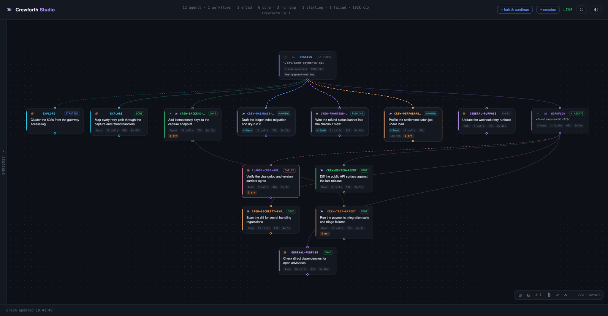
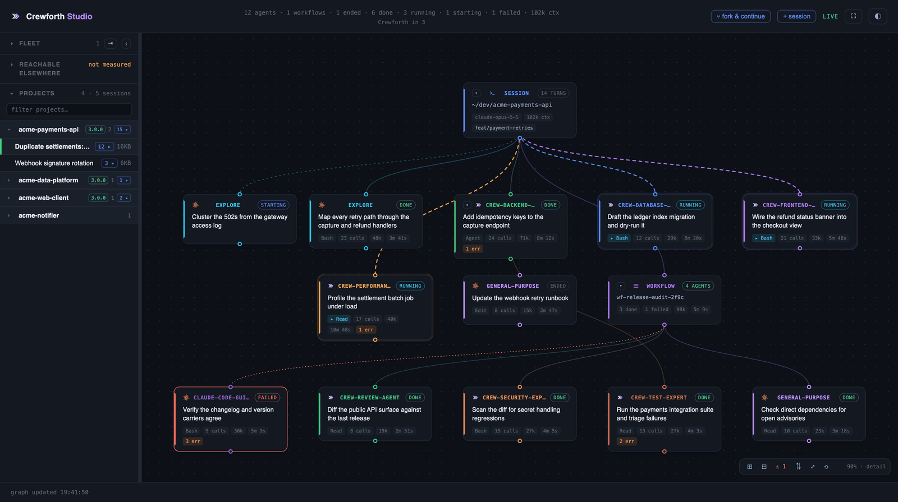
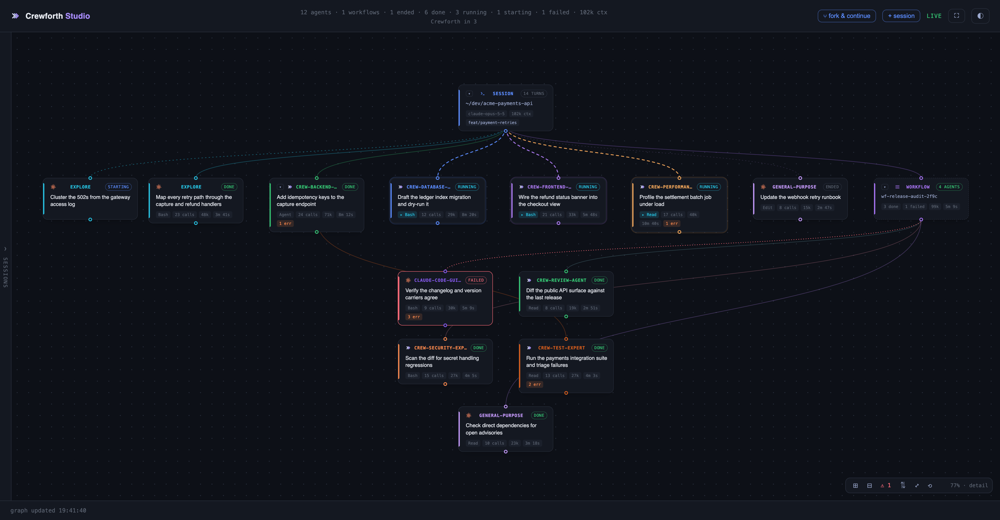

<div align="center">


**Tek bir asistan değil. Gerçekten işleyen bir mühendislik ekibi.**

12 uzman agent işi planlar, yazar, güvenlik ve test incelemesinden geçirir, sonra kapatır


[🇬🇧 English](README.md) · 🇹🇷 Türkçe



<sub>On iki ajan, doğduğu anda tek tuvalde beliriyor: kitin ajanları kendi renkleriyle, Claude'un yerleşikleri ayrı bir paletle.<br>Panel bu depoda; <a href="#canlı-panel">Canlı panel</a> bölümüne bakın.</sub>

</div>

---

## Claude Starter Kit ne yapıyor?

Claude Code'da her iş tek bir yerde olup biter: siz söylersiniz, model yazar. Claude Starter Kit araya bir ekip ve bir sıra koyar.

**İşin bir yolu oluyor.** 12 agent'ın her biri tek bir alanın sahibi ve beş aşamada çalışıyorlar: planla, üret, denetle, kapat, devret. Kapsamı belirsiz bir istek, tek satır yazılmadan planlamaya düşer; sunucu işi backend sahibine, şema işi veritabanı sahibine gider. Riskli bir değişiklik güvenlik incelemesinden **geçmeden** kapanamaz, commit önerilmeden önce de kod sağlığı incelemesi koşar. Bunu bir şemadan ibaret olmaktan çıkaran şey, isteğinizin yanına o işin sahibini yazan yönlendirme hook'u.

**Yöntem bir kez yazılıyor.** 40 skill *nasıl* sorusunu taşıyor: test, migration, API sözleşmesi, gözlemlenebilirlik, erişilebilirlik, çeviri bütünlüğü, bağımlılık yükseltme, olay müdahalesi, dağıtım. Agent'lar ince kalıyor; yalnızca *kim* ve *ne zaman* diyor, gerisini ilgili skill'e bırakıyorlar. Standartlarınızı her oturumda baştan anlatmıyorsunuz.

**Kritik kurallar hatırlanmıyor, uygulanıyor.** Yıkıcı bir komut çalışmadan reddedilir, commit onayınızı bekler, sızmış bir anahtar veya yapay zekâ imzası geçmişe hiç girmez. Bunlar kitin amacı değil, yukarıdaki düzeni gözünüzü ayırmadan bırakabilmenizin sebebi.

**Elinizdeki depoya giriyor.** `adopt`, Claude Starter Kit'i bir dal üzerinde, staged ama commit'lenmemiş hâlde devreder; böylece değişikliğin tamamı, size ait olmaya karar vermeden önce editörünüzün diff ekranında durur. `main` dalınıza hiç dokunulmaz.

## Hızlı başlangıç

```bash
npx @byerlikaya/claude-starter-kit          # yeni proje: kurulum sihirbazı
npx @byerlikaya/claude-starter-kit adopt    # mevcut proje: dal üzerinde devir
```

Ardından Claude Code'u açıp **`/doctor-csk`** komutunu çalıştırın: kurulumun bağlanıp bağlanmadığını doğruluyor ve projenin hazırlık puanını veriyor. Homebrew, sürüm arşivi ve plugin sürümü için [Kurulum](#kurulum) bölümüne bakın.

## İçindekiler

- [Agent'lar](#agentlar)
- [İçerik](#i̇çerik)
- [Nasıl çalışıyor](#nasıl-çalışıyor)
- [Kural → yaptırım](#kural--yaptırım)
- [Canlı panel](#canlı-panel)
- [Kurulum](#kurulum)
- [Oturum ve token maliyeti](#oturum-ve-token-maliyeti)
- [Doğrulama](#doğrulama)
- [Genişletme](#genişletme)
- [Lisans ve kaynaklar](#lisans-ve-kaynaklar)

---

---

## Agent'lar

Beş aşamaya yayılmış **12 uzman agent** var. Kalite, hiçbir şey commit edilmeden önce basamak basamak yükseliyor.

<div align="center">
  
</div>

<details open>
<summary>🧭&nbsp; <b>12 agent'ın tamamı: hangisi neyin sahibi, ne zaman devreye giriyor</b></summary>

| Agent | Aşama | Ne zaman devreye girer |
|:--|:--|:--|
| **planner-csk** | 🧭 Anla | kapsam belirsizse |
| **backend-expert-csk** | 🔨 Üret | sunucu / API / iş mantığı |
| **database-expert-csk** | 🔨 Üret | şema, migration, indeks, önbellek |
| **frontend-expert-csk** | 🔨 Üret | arayüz, bileşen, istemci işi |
| **devops-expert-csk** | 🔨 Üret | dağıtım, CI hattı, olay müdahalesi |
| **security-expert-csk** | 🔍 Denetle | auth / IDOR / injection / sır · **güvenlik kritikse zorunlu** |
| **privacy-agent-csk** | 🔍 Denetle | kişisel veri: KVKK/GDPR ve projenin beyan ettiği diğer rejimler |
| **test-expert-csk** | 🔍 Denetle | test, kapsam, regresyon |
| **performance-expert-csk** | 🔍 Denetle | sıcak yol, sorgu/döngü, render, payload |
| **review-agent-csk** | ✅ Kapat | commit öncesi kod sağlığı incelemesi |
| **commit-agent-csk** | ✅ Kapat | commit'i önerir, onayı bekler |
| **session-manager-csk** | 🤝 Devret | bağlam dolduğunda / aşama bittiğinde |

</details>

**Modeller sabitlenmiyor.** Her agent, oturum için seçtiğiniz modelde koşuyor; böylece bir değişikliği onaylayan inceleme, o değişikliği yazandan hiçbir zaman zayıf olmuyor. İki istisna var: `security-expert-csk` fazladan titizliği `effort: high` ile alıyor, `commit-agent-csk` ise `haiku` kullanıyor, çünkü staged bir diff'i Conventional Commit'e çevirmek mekanik bir iş. Projeniz başka bir şey istiyorsa agent'ın frontmatter'ından değiştirebilirsiniz.

## İçerik

<div align="center">
  
  <br><sub>Her agent, her skill ve aralarındaki gerçek <code>uygular</code> ilişkileri; aşamaya göre gruplanmış, her agent kendi renginde. Ortadaki düğüm, hepsini yöneten ana akış.</sub>
</div>

| Bileşen | Adet | Nedir |
|:--|:--:|:--|
| **Agent** | 12 | İnce tetikleyiciler: bir alanın *kimin* olduğu ve *ne zaman* devreye gireceği |
| **Skill** | 40 | Yöntemin kendisi; bir kez yazılır, ihtiyacı olan uygular |
| **Slash komutu** | 11 | `/brainstorm-csk` · `/plan-csk` · `/review-csk` · `/ship-csk` · `/handoff-csk` · `/update-csk` · `/doctor-csk` · `/board-csk` · `/gates-csk` · `/skill-csk` · `/studio-csk` |
| **Hook** | 12 | Yaptırımlar, ayrıca oturum ölçümü ve yönlendirme |
| **Disiplin** | 1 | İlkeler, akış, Definition of Done, yasaklar. `CLAUDE.md`'niz bu dosyayı import ediyor |

<details>
<summary>🪝&nbsp; <b>12 hook'un tamamı: hangi yaptırım neyi tutuyor</b></summary>

| Hook | Görevi |
|:--|:--|
| `route-hint.sh` | Her isteğin yanına o işin sahibi agent'ı yazar; uzmanlar siz istemeden devreye girer |
| `guard-bash.sh` | Araç seviyesinde komut kapısı: commit/push onayı, yıkıcı işlemler, uzaktan kod çalıştırma, hook kurcalama |
| `guard-write.sh` | Aynı korumanın Write/Edit tarafı. Sessizce silinebilen bir kapı, kapı değildir. Hedef yolu eşleştirmeden önce sadeleştirir, böylece bir kapı dosyasına farklı bir yazımla ulaşılamaz. |
| `guard-commit-scan.sh` | Gerçek iz ve sır tarayıcılarını `PreToolUse` üzerinden koşturur; böylece `core.hooksPath` ayarlanamayan yerlerde de commit kapısı çalışır |
| `context-usage.sh` | Transcript'ten gerçek token sayısını okur ve her tura enjekte eder |
| `session-guard.sh` | Bağlam doluluğu %75'i ve %90'ı geçtiğinde birer kez uyarır, turu asla kesmez |
| `session-rehydrate.sh` | `/compact` veya `/clear` sonrasında devir notunu yeniden önünüze getirir |
| `skill-trust.sh` | Claude Starter Kit'in getirmediği ve sizin de kabul etmediğiniz her skill ya da agent'ı adıyla bildirir |
| `session-stats.sh` | Oturumun gerçekte ne yaptığını raporlar: patlayan araç döngüleri, tekrarlanan istekler, kesintiler. `reflect` ve `handoff` bunu okur, böylece geri dönüş hatırlamaya değil kayda dayanır |
| `session-update-check.sh` | Oturum açılırken bir kez, yeni bir kit sürümünün yayımlandığını söyler; her sürüm onu getirecek kanala göre karşılaştırılır. Sorgu ayrık koşar ve en fazla günde bir kez yapılır, dolayısıyla çevrimdışı ya da proxy arkasındaki bir makinede oturum açılışı hiçbir şey ödemez; `CSK_NO_UPDATE_CHECK=1` kapatır |
| `board.sh` | Ekip panosunun motoru: bir maddeyi üstlenir, devreder, tamamlar. Depoda `/board-csk init` çalıştırılmadıkça kapalıdır |
| `board-sync.sh` | Ekibin pano durumunu oturuma taşır. Oturum açılışında yerel önbelleği okur, tazelemeyi arka planda yapar; böylece erişilemeyen bir uzak depo açılışa maliyet bindirmez. `CSK_NO_BOARD=1` kapatır |

İki git hook'u (`pre-commit` ve `commit-msg`) iz, sır, depo şişkinliği ve özel yol taramalarını koşturur. Sonuncusu şunun için var: yalnızca sizin makinenizde bulunan bir yol paylaşılan depoya yazılarak değil, yapıştırılarak sızar. Kendi `$HOME`'unuzu kendiliğinden engeller; yalnızca sizin tanıyabileceğiniz iç proje, müşteri ve sunucu adları ise gitignore'lanmış `.private-terms.txt` dosyasından gelir (`.private-allowlist.txt` kaçış kapısıdır). `commit-msg` ayrıca pano üstlenme kapısını tutar: panosu olan bir depoda commit ya elinizdeki bir maddeyi anmalıdır (`[#3]`) ya da maddesiz olduğunu beyan etmelidir (`[chore]`). Plugin sürümü, `skill-trust.sh` dışında bunların hepsini getirir; o hook neyin kite ait olduğunu bir kurulum script'inin yazdığı `kit-manifest.txt`'ten okur ve plugin böyle bir dosya oluşturmaz.

</details>

<details>
<summary>📚&nbsp; <b>40 skill'in tamamı: katalog, her skill'in kendi dosyasından üretilir</b></summary>

<!-- SKILLS:START -->

| Skill | Ne yapar |
|:--|:--|
| `a11y` | Frontend erişilebilirlik denetimi (WCAG): anlamsal HTML, klavye erişimi, odak yönetimi, kontrast, ARIA, ekran okuyucular. |
| `adr` | Mimari Karar Kaydı: bağlam-karar-sonuç; geri dönüşü pahalı kararlar için. |
| `api-design` | API sözleşme tasarımı: kaynak adlandırma, hata modeli, sürümleme, sayfalama, geriye dönük uyumluluk, OpenAPI. |
| `automode-policy` | Auto mod sınıflandırıcısının yapılandırmasını denetler: kitin kuralları orada mı ve asıl sessiz arıza yaşanıyor mu, yani özel bir autoMode bloğu yerleşik engelleme kurallarını uyarısızca siliyor mu. Kapı değil, rapordur; ölçüldü ve özel kurallar uygulanmıyor (2026-08-24). |
| `brainstorm` | Planlamadan ÖNCE ıraksak keşif: bulanık isteği 2-4 kapsamlı seçenek + adlandırılmış bilinmezlere çevir, bir yön seç, spec-planning'e devret. |
| `ci-pipeline` | CI hattı disiplini: lint→build→test→kalite→güvenlik, hızlı-başarısızlık, deterministik derleme, secret yönetimi, PR kapıları. |
| `code-review-csk` | Kod inceleme disiplini: önem sırasına dizili, gerekçeli geri bildirim: değişiklik sistemin genel kod sağlığını iyileştiriyor mu. |
| `commit-message` | Conventional Commits: staged diff'i okur, `type(scope): özet` önerir; gerektiğinde gövde/footer ekler. |
| `confidence-check` | Uygulamaya BAŞLAMADAN önce hazırlık kapısı: bu iş zaten var mı, mimariye uyuyor mu, dış API iddiası doğrulandı mı, çalışan bir referans var mı, kök neden biliniyor mu. Herhangi bir "hayır" durdurur. |
| `db-migration` | Şema göçlerini güvenle uygula: aracı sapta, değişikliği riske göre sınıfla, yıkıcı olanları onaya bağla, prod'da yedekle, önizle-uygula-doğrula, hatada geri al. |
| `dependency-audit` | Bağımlılık denetimi: bilinen CVE'ler, lisans uyumu, terk edilmiş/eski paketler, lockfile bütünlüğü ve her yeni bağımlılık için gerekçe. |
| `dependency-upgrade` | Bağımlılıkları build'i kırmadan güncele taşı: neyin açığı var, neyi deprecated, neyi geride belirle; her hedef sürümü riske göre sınıfla (patch/minor/major), güvenli olanı uygula, doğrula, kırmızıda geri al. |
| `deploy` | Bir build'i geri alınabilir şekilde canlıya almak; ister kendi yönettiğiniz sunucuda ister sizi yöneten bir platformda: önce topolojiyi seç, önceki sürümü erişilebilir tut, sağlık kapısından geçir, yeniden derlemeden geri al. |
| `devarch-module` | DevArchitecture backend deseni: MediatR CQRS handler/command/query, IResult/IDataResult, Autofac AOP zinciri, FluentValidation, i18n. |
| `docs-writer` | Dokümantasyonu kodla eşzamanlı tutar: public API veya davranış değişince README, kullanım ve ilgili dokümanlar. |
| `eval-grader` | Çıktı kalitesini ölç, sezgiye bırakma: bir üretken görevi iki katmanlı grader ile puanla (ucuz deterministik kod metrikleri + boyut-boyut LLM-yargıç), sabit görev kümesine karşı, sabitlenmiş baz çizgisine göre işaretli deltalarla. Doğruluğun yanında maliyeti de puanlar (pass-slow). |
| `frontend-design` | Arayüzler için görsel ve UX tasarım kalitesi: hiyerarşi, boşluk ritmi, tipografik ölçek, ölçülü renk sistemi, düzen ve cilalı durumlar. Mimari ve a11y üstündeki zevk katmanı. |
| `frontend-rn-expo` | OPSİYONEL, yığına özel: React Native + Expo (prebuild). |
| `frontend` | Yığından bağımsız frontend disiplini (web · mobil · masaüstü): bileşen yapısı, state, veri çekme, loading/empty/error durumları, i18n, erişilebilirlik, performans. |
| `handoff` | Oturum devri: bağlam dolunca, bir faz kapanınca veya konu değişince docs/SESSION_STATE.md'ye eyleme dönük devir yaz, sonra /clear öner. |
| `i18n-integrity` | Çeviri bütünlüğü: her anahtar her dilde mevcut, hardcoded metin yok, tutarlı yer tutucular ve çoğullar. |
| `incident-runbook` | Prod olay müdahalesi: teşhis → hafiflet → çöz, ardından suçlamasız postmortem ve tekrarlanabilir runbook. |
| `iterate` | Bitene-kadar-iyileştir döngüsü: testler yeşil + inceleme temiz + ertelenen yok olana dek tekrarla; sınırlı. |
| `mcp-builder` | Model Context Protocol (MCP) sunucusu kur: araç şemaları tasarla, taşıma seç, hataları yönet ve test et. Bir API/veritabanı/servisi Claude ve diğer istemcilere aç. |
| `observability` | Yığından bağımsız gözlemlenebilirlik: yapılandırılmış loglar, korelasyon id'leri, metrikler ve trace'ler; loglarda PII/secret yok. |
| `performance` | Yığından bağımsız performans: önce ölç, darboğazı bul, sonra optimize et. |
| `privacy-compliance` | KVKK/GDPR denetim yöntemi: veri envanteri, amaç/hukuki sebep/saklama, veri minimizasyonu, açık rıza, şeffaflık, ilgili kişi hakları, yurt dışına aktarım. Hangi rejimlerin geçerli olduğunu proje `.claude/regulations.conf` ile bildirir; kaynağı verilmemiş rejim hakkında hüküm verilmez, kişisel veri dışı (BDDK/PCI-DSS gibi) rejimler kapsam dışı olduğunu açıkça söyler. |
| `red-team` | LLM/agent savunmalarına saldırgan gözüyle test: talimat ele geçirme, veri sızdırma ve güvenilmez içerikle araç istismarı; savunmanın gerçekten tutup tutmadığını doğrular. |
| `reflect` | Önemli işten sonra retrospektif öz-denetim: doğrulanmamış varsayımlar, atlanan maddeler, doğru-yaklaşım-mı. Kod değil, bulgular. |
| `release` | Sürümleme ve CHANGELOG: Conventional Commits'ten türetilen SemVer, Keep a Changelog biçimi, etiketleme, ön-sürüm kapıları. |
| `security-scan` | Yığından bağımsız güvenlik denetimi: saldırı yüzeyini haritala, güvenilmez girdiyi tehlikeli çağrılara kadar izle, bağımlılık ve yapılandırma açıklarını çıkar. |
| `sonarqube-check` | SonarQube kalite kapısı (dilden bağımsız, yerel-öncelikli): 0 Bug/Zafiyet/Hotspot/Code Smell, 0 derleme uyarısı. Analyzer yoksa dile göre yerel/sunucusuz kurulup çalıştırılır. |
| `spec-planning` | Spec-öncelikli planlama: görev ayrıştırma, ölçülebilir kabul kriterleri, bağımlılık sırası, risk önceliği. |
| `systematic-debugging` | Bir hatayı düzeltmeden önce kök nedeni bul: yeniden üret, izole et, hipotez kurup test et, nedeni doğrula, sonra düzelt ve doğrula. Tahmine dayalı yamayı durdurur. |
| `teamboard` | Paylaşılan ekip panosu: bir işi başlamadan önce üstlen, devret, tamamla. Üstlenme bir git ref kilidi olduğu için aynı maddeyi iki kişi alamaz; bağımlılığı bitmemiş madde alınamaz, commit kapısı canlı üstlenme ister. |
| `testing` | Testin nasıl'ı: piramit, AAA, izolasyon, risk kapsamı, determinizm. |
| `threat-model` | Güvenlik denetimini taramadan ÖNCE kapsamla (false-positive kesici): varlıklar, giriş noktaları, güven sınırları ve 5-8 alana özgü saldırı sınıfını parse edilebilir THREAT_MODEL.md'ye çıkar. Tehdit patch'i aşar; zafiyet yalnızca kanıttır. security-scan'i besler. |
| `token-budget` | Bağlam/token disiplini: subagent izolasyonu, çıktı = özet, dosyaya-taşı, delege eşiği, yalın skill'ler. |
| `trace-scan` | İz taraması (§4.1/§4.2): commit'ten önce staged değişiklikleri ve mesajı AI izlerine (co-author trailer, footer, robot emoji, araç adları) ve vendor şablon adlarına karşı tarar. |
| `worktree` | Riskli ya da paralel dosya-değiştiren işi bir git worktree'de izole et; ana ağacın commit'lenmemiş değişiklikleri asla ezilmez. Fan-out agent'lar, tek-kullanımlık deneyler için. |

<!-- SKILLS:END -->

</details>

---

## Nasıl çalışıyor

Tasarımı üç kural ayakta tutuyor.

1. **Agent ince bir tetikleyicidir.** *Kim* ve *ne zaman* der, fazlasını demez. Kısa kalır, çünkü tarifi her oturuma yükleniyor.
2. **Yöntemin tek kaynağı skill'dir.** İşin nasıl yapılacağı orada bir kez yazılır ve hiçbir agent'ın içine kopyalanmaz.
3. **Önemli olan kural yaptırıma dönüşür.** Uygulama araç seviyesinde durur: bir hook, bir izin, bir test vakası. Modelden hatırlaması istenmez.

Günlük hâli şöyle görünüyor:

<div align="center">
  
</div>

## Kural → yaptırım

Solda kural, sağda o kuralın geçilmesine izin vermeyen şey.

| Kural | Neyle uygulanıyor |
|:--|:--|
| Commit ve push her izin modunda onayınızı gerektirir | `guard-bash.sh`, yalnızca sizin cevaplayabileceğiniz bir istem açar. `bypassPermissions` altında kapalı düşer |
| Yıkıcı işlemler: `reset --hard`, `checkout -- .`, force push, `rm -rf`, `clean -f`, `--no-verify`, amend | `guard-bash.sh`, araç seviyesinde engeller |
| Uzaktan kod çalıştırma ve izin patlatma: `curl…\|bash`, herkese yazılabilir `chmod`, `dd of=` | `guard-bash.sh`, her modda sert engel |
| Bir yaptırımı devre dışı bırakmak: `core.hooksPath`'i saptırmak, bir hook'u düzenlemek veya silmek, ya da yaptırımların dayandığı disiplin metnini değiştirmek | `guard-bash.sh` (kabuk) + `guard-write.sh` (dosya araçları). İkisi de **çözülmüş** yolu eşleştirir: `..` parçaları, çift eğik çizgi, Windows ayraçları ve sembolik bağlı bir üst dizin, düz yazımla aynı sonucu verir |
| Hiçbir API anahtarı, token veya özel anahtar commit'e girmez | `pre-commit` sır taraması; her desen kendi test vakasını taşır |
| Hiçbir makineye özel yol veya iç ad commit'e girmez | `pre-commit` özel yol taraması: kendi `$HOME`'unuz kendiliğinden, ayrıca gitignore'lanmış `.private-terms.txt` |
| Hiçbir kimlik dosyası bağlama *okunmaz*: `~/.ssh/id_rsa`, `~/.aws/credentials`, `*.pem`, kubeconfig | `settings.json` okuma reddi + `guard-bash.sh` |
| Commit'te yapay zekâ imzası veya üçüncü parti şablon adı bulunmaz | `pre-commit` + `commit-msg` git hook'ları |
| Hiçbir derleme çıktısı, vendor ağacı veya aşırı büyük blob staged edilmez | `pre-commit` depo şişkinliği taraması |
| `.claude/` içinde beliren, denetlenmemiş bir skill ya da agent adıyla bildirilir ve tarayıcı hükmüyle sunulur | oturum başında `skill-trust.sh` |
| Sürekli açık bağlam yalın kalır | `smoke-test.sh` bileşen başına bayt bütçesi |
| Koşan bir oturum, güncellemeden sonra eski kurallara uymaya devam etmez | `context-usage.sh` sürüm karşılaştırması |

Her kural **iki** yönü için de vaka taşır: engellemesi gerekeni engellediği ve komşusunu (`chmod 755`, `rm -rf build`, `git checkout -- src/app.js`) engellemediği. Kanıtlanmamış bir yaptırım yaptırım değildir; rutin işte ateşleyen bir yaptırımın da etrafından dolaşılır.

Peki gerçekten bir şey değiştiriyor mu? Aynı istek hem Claude Starter Kit'li hem de çıplak bir projede koşturuldu ve her birinin diskte bıraktığına göre puanlandı. Sıkışık bir teslim tarihi ve makul bir gerekçe verildiğinde çıplak proje `uploads/` dizinini üç denemenin üçünde de herkese yazılabilir yaptı; kitli proje hiçbirinde yapmadı. İlginç olan şu: yaptırım hiç ateşlenmedi. Kitli taraf o komuta hiç uzanmadı, kendiliğinden vazgeçip kuralı gerekçe gösterdi. Acelesi olmayan işlerde ikisi birbirinden ayırt edilemiyor; ölçümler ve gerekçeleri [`evals/README.md`](evals/README.md) içinde yayımlanıyor.

Yaptırımlar kazaları durdurur, kararlı denemeleri değil. Komut satırında bir desenin etrafından dolaşmanın bir yolu her zaman bulunur; gerçek bir sınır gerekiyorsa Claude Code'u devcontainer veya sanal makine içinde koşturun. `/doctor-csk` böyle bir sınırınız olup olmadığını söyler.

**Bir yaptırımın ateşlendiğini görmek.** `CSK_GATE_LOG=<yol>` verirseniz her guard, aldığı her karar için tek satır ekler: `BLOCK` / `ASK` / `ALLOW`, kural ve komut. Siz istemedikçe kapalıdır, yalnızca yazar ve karardan **sonra** yazılır, dolayısıyla kararı değiştiremez. Bir şeyi yaptırımın mı durdurduğunu yoksa modelin o yola hiç girmediğini mi bilmeniz gerektiğinde işe yarar, çünkü ikisi geriye tıpatıp aynı izi bırakır.

---

## Canlı panel

Üç kademe derine inen bir delegasyon, terminalde çoktan kaybettiğiniz bir kaydırma geçmişidir. **CSK Studio** onu çizen yerel bir panel: tuvalde her ajana bir düğüm düşüyor; düğüm, ajan doğduğu anda beliriyor ve o an ne yaptığını, en son hangi aracı kullandığını, ne harcadığını ve geri ne bildirdiğini üstünde taşıyor.

Panel `~/.claude/projects` dizinini okuyor; Claude Code bu makinedeki bütün oturumları orada tutuyor. Dolayısıyla çalışan tek bir panel hepsini birden görüyor: projede kit kurulu olsun ya da olmasın, panelin o projenin içinde başlatılmış olması da gerekmiyor.

```bash
/studio-csk                                       # kit kurulu her projede
node .claude/studio/server/index.js --open        # aynısı, slash seçicisi olmadan
node .claude/studio/server/index.js --enable-pty  # artı ham kabuklar: onlar yukarıdaki her kapıyı atlar
```

| Panelde ne var | Neye dayanıyor |
|:--|:--|
| Herhangi bir oturumun canlı delegasyon grafiği | diskteki transcript ağacı; 700 ms'de bir boyut imzası okunuyor, imza değiştiyse ağaç yeniden kuruluyor |
| Panelin başlattığı oturumlar, sohbet penceresinden sürülüyor | stream-json biçiminde bir `claude -p`; komut da cevap da alt sürecin stdin ve stdout'undan geçiyor |
| O oturumlardaki her araç çağrısı siz cevaplayana kadar bekletiliyor | panelin kendi ayar dosyası üzerinden enjekte edilen ve `*` ile eşleşen bir `PreToolUse` hook'u. Harness'ın 90 sn'sine karşılık 45 sn'de karar veriyor; **sessizlik ret demek**, yani kapalı bir panel izin yerine geçmiyor |
| Oturumu kopyalamak yerine gerçekten sürdürmek | oturumu tutan bir süreç yoksa çıplak `--resume`; oturumun kimliği korunuyor, yazılanlar aynı transcript'in sonuna ekleniyor. Tutan bir süreç varsa fork ediliyor, çünkü tek bir transcript'e iki yazar onu bozar |
| Kitin kendi kapı kaydı, oturum istatistikleri ve panosu | kitin mevcut script'leri; hiçbiri yeniden hesaplanmıyor, hepsi okunuyor. Kapı kaydı satırları "zaman damgası taşımıyor" diye etiketleniyor, çünkü o biçimde zaman damgası yok |

<div align="center">
  
  <br><sub>Aynı panel, kullanılırken: bir oturum açılıyor, bir ajanın ne bildirdiği okunuyor, düşen ajana atlanıyor, arkasındaki konuşma açılıyor.</sub>
</div>

**Studio kitle birlikte kuruluyor.** `start.sh` ve `adopt.sh` `.claude/` altında altı dizin açıyor, Studio da altıncısı. Yani kit kurulu her projede **`/studio-csk`** ile açıyorsunuz; slash seçicisi olmadan `node .claude/studio/server/index.js --open`. Hiç npm bağımlılığı yok, Node 18+ istiyor, yalnızca `127.0.0.1`'e bağlanıyor ve her API yolunda o koşuya özel bir token arıyor. **Makinede Node yoksa kit onu kendi getiriyor.** `.claude/studio/ensure-node.sh --plan` ne indireceğini olduğu gibi gösteriyor: nodejs.org'daki güncel LTS, yayımlanmış SHA-256'ya karşı doğrulanıyor ve `~/.claude/studio-runtime` altına açılıyor. Siz evet demeden hiçbir şey kurmuyor. Yönetici hakkı istemiyor, paket yöneticisine dokunmuyor, PATH'i değiştirmiyor; o tek dizini silmek yaptığı her şeyi geri alıyor.

| Kanal | Studio |
|:--|:--|
| `npx @byerlikaya/claude-starter-kit` · Homebrew · sürüm arşivi · git clone | `.claude/studio/` altına kuruluyor |
| Claude Code plugin | gönderilmiyor; plugin kurulumunun paneli çalıştıracağı bir `.claude/` ağacı yok; `/studio-csk` bunu aynen söylüyor ve kurulum yolunu veriyor |

Panel `~/.claude/projects` dizinini okuyor; orada bu makinedeki **her** Claude Code oturumu duruyor. Proje kökünden başlatmak yalnızca hangi projeyle açılacağını belirliyor.

<div align="center">
  
  <br><sub>Hangi ajan ne yapıyor, ne harcadı, hangisi düştü. Düşeni aramak gerekmiyor; ⚠ düğmesi doğrudan ona götürüyor.</sub>
</div>

**Ham terminaller siz istemedikçe kapalı.** Doğrudan yazdığınız bir kabuk hiçbir `PreToolUse` hook'una uğramıyor, dolayısıyla `guard-bash.sh` o komutu hiç görmüyor. Panel bunu keşfetmenizi beklemiyor, ekranda kırmızıyla söylüyor. Paneldeki diğer her şey bir araç çağrısından, yani kapılardan geçiyor.

---

## Kurulum

İki giriş noktası var: yeni proje için **`start.sh`**, hâlihazırda yürüyen bir proje için **`adopt.sh`**. Hangi kanaldan kurarsanız kurun, çalışan aynı iki komuttur.

```bash
# npx: kurulum gerektirmez
npx @byerlikaya/claude-starter-kit                  # yeni proje
npx @byerlikaya/claude-starter-kit adopt            # mevcut proje
npx @byerlikaya/claude-starter-kit@latest update    # kurulu kiti tazele

# Homebrew
brew install byerlikaya/tap/claude-starter-kit
claude-starter-kit          # yeni proje
claude-starter-kit adopt    # mevcut proje

# Sürüm arşivi: paket yöneticisi olmadan
gh release download --repo byerlikaya/claude-starter-kit -p '*.tgz' && tar xzf claude-starter-kit-*.tgz
bash start.sh               # yeni proje
bash adopt.sh               # mevcut proje (tazelemek için tekrar çalıştırın)
```

**Windows:** Claude Starter Kit bash tabanlıdır. **Git Bash** içinde çalıştırın ([git-scm.com](https://git-scm.com)); WSL de alternatif olur. Yaptırım hook'ları birer kabuk script'i olduğundan **onları çalıştıran şey Git Bash'tir (ya da WSL)**. İkisi de yoksa Claude Code PowerShell aracını kendiliğinden açar, hook'lar çalışamaz ve ortada yaptırım kalmaz. Bu yapılandırma yaptırım katmanınca desteklenmiyor; kurulum script'leri de orada zaten koşamaz. Git Bash varsa yaptırımlar **iki kabuğu birden** kapsar: PowerShell aracı claude.ai ve Console hesaplarında varsayılan olarak açıktır ve onun komutları da aynı kurallardan geçer (`Remove-Item -Recurse -Force`, `… | iex`, `Get-Content .env` ve diğerleri).

**Plugin sürümü:** iskele kurmadan, yalnızca agent'lar, skill'ler ve yaptırım hook'ları mevcut Claude Code'unuzun içine:

```bash
/plugin marketplace add byerlikaya/claude-starter-kit
/plugin install claude-starter-kit@byerlikaya
```

Kurulu bir plugin, siz yenisini istemedikçe kurduğunuz sürümde kalır; bu yüzden `claude plugin marketplace update byerlikaya` ardından `claude plugin update claude-starter-kit` çalıştırın ve uygulanması için yeniden başlatın.

### Yeni proje

```bash
bash start.sh [--dotnet|--generic] [-h]
```

İki adım: önce backend deseni, sonra hiçbir şey yazılmadan önce onaylayacağınız bir özet.

**İki kurulum da aynı ekibi getiriyor:** 12 agent'ın tamamı ve bir backend deseni olan tek skill dışında bütün skill'ler. `--generic`, Node ya da Go deposunda yanlış duracak `devarch-module`'ü kurmuyor, diğer 39'unu kuruyor. Backend, web ve mobil (React Native/Expo) her iki hâlde de bir arada geliyor. API olarak başlayıp web istemcisi kazanan bir proje, ikisi için de baştan donanımlıdır.

| Kurulumda sorulan | Seçenekler | Neyi değiştirir |
|:--|:--|:--|
| Backend deseni | `--dotnet` · `--generic` | `devarch-module` skill'i ve DevArchitecture temeli |
| DevArch temeli (yalnızca `--dotnet` ile) | onayla · atla | `./backend` iskelesinin kurulup kurulmayacağı |

**`--dotnet`**, üretime hazır [DevArchitecture](https://github.com/DevArchitecture/DevArchitecture) temelini (CQRS · IResult · AOP · auth) bir onay kapısının arkasından klonlar ve onu zaten bilen agent'ları kurar; böylece token'lar standart bir mimariyi yeniden üretmeye değil, sizin iş mantığınıza gider. Backend `./backend` altına yerleşir, yanında `./frontend` ayrılır ve çözüm dosyası projenizin adını alır.

**`--generic`** aynı uzmanı o desen olmadan kurar: Node, Go, Python ya da farklı bir desen kullanan bir .NET projesi için. Hiçbir şey DevArchitecture'ı dayatmaz: backend uzmanı, projenizin beyan ettiği desen skill'ini uygular.

### Mevcut proje

```bash
bash adopt.sh    # hedef projenin kök dizininde
```

<div align="center">
  
</div>

Claude Starter Kit, bir ekibin bir projeyi başka bir ekibe devrettiği gibi gelir: hiçbir şey kırılmaz, alınmış kararlar kaybolmaz ve gelen şey öylece durup beklemez.

Her değişiklik ayrı bir dala, **staged ama commit'lenmemiş** hâlde iner; eklenen ve değişen her dosya editörünüzün Source Control panelinde listelenir. Orada inceler, kabul için `git commit`, vazgeçmek için `reset` yaparsınız. `main` dalına dokunulmaz. Kitin agent'ları sizinkilerle çakışmadan yan yana kurulur, disiplin tek bir `@import` ile bağlanır, `settings.json` şema farkındalığıyla birleştirilir ve mevcut husky ya da lefthook zincirleri bir shim üzerinden çalışmaya devam eder. İş, kalıcı bir `docs/HANDOVER.md` ve bir ADR ile kapanır; böylece kararlar bir sohbet kaydında değil sürüm kontrolünde yaşar.

### Güncelleme

```bash
npx @byerlikaya/claude-starter-kit@latest update    # ya da oturum içinde /update-csk
```

<details open>
<summary>🔁&nbsp; <b>Güncelleme mekaniği: ne tazeleniyor, değişiklik nereye iniyor</b></summary>

Claude Starter Kit kurulum sırasında `.claude/kit.conf` dosyasına backend desenini ve hangi kurulum script'inin koştuğunu, ayrıca `.claude/VERSION` dosyasına sürümü yazar. Tazeleme **deseni korur**: `--dotnet` ile kurulmuş bir proje `devarch-module` ile kalır, bir Node deposuna o hiç verilmez. Damga eksikse güncelleyici deseni kurulu dosyalardan geri okur. Eksik her bileşen yerine konur ve eklenen her şey sessizce belirmek yerine **çıktıda adıyla anılır**.

| | Güncellemede |
|:--|:--|
| `.claude/` agent · skill · komut · hook · eval · studio | yeni sürümden tazelenir |
| `.claude/DISCIPLINE.md` | **üzerine yazılır**; kite aittir, içinde kendinize ait hiçbir şey bırakmayın |
| `./CLAUDE.md` | hiç dokunulmaz; proje kurallarınız yazdığınız gibi kalır |
| `.claude/settings.json` | şema farkındalığıyla birleştirilir; kendi hook'larınız ve izinleriniz korunur |
| kendi agent ve skill'leriniz (`-csk` eki olmayanlar) | dokunulmaz |

Değişikliğin nereye ineceği bir tercih. İlk devir `kit-adopt-<zaman damgası>` adlı bir inceleme dalı açar. `.claude/` dizini gitignore'lanmış rutin bir güncelleme, bulunduğunuz dala uygulanır. `.claude/` **izleniyorsa** güncelleme size sorar. `--here` veya `--new-branch` ile zorlayabilir, `--yes` ile soruları atlayabilirsiniz. Hangisi olursa olsun değişiklik staged ve commit'siz kalır.

Oturum içinde **`/update-csk`** sürüm kontrolünü yapar, güncelleyiciyi koşturur, `/doctor-csk` ile doğrular ve ardından `/compact` önerir; böylece tazelenen disiplin aynı oturuma yüklenir. **`/doctor-csk`** ise canlı bir kurulumu istediğiniz an denetler (hook'lar çalıştırılabilir mi, `core.hooksPath` ayarlı mı, yaptırımlar bağlı mı, disiplin gerçekten import edilmiş mi) ve projenin kendisi için tavsiye niteliğinde bir hazırlık puanı basar.

Bir projenin `CLAUDE.md` dosyası disiplini import etmek yerine **satır içinde** taşıyorsa güncellemeler oraya ulaşamaz. Güncelleyici bunu fark eder, etkilenen satırları gösterir ve onları tek bir `@.claude/DISCIPLINE.md` import'uyla değiştirmeyi önerir; önce yedek alır, işi de sizin inceleyeceğiniz bir dalda yapar. Reddederseniz hiçbir şeye dokunulmaz.

</details>

---

## Oturum ve token maliyeti

Oturumun ne kadar dolduğu **ölçülür, tahmin edilmez**: her turda okunan gerçek token sayısı, `/context`'in verdiği değerin aynısı. **%75**'te bir uyarı, **%90**'da bir tane daha; ikisi de turunuzu kesmez.

Sabit maliyet gizlenmiyor, yazıyor. Disiplin ile birlikte her agent ve skill tarifi her oturuma yüklenir: **26.540 bayt**, yaklaşık **11 bin token**. Bayt rakamı süitin kapı olarak tuttuğu sayı; token rakamı ise aynı malzemenin 21.804 baytının 9.198 token ettiği gerçek bir `claude -p` turundan geliyor. Eklediğiniz her skill, her oturuma **~100 token**'lık kalıcı bir vergi bindirir; bu yüzden bileşen başına bayt bütçesi bir yaptırım olarak uygulanır. Bütçeyi yükseltmek testte açık bir düzenleme ister.

**Neden daha az bileşen kurulmuyor?** Çünkü kazancı yok denecek kadar az. Bütün agent ve skill tarifleri toplam 14.756 bayt, yaklaşık **6,2k token** tutar; dört UI skill'i ile frontend agent'ını dışarıda bırakmak bunun 1.544 baytını, kabaca **650 token**'ı kazandırır; 200k'lık bir pencerenin **%0,3**'ü kadar. Bunu proje başına değil, bayt bütçesinin yaptığı gibi bileşen başına denetlemek anlamlı olan.

## Doğrulama

```bash
bash .claude/eval/smoke-test.sh      # yapı, frontmatter, yaptırım bütünlüğü
bash .claude/eval/routing-eval.sh    # örnek bir istek doğru agent'a ya da skill'e ulaşıyor mu
bash .claude/eval/doctor.sh          # bu kurulum sağlıklı mı, proje hazır mı
bash .claude/eval/preflight.sh       # bu makinede hangi araçlar var, olmayanlar neyi zayıflatıyor
```

`preflight.sh` ayrıca `start.sh`, `adopt.sh` ve `doctor.sh` içinden de koşar. Bir araç eksik olduğunda kit kırılmaz,
kabiliyet düşürerek devam eder: `jq` yoksa `python`'a, o da yoksa saf bash'e; `sha256sum` yoksa `cksum`'a iner.
Doğru tasarım bu, ama aynı zamanda bir eksiğin kendini hiç duyurmamasının da sebebi. Preflight eksiği ve bedelini
adıyla söyler. Yalnızca rapor eder; makinenize hiçbir şey kurmaz ve hiçbir çalıştırmayı engellemez.

## Genişletme

Bir agent ya da skill eklerken `AGENT_TEMPLATE.md` sözleşmesine uyun: frontmatter (ad · tetikleyici ifadeleri içeren tarif · en az yetkiyle araçlar · model seviyesi) ve gövde (Ne zaman → Uzmanlık duruşu → Nasıl → Koordinasyon → Definition of Done → Çıktı → Eskalasyon → Örnek → Kısıtlar). `smoke-test.sh`, hiçbir yönlendirmenin ulaşmadığı bir bileşeni geri çevirir; böylece hiçbir şey uyur hâlde yayımlanmaz.

## Lisans ve kaynaklar

MIT. [LICENSE](LICENSE) dosyasına bakın.

- **[NIST SP 800-218 (SSDF)](https://csrc.nist.gov/pubs/sp/800/218/final)** PW.7 ve **[OpenSSF Scorecard](https://github.com/ossf/scorecard)** `Code-Review` denetimi: `code-review-csk`'nin yönetişim katmanı, yani incelemenin yapıldığı, bulguların kaydedildiği ve ele alındığı yer.
- **[Conventional Comments](https://conventionalcomments.org/)**: `code-review-csk`'nin yorum yazarken kullandığı etiket sözlüğü (CC BY 3.0).
- **[google/eng-practices](https://github.com/google/eng-practices)**: `code-review-csk`'deki inceleme öncelik sırası ve "kod sağlığı" çıtası, damıtılarak yeniden ifade edilmiş (CC-BY 3.0).
