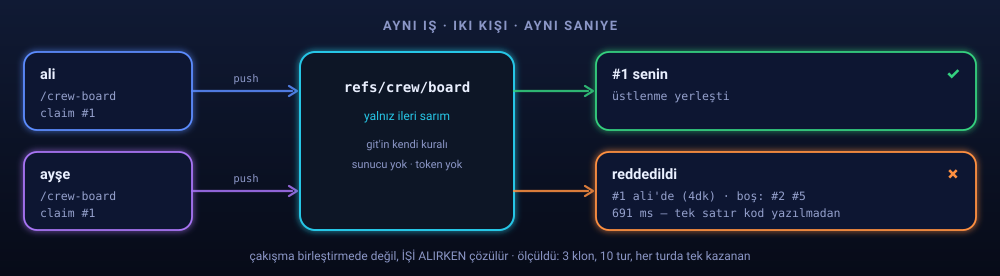
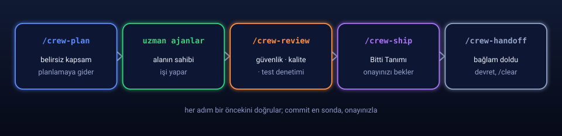

<div align="center">


**Tek bir asistan değil. Gerçekten çalışan bir mühendislik ekibi.**

12 uzman agent işi planlar, üretir, güvenlik ve test denetiminden geçirir, sonra kapatır.

Paylaşılan bir depoda bir işi üstlenmek atomik bir git claim'idir — aynı işi iki kişi başlatamaz


[🇬🇧 English](README.md) · 🇹🇷 Türkçe

</div>

---

## Claude Starter Kit ne yapıyor?

Claude Code'da her iş aynı yerde yapılır: siz istersiniz, model yazar. Claude Starter Kit araya bir ekip ve bir sıra koyar.

**İş bir sürece giriyor.** 12 agent'ın her biri tek bir alanın sahibi ve beş aşamada çalışıyor: planla, üret, denetle, kapat, devret. Belirsiz bir istek, tek satır yazılmadan önce planlamaya gidiyor; sunucu işi backend sahibine, şema işi veritabanı sahibine. Riskli bir değişiklik **güvenlik incelemesi temize çıkmadan** kapanamıyor ve commit önerilmeden önce kod sağlığı incelemesi koşuyor. Bir yönlendirme hook'u isteğinizin yanına o işin sahibini yazıyor. Bu satır olmasa beş aşama kâğıt üstünde kalırdı.

**Yöntem bir kez yazılıyor.** 39 skill *nasıl*ı taşıyor: test, migration, API sözleşmesi, gözlemlenebilirlik, erişilebilirlik, çeviri bütünlüğü, bağımlılık güncelleme, olay müdahalesi, dağıtım. Ajanlar yalın kalıyor: yalnızca *kim* ve *ne zaman* diyip gerisini taşıyan skill'i uyguluyorlar. Standartlarınızı her oturumda yeniden anlatmıyorsunuz.

**Kritik kurallar hatırlanmıyor, uygulanıyor.** Yıkıcı bir komut çalışmadan reddediliyor, commit onayınızı bekliyor, sızmış bir anahtar ya da yapay zekâ imzası depoya giremiyor. Bunlar kitin amacı değil; yukarıdaki işi rahatça çalışır bırakabilmenizin sebebi.

**Ekip arkadaşlarınızın işi görünmez olmaktan çıkıyor.** Her kit tek bir makinede koşar; üç kişi aynı depoyu paylaştığında "Ali 1. maddeye bir saat önce başladı" bilgisi diğer ikisinin görebileceği hiçbir yerde yoktur ve iş iki kez yapılır. Pano bunu kırıldığı yerde onarır: birleştirme anında değil, **maddeyi alma** anında. Üstlenme bir git ref'ine push'tur ve `git push` yalnız ileri-sarımdır; dolayısıyla eş zamanlı iki üstlenmeden tam olarak biri yerleşir, diğeri saniyenin altında, kimin tuttuğu ve neyin boş olduğu bilgisiyle reddedilir — tek satır yazılmadan. Tavsiye niteliğinde bir kilit dosyası değil, sonradan çözülecek bir merge conflict değil: atomiklik git'in kendisinden gelir ve içinde sunucu, token ya da servis yoktur. Bir maddeyi almak ayrıca bağımlılıklarının gerçekte ne teslim ettiğini önünüze getirir ve sizi kimin beklediğini adlandırır. `/board-csk init` çalıştırılana kadar kapalıdır; solo çalışma onu hiç görmez.

<div align="center">
  
</div>

**Elinizdeki repoya da kuruluyor.** `adopt`, Claude Starter Kit'i ayrı bir dala commit'lenmemiş hâlde bırakıyor; yani değişikliğin tamamı, hiçbiri kalıcı olmadan önce editörünüzün diff ekranında duruyor. `main` dalına hiç dokunulmuyor.

## Hızlı başlangıç

```bash
npx @byerlikaya/claude-starter-kit          # yeni proje: kurulum sihirbazı
npx @byerlikaya/claude-starter-kit adopt    # mevcut proje: ayrı bir dalda devir
```

Ardından ilk Claude Code mesajınız olarak `.claude/FIRST_PROMPT.md` dosyasını yapıştırın. Homebrew, sürüm arşivi ve plugin sürümü [Kurulum](#kurulum) başlığında.

## İçindekiler

- [Ajanlar](#ajanlar)
- [İçerik](#i̇çerik)
- [Nasıl çalışıyor](#nasıl-çalışıyor)
- [Kural → yaptırım](#kural--yaptırım)
- [Kurulum](#kurulum)
- [Oturum ve token maliyeti](#oturum-ve-token-maliyeti)
- [Doğrulama](#doğrulama)
- [Genişletme](#genişletme)
- [Lisans ve kaynaklar](#lisans-ve-kaynaklar)

---

---

## Ajanlar

**12 uzman agent**, beş aşamaya dağılmış; böylece hiçbir şey commit'lenmeden önce kalite kademe kademe yükseliyor.

<div align="center">
  
</div>

<details open>
<summary>🧭&nbsp; <b>12 agent'ın tamamı: hangisi neyin sahibi, ne zaman devreye girer</b></summary>

| Agent | Aşama | Ne zaman | Model |
|:--|:--|:--|:--:|
| **planner-csk** | 🧭 Anla | kapsam belirsizse | `inherit` |
| **backend-expert-csk** | 🔨 Üret | sunucu / API / iş kuralı | `inherit` |
| **database-expert-csk** | 🔨 Üret | şema, migration, index, cache | `inherit` |
| **frontend-expert-csk** | 🔨 Üret | arayüz, bileşen, istemci işi | `inherit` |
| **devops-expert-csk** | 🔨 Üret | dağıtım, CI hattı, olay | `inherit` |
| **security-expert-csk** | 🔍 Denetle | auth / IDOR / injection / sır · **güvenlik kritikse zorunlu** | `inherit` · `effort: high` |
| **privacy-agent-csk** | 🔍 Denetle | kişisel veri — KVKK/GDPR, ayrıca projenin bildirdiği rejimler | `inherit` |
| **test-expert-csk** | 🔍 Denetle | test, kapsam, regresyon | `inherit` |
| **performance-expert-csk** | 🔍 Denetle | sıcak yol, sorgu/döngü, render, payload | `inherit` |
| **review-agent-csk** | ✅ Kapat | commit öncesi kod sağlığı incelemesi | `inherit` |
| **commit-agent-csk** | ✅ Kapat | commit'i önerir, onayı bekler | `haiku` |
| **session-manager-csk** | 🤝 Devret | bağlam dolduğunda / faz bittiğinde | `inherit` |

</details>

**Neredeyse her agent neden `inherit` diyor?** Modeli sabitlenmemiş bir alt agent, oturum için seçtiğiniz modelde çalışır. Bu bilinçli bir tercih: bir sabitleme yalnızca agent'ı çevresindeki işten *farklı* bir seviyeye çekebilir, oysa bir değişikliği temize çıkaran inceleme, o değişikliği yazan şeyden asla zayıf olmamalı. `security-expert-csk` fazladan titizliği `effort: high` ayarıyla sağlar: başka bir modelle değil, *sizin* modelinizde daha çok düşünerek. `commit-agent-csk` ise `haiku` kalır; çünkü hazırlanmış bir diff'i Conventional Commit'e çevirmek mekanik bir iştir ve commit kuralları zaten yaptırıma bağlıdır.

## İçerik

<div align="center">
  
  <br><sub>Her agent, her skill ve aralarındaki gerçek <code>uygular</code> ilişkileri: aşamalara göre gruplanmış, her agent kendi renginde; merkezde hepsini yöneten ana akış.</sub>
</div>

| Bileşen | Adet | Nedir |
|:--|:--:|:--|
| **Ajanlar** | 12 | Yalın tetikleyiciler: bir alanın *sahibi kim*, *ne zaman* devreye girer |
| **Skiller** | 39 | Yöntemin kendisi; bir kez yazılır, ihtiyacı olan uygular |
| **Slash komutları** | 8 | `/brainstorm-csk` · `/plan-csk` · `/review-csk` · `/ship-csk` · `/handoff-csk` · `/update-csk` · `/doctor-csk` · `/board-csk` |
| **Hook'lar** | 12 | Kapılar, ayrıca oturum ölçümü ve yönlendirme |
| **Disiplin** | 1 | İlkeler, akış, Bitti Tanımı, yasaklar; `CLAUDE.md`'nizin içe aktardığı dosya |

<details>
<summary>🪝&nbsp; <b>12 hook'un tamamı: hangisi neyi engelliyor</b></summary>

| Hook | Görevi |
|:--|:--|
| `route-hint.sh` | Her isteğin yanına o işin sahibi agent'ın adını yazar; uzmanlar siz istemeden devreye girer |
| `guard-bash.sh` | Araç seviyesinde komut denetimi: commit/push onayı, yıkıcı işlemler, uzaktan kod çalıştırma, hook kurcalama |
| `guard-write.sh` | Aynı korumanın Write/Edit tarafı; sessizce silinebilen bir koruma, koruma değildir. Pano üstlenme kapısını da tutar: ekip deposunda, elinizde madde yokken İLK dosya düzenlemesi reddedilir; böylece üstlenilmemiş iş commit anında değil ilk dakikada yakalanır |
| `guard-commit-scan.sh` | Gerçek iz ve sır tarayıcılarını `PreToolUse`'dan çalıştırır; `core.hooksPath` kurulamayan yerde bile commit denetimi çalışır |
| `context-usage.sh` | Gerçek token sayısını transcript'ten okur ve her turda bağlama enjekte eder |
| `session-guard.sh` | Bağlam %75 dolunca bir, %90'da bir daha uyarır, turu asla bloklamaz |
| `session-rehydrate.sh` | `/compact` ya da `/clear` sonrası devir notunu yeniden yüzeye çıkarır |
| `skill-trust.sh` | Claude Starter Kit'in göndermediği ve sizin kabul etmediğiniz her skill ya da agent'ı adıyla bildirir |
| `session-stats.sh` | Oturumda gerçekte ne olduğunu raporlar: başarısız araç döngüleri, tekrarlanan istekler, kesintiler. `reflect` ve `handoff` bunu okur, böylece geri dönük değerlendirme hatırlamaya değil kayda dayanır |
| `session-update-check.sh` | Oturum açılırken, yeni bir kit sürümü yayınlandığını bir kez söyler; her edisyonu kendisine ulaşacak kanalla karşılaştırır. Sorgu ayrık bir süreçte ve en fazla günde bir çalışır; çevrimdışı ya da proxy arkasındaki makinede oturum açılışı hiç beklemez. `CSK_NO_UPDATE_CHECK=1` ile kapanır |
| `board.sh` | Ekip panosu motoru: bir iş maddesini üstlenir, devreder, tamamlar. Üstlenmenin KENDİSİ bir push'tur — git ref'ine commit, yalnız ileri-sarım — dolayısıyla aynı maddeyi iki kişinin alması ALMA ANINDA, saniyenin altında çözülür: biri yerleşir, diğeri kimin tuttuğu ve neyin boş olduğu bilgisiyle reddedilir. Commit'ler git plumbing ile üretilir; üstlenme çalışma ağacınıza, index'e ya da branch'inize dokunmaz |
| `board-sync.sh` | Yalnız bu makineyi gören oturuma ekibin durumunu taşır: hangi maddeyi kim tutuyor, ne üstlenilebilir, ne bloklu, hangi üstlenme sessizleşmiş. Oturum açılışında yerel önbelleği okur, tazelemeyi ayrık süreçte yapar; erişilemeyen uzak sunucu oturum açılışına hiçbir şey mal olmaz. `CSK_NO_BOARD=1` ile kapanır |

İki git hook'u (`pre-commit` ve `commit-msg`) iz, sır ve depo şişkinliği taramalarını çalıştırır. `commit-msg` ayrıca pano üstlenme kapısını tutar: panosu olan bir depoda commit ya tuttuğunuz bir maddeyi adlandırır (`[#3]`) ya da maddesiz olduğunu bildirir (`[chore]`). Plugin sürümü `skill-trust.sh` dışında hepsini taşır; o hook kararını kurucunun yazdığı `kit-manifest.txt` dosyasına göre verir ve plugin o dosyayı oluşturmaz.

**Ekip hâlinde çalışmak.** Her ekip üyesinin kiti kendi makinesinde koşar ve `docs/` gitignore'dadır — yani plan da, devir notu da, devam eden madde de varsayılan olarak özeldir; iki kişinin aynı şeyi inşa etmesi tam olarak buradan çıkar. Panonun kapattığı yer burası: **tek kişi** `/board-csk init` çalıştırır (panoyu ayrı bir depoda tutmak için `--remote <url>`) ve maddeleri ekler; **diğerlerinin hiçbir konfigürasyon yapması gerekmez** — oturumları panoyu kendiliğinden çeker ve kimin neyi tuttuğu, neyin alınabilir olduğu, neyin hangi maddeye bloklu olduğuyla açılır. Bir maddeyi almak, bağımlılıklarının gerçekte ne teslim ettiğini yazdırır ve o maddeyi bekleyenleri adlandırır; böylece devralan kişi, öncekinin sahip olduğu bağlamla başlar. Hesap yok, token yok, servis yok: pano bir git ref'i, üstlenme ise bir push.

**Ve siz istemeden açılmaz.** `/board-csk init` çalıştırılmamış bir depoda pano da yoktur, pano kapıları da — solo çalışma ve kiti daha önce kurmuş her proje aynen eskisi gibi davranır. Panosu olan bir depoda `/board-csk off` (ya da `--global`) üç kapıyı birden serbest bırakır ve panoya dokunmaz; `CSK_NO_BOARD=1` aynısını tek oturum için yapar; panonun `config` dosyasındaki `require_item: referenced` ise üstlenmeyi ve paylaşılan hafızayı korur, yalnızca yaptırımı kaldırır. Pano uzak sunucu olmadan da çalışır: madde listesi, bağımlılık sırası ve kapılar durur, yalnızca paylaşım olmaz.

</details>

<details>
<summary>📚&nbsp; <b>39 skill'in tamamı: katalog, her skill'in kendi dosyasından üretilir</b></summary>

<!-- SKILLS:START -->

| Beceri | Ne yapar |
|:--|:--|
| `a11y` | Frontend erişilebilirlik denetimi (WCAG): anlamsal HTML, klavye erişimi, odak yönetimi, kontrast, ARIA, ekran okuyucular. |
| `adr` | Mimari Karar Kaydı: bağlam-karar-sonuç; geri dönüşü pahalı kararlar için. |
| `api-design` | API sözleşme tasarımı: kaynak adlandırma, hata modeli, sürümleme, sayfalama, geriye dönük uyumluluk, OpenAPI. |
| `brainstorm` | Planlamadan ÖNCE ıraksak keşif: bulanık isteği 2-4 kapsamlı seçenek + adlandırılmış bilinmezlere çevir, bir yön seç, spec-planning'e devret. |
| `ci-pipeline` | CI hattı disiplini: lint→build→test→kalite→güvenlik, hızlı-başarısızlık, deterministik derleme, secret yönetimi, PR kapıları. |
| `code-review-csk` | Kod inceleme disiplini: önem sırasına dizili, gerekçeli geri bildirim: değişiklik sistemin genel kod sağlığını iyileştiriyor mu. |
| `commit-message` | Conventional Commits: staged diff'i okur, `type(scope): özet` önerir; gerektiğinde gövde/footer ekler. |
| `confidence-check` | Uygulamaya BAŞLAMADAN önce hazırlık kapısı: bu iş zaten var mı, mimariye uyuyor mu, dış API iddiası doğrulandı mı, çalışan bir referans var mı, kök neden biliniyor mu. Herhangi bir "hayır" durdurur. |
| `db-migration` | Şema göçlerini güvenle uygula: aracı sapta, değişikliği riske göre sınıfla, yıkıcı olanları onaya bağla, prod'da yedekle, önizle-uygula-doğrula, hatada geri al. |
| `dependency-audit` | Bağımlılık denetimi: bilinen CVE'ler, lisans uyumu, terk edilmiş/eski paketler, lockfile bütünlüğü ve her yeni bağımlılık için gerekçe. |
| `dependency-upgrade` | Bağımlılıkları build'i kırmadan güncele taşı: neyin açığı var, neyi deprecated, neyi geride belirle; her hedef sürümü riske göre sınıfla (patch/minor/major), güvenli olanı uygula, doğrula, kırmızıda geri al. |
| `devarch-module` | DevArchitecture backend deseni: MediatR CQRS handler/command/query, IResult/IDataResult, Autofac AOP zinciri, FluentValidation, i18n. |
| `docs-writer` | Dokümantasyonu kodla eşzamanlı tutar: public API veya davranış değişince README, kullanım ve ilgili dokümanlar. |
| `eval-grader` | Çıktı kalitesini ölç, sezgiye bırakma: bir üretken görevi iki katmanlı grader ile puanla (ucuz deterministik kod metrikleri + boyut-boyut LLM-yargıç), sabit görev kümesine karşı, sabitlenmiş baz çizgisine göre işaretli deltalarla. Doğruluğun yanında maliyeti de puanlar (pass-slow). |
| `frontend-design` | Arayüzler için görsel ve UX tasarım kalitesi: hiyerarşi, boşluk ritmi, tipografik ölçek, ölçülü renk sistemi, düzen ve cilalı durumlar. Mimari ve a11y üstündeki zevk katmanı. |
| `frontend-rn-expo` | OPSİYONEL, yığına özel: React Native + Expo (prebuild). |
| `frontend` | Yığından bağımsız frontend disiplini (web · mobil · masaüstü): bileşen yapısı, state, veri çekme, loading/empty/error durumları, i18n, erişilebilirlik, performans. |
| `handoff` | Oturum devri: bağlam dolunca, bir faz kapanınca veya konu değişince docs/SESSION_STATE.md'ye eyleme dönük devir yaz, sonra /clear öner. |
| `i18n-integrity` | Çeviri bütünlüğü: her anahtar her dilde mevcut, hardcoded metin yok, tutarlı yer tutucular ve çoğullar. |
| `incident-runbook` | Prod olay müdahalesi: teşhis → hafiflet → çöz, ardından suçlamasız postmortem ve tekrarlanabilir runbook. |
| `iterate` | Bitene-kadar-iyileştir döngüsü: testler yeşil + inceleme temiz + ertelenen yok olana dek tekrarla; sınırlı. |
| `mcp-builder` | Model Context Protocol (MCP) sunucusu kur: araç şemaları tasarla, taşıma seç, hataları yönet ve test et. Bir API/veritabanı/servisi Claude ve diğer istemcilere aç. |
| `observability` | Yığından bağımsız gözlemlenebilirlik: yapılandırılmış loglar, korelasyon id'leri, metrikler ve trace'ler; loglarda PII/secret yok. |
| `performance` | Yığından bağımsız performans: önce ölç, darboğazı bul, sonra optimize et. |
| `privacy-compliance` | KVKK/GDPR denetim yöntemi: veri envanteri, amaç/hukuki sebep/saklama, veri minimizasyonu, açık rıza, şeffaflık, ilgili kişi hakları, yurt dışına aktarım. Hangi rejimlerin geçerli olduğunu proje `.claude/regulations.conf` ile bildirir; kaynağı verilmemiş rejim hakkında hüküm verilmez, kişisel veri dışı (BDDK/PCI-DSS gibi) rejimler kapsam dışı olduğunu açıkça söyler. |
| `red-team` | LLM/ajan savunmalarına saldırgan gözüyle test: talimat ele geçirme, veri sızdırma ve güvenilmez içerikle araç istismarı; savunmanın gerçekten tutup tutmadığını doğrular. |
| `reflect` | Önemli işten sonra retrospektif öz-denetim: doğrulanmamış varsayımlar, atlanan maddeler, doğru-yaklaşım-mı. Kod değil, bulgular. |
| `release` | Sürümleme ve CHANGELOG: Conventional Commits'ten türetilen SemVer, Keep a Changelog biçimi, etiketleme, ön-sürüm kapıları. |
| `security-scan` | Yığından bağımsız güvenlik denetimi: saldırı yüzeyini haritala, güvenilmez girdiyi tehlikeli çağrılara kadar izle, bağımlılık ve yapılandırma açıklarını çıkar. |
| `sonarqube-check` | SonarQube kalite kapısı (dilden bağımsız, yerel-öncelikli): 0 Bug/Zafiyet/Hotspot/Code Smell, 0 derleme uyarısı. Analyzer yoksa dile göre yerel/sunucusuz kurulup çalıştırılır. |
| `spec-planning` | Spec-öncelikli planlama: görev ayrıştırma, ölçülebilir kabul kriterleri, bağımlılık sırası, risk önceliği. |
| `systematic-debugging` | Bir hatayı düzeltmeden önce kök nedeni bul: yeniden üret, izole et, hipotez kurup test et, nedeni doğrula, sonra düzelt ve doğrula. Tahmine dayalı yamayı durdurur. |
| `teamboard` | Paylaşılan ekip panosu: bir işi başlamadan önce üstlen, devret, tamamla. Üstlenme bir git ref kilidi olduğu için aynı maddeyi iki kişi alamaz; bağımlılığı bitmemiş madde alınamaz, commit kapısı canlı üstlenme ister. |
| `testing` | Testin nasıl'ı: piramit, AAA, izolasyon, risk kapsamı, determinizm. |
| `threat-model` | Güvenlik denetimini taramadan ÖNCE kapsamla (false-positive kesici): varlıklar, giriş noktaları, güven sınırları ve 5-8 alana özgü saldırı sınıfını parse edilebilir THREAT_MODEL.md'ye çıkar. Tehdit patch'i aşar; zafiyet yalnızca kanıttır. security-scan'i besler. |
| `token-budget` | Bağlam/token disiplini: subagent izolasyonu, çıktı = özet, dosyaya-taşı, delege eşiği, yalın skill'ler. |
| `trace-scan` | İz taraması (§4.1/§4.2): commit'ten önce staged değişiklikleri ve mesajı AI izlerine (co-author trailer, footer, robot emoji, araç adları) ve vendor şablon adlarına karşı tarar. |
| `vps-deploy` | Bir VPS'e güvenli dağıtım: runtime saptama, ters proxy + SSL, atomik geçiş, önceki sürümü koru, dağıtım sonrası sağlık kapısı, hatada otomatik geri alma. |
| `worktree` | Riskli ya da paralel dosya-değiştiren işi bir git worktree'de izole et; ana ağacın commit'lenmemiş değişiklikleri asla ezilmez. Fan-out ajanlar, tek-kullanımlık deneyler için. |

<!-- SKILLS:END -->

</details>

---

## Nasıl çalışıyor

Tasarımı ayakta tutan üç kural var.

1. **Agent yalın bir tetikleyicidir.** Yalnızca *kim* ve *ne zaman* der, fazlası yok. Kısa kalır, çünkü tarifi her oturumun bağlamına yüklenir.
2. **Skill tek doğruluk kaynağıdır.** Yöntemin kendisi orada bir kez yazılır ve asla agent'a kopyalanmaz.
3. **Önemli kural yaptırıma dönüşür.** Yaptırım araç seviyesinde durur: bir hook, bir izin, bir test vakası. Modelden hatırlaması istenmez.

Günlük hâli şöyle görünür:

<div align="center">
  
</div>

## Kural → yaptırım

Solda kural, sağda o kuralın esnemesine izin vermeyen şey. Hiçbiri modelin hatırlamasına bağlı değil.

| Kural | Neyle zorlanıyor |
|:--|:--|
| Commit ve push her izin modunda onayınızı ister | `guard-bash.sh` yalnızca sizin cevaplayabileceğiniz bir onay sorar. `bypassPermissions` altında kapalı tarafa düşer |
| Yıkıcı işlemler: `reset --hard`, `checkout -- .`, force push, `rm -rf`, `clean -f`, `--no-verify`, amend | `guard-bash.sh`, araç seviyesinde engeller |
| Uzaktan kod çalıştırma ve izin patlatma: `curl…\|bash`, herkese yazılabilir `chmod`, `dd of=` | `guard-bash.sh`, her modda kesin engel |
| Kapıyı etkisizleştirme: `core.hooksPath` yönlendirme, hook düzenleme ya da silme | `guard-bash.sh` (komut tarafı) + `guard-write.sh` (dosya düzenleme tarafı) |
| Hiçbir API anahtarı, token ya da özel anahtar commit'e girmez | `pre-commit` sır taraması; her kalıbın kendi test vakası var |
| Hiçbir kimlik bilgisi bağlama *okunmaz*: `~/.ssh/id_rsa`, `~/.aws/credentials`, `*.pem`, kubeconfig | `settings.json` okuma reddi + `guard-bash.sh` |
| Commit'te yapay zekâ imzası ya da satıcı şablonu adı bulunmaz | `pre-commit` + `commit-msg` git hook'ları |
| Build çıktısı, vendor ağacı ya da aşırı büyük dosya hazırlanmaz | `pre-commit` depo şişkinliği taraması |
| `.claude/` içinde beliren doğrulanmamış skill ya da agent, tarayıcı kararıyla bildirilir | Oturum başında `skill-trust.sh` |
| Aynı iş maddesini iki kişi başlatamaz — ikincisi **maddeyi almaya çalıştığı anda**, saniyenin altında, tek satır kod yazılmadan reddedilir | `board.sh claim` (üstlenmenin kendisi bir git ref'ine push'tur; yalnız ileri-sarım olduğu için eş zamanlı iki üstlenmeden tam olarak biri yerleşir). Ölçüldü: üç klon aynı maddede yarıştı, on tur, her turda tek kazanan |
| Kimsenin haberi olmadan işe başlayamazsınız | Elinizde madde yokken `guard-write.sh` ilk dosya düzenlemesini bloklar; `commit-msg` tutmadığınız bir maddeyi adlandıran commit'i bloklar |
| Sabit yüklenen bağlam yalın kalır | `smoke-test.sh` bileşen başına bayt bütçesi |
| Çalışan bir oturum, güncellemeden sonra eski kuralları izlemez | `context-usage.sh` sürüm karşılaştırması |

Her kural **iki yönlü** test edilir: engellemesi gerekeni engelliyor mu, ve komşusuna dokunuyor mu: `chmod 755`, `rm -rf build`, `git checkout -- src/app.js`. Kanıtlanmamış bir yaptırım yaptırım sayılmaz; rutin işte durduk yere devreye giren bir yaptırımın da etrafından dolanılır.

Peki gerçekten fark ediyor mu? Aynı isteği Claude Starter Kit kurulu bir projede ve çıplak bir projede çalıştırıp diske ne bıraktıklarına baktık. Teslim baskısı ve makul bir gerekçe taşıyan bir istekte çıplak proje `uploads/` dizinini üç denemenin üçünde herkese yazılabilir yaptı; kit kurulu proje hiçbirinde yapmadı. İlginci, yaptırımın hiç devreye girmemiş olması: Claude Starter Kit kurulu taraf o komuta hiç uzanmadı, kuralı gerekçe göstererek kendisi vazgeçti. Acelesi olmayan işlerde ise iki taraf arasında fark çıkmıyor; o ölçümler de gerekçesiyle [`evals/README.md`](evals/README.md) içinde yayında.

Yaptırımlar kazayı önler, kararlı bir girişimi değil. Komut satırında her kuralın etrafından dolaşmanın bir yolu vardır; gerçek bir sınır istiyorsanız Claude Code'u bir devcontainer ya da sanal makinede çalıştırın. `/doctor-csk` bunun olup olmadığını söyler.

**Yaptırım devreye girerken görmek.** `CSK_GATE_LOG=<yol>` verirseniz her guard, her karar için tek satır yazar: `BLOCK` / `ASK` / `ALLOW`, kural ve komut. İstemedikçe kapalıdır, yalnızca yazar ve kararı verdikten *sonra* yazar; yani kararı etkileyemez. "Kapı mı durdurdu, yoksa model oraya hiç uzanmadı mı?" sorusunda işe yarar, çünkü bu iki durum geriye birebir aynı izi bırakır.

---

## Kurulum

İki giriş noktası: yeni proje için **`start.sh`**, hâlihazırda ilerleyen proje için **`adopt.sh`**. Hangi kanaldan giderseniz gidin aynı iki komut çalışır.

```bash
# npx: kurulum gerektirmez
npx @byerlikaya/claude-starter-kit                  # yeni proje
npx @byerlikaya/claude-starter-kit adopt            # mevcut proje
npx @byerlikaya/claude-starter-kit@latest update    # kurulu kiti tazele

# Homebrew
brew install byerlikaya/tap/claude-starter-kit
claude-starter-kit          # yeni proje
claude-starter-kit adopt    # mevcut proje

# Sürüm arşivi: paket yöneticisi olmadan
gh release download --repo byerlikaya/claude-starter-kit -p '*.tgz' && tar xzf claude-starter-kit-*.tgz
bash start.sh               # yeni proje
bash adopt.sh               # mevcut proje (tazelemek için tekrar çalıştırın)
```

**Windows:** Claude Starter Kit bash tabanlıdır. **Git Bash** içinde çalıştırın ([git-scm.com](https://git-scm.com)); WSL de alternatif olarak çalışır.

**Plugin sürümü:** iskele kurmadan, yalnızca ajanlar, skiller ve yaptırım hook'ları mevcut Claude Code'unuzun içinde:

```bash
/plugin marketplace add byerlikaya/claude-starter-kit
/plugin install claude-starter-kit@byerlikaya
```

Kurulu bir plugin, siz yenisini istemedikçe kurduğunuz sürümde kalır; bu yüzden `claude plugin marketplace update byerlikaya` ve ardından `claude plugin update claude-starter-kit` çalıştırın, uygulanması için de Claude Code'u yeniden başlatın.

### Yeni proje

```bash
bash start.sh [--dotnet|--generic] [-h]
```

İki adım: backend kalıbı, sonra hiçbir şey yazılmadan önce onayladığınız bir özet.

**Her kurulum aynı kurulumdur:** 12 ajanın ve 39 skill'in tamamı; backend, web ve mobil (React Native/Expo) bir arada. API olarak başlayıp sonradan web istemcisi kazanan bir proje, ikisi için de baştan donanımlıdır.

| Kurulumda sorulan | Seçenekler | Neyi değiştirir |
|:--|:--|:--|
| Backend kalıbı | `--dotnet` · `--generic` | `devarch-module` skill'i ve DevArchitecture tabanı |
| DevArch tabanı (yalnız `--dotnet`) | onayla · atla | `./backend` iskelesinin kurulup kurulmayacağı |

**`--dotnet`**, üretime hazır [DevArchitecture](https://github.com/DevArchitecture/DevArchitecture) temelini (CQRS · IResult · AOP · kimlik doğrulama) onayınızı aldıktan sonra klonlar ve onu zaten bilen ajanları kurar; böylece token'lar standart bir mimariyi yeniden üretmeye değil, sizin iş mantığınıza gider. Backend `./backend` altına yerleşir, yanına `./frontend` ayrılır ve çözüm dosyası projenizin adıyla yeniden adlandırılır.

**`--generic`** ise aynı uzmanı o kalıp olmadan kurar: Node, Go, Python ya da farklı bir kalıp kullanan bir .NET projesi için. Hiçbir şey DevArchitecture'ı dayatmaz: backend uzmanı, projenizin beyan ettiği kalıp skill'ini uygular.

### Mevcut proje

```bash
bash adopt.sh    # hedef projenin kökünde
```

<div align="center">
  
</div>

Claude Starter Kit, bir ekibin projeyi başka bir ekibe devretmesi gibi gelir: hiçbir şey bozulmaz, verilmiş kararlar kaybolmaz ve kit kenarda pasif durmaz.

Bütün değişiklikler ayrı bir dala, **commit'lenmeden** düşer; yani eklenen ve değişen her dosya editörünüzün Source Control panelinde görünür. Oradan inceler, `git commit` ile kabul eder ya da `reset` ile atarsınız. `main` el değmeden kalır. Ajanları çakışmadan yan yana kurulur, disiplin tek bir `@import` ile bağlanır, `settings.json` şema farkındalığıyla birleştirilir ve mevcut husky ya da lefthook zincirleri bir shim üzerinden çalışmaya devam eder. İş, kalıcı bir `docs/HANDOVER.md` ve bir ADR ile kapanır; böylece kararlar bir sohbet kaydında değil, versiyon kontrolünde yaşar.

### Güncelleme

```bash
npx @byerlikaya/claude-starter-kit@latest update    # ya da oturum içinde /update-csk
```

<details open>
<summary>🔁&nbsp; <b>Güncelleme mekaniği: ne tazelenir, değişiklik nereye düşer</b></summary>

Claude Starter Kit, kurulum anında `.claude/kit.conf` dosyasına backend kalıbını ve hangi kurucunun çalıştığını damgalar; yanına `.claude/VERSION` düşer. Tazeleme **kalıbı korur**: `--dotnet` bir proje `devarch-module` skill'ini korur, bir Node reposuna ise asla verilmez. Damga yoksa güncelleyici kalıbı kurulu dosyalardan geri okur. Eksik kalan her bileşen tamamlanır ve eklenen her şey sessizce belirmek yerine **adıyla listelenir**.

| | Güncellemede |
|:--|:--|
| `.claude/` ajanlar · skiller · komutlar · hook'lar · eval | yeni sürümden tazelenir |
| `.claude/DISCIPLINE.md` | **üzerine yazılır**; kite aittir, kendinize ait hiçbir şeyi burada tutmayın |
| `./CLAUDE.md` | hiç dokunulmaz; proje kurallarınız yazdığınız gibi kalır |
| `.claude/settings.json` | şema farkındalığıyla birleştirilir; kendi hook'larınız ve izinleriniz korunur |
| kendi ajanlarınız ve skilleriniz (`-csk` eki olmayanlar) | dokunulmaz |

Değişikliğin nereye düşeceği bir tercihtir. İlk devir `kit-adopt-<zaman>` adında bir inceleme dalı açar. `.claude/` dizini gitignore'lu rutin bir güncelleme mevcut dalınızda uygulanır. `.claude/` dizini **takip ediliyorsa** güncelleme size sorar. `--here` ya da `--new-branch` ile zorlayabilir, `--yes` ile soruları atlayabilirsiniz. Her hâlükârda değişiklik commit'lenmeden bırakılır.

Oturum içinde **`/update-csk`** sürüm kontrolünü yapar, güncelleyiciyi çalıştırır, sonucu `/doctor-csk` ile doğrular ve tazelenmiş disiplinin aynı oturumda yüklenmesi için `/compact` önerir. **`/doctor-csk`** kurulu bir kiti istediğiniz an denetler: hook'lar çalıştırılabilir mi, `core.hooksPath` ayarlı mı, yaptırımlar bağlı mı, disiplin gerçekten içe aktarılmış mı. Ayrıca projenin kendisi için tavsiye niteliğinde bir hazırlık puanı basar.

Bir projenin `CLAUDE.md` dosyası disiplini içe aktarmak yerine **satır içinde** taşıyorsa güncellemeler oraya ulaşamaz. Güncelleyici bunu saptar, hangi satırların etkilendiğini gösterir ve onları tek bir `@.claude/DISCIPLINE.md` satırıyla değiştirmeyi önerir; önce yedek alarak, incelediğiniz bir dalda. Reddederseniz hiçbir şeye dokunulmaz.

</details>

---

## Oturum ve token maliyeti

Oturumun ne kadar dolduğu **ölçülür, tahmin edilmez**: gerçek token sayısı her turda okunur, `/context`'in verdiği değerin aynısı. **%75**'te bir uyarı, **%90**'da bir uyarı daha; ikisi de turunuzu kesmez.

Sabit maliyet gizlenmiyor, yazıyor. Disiplin ve her agent ile skill tarifi her oturuma yüklenir: **~24 KB**, gerçek bir turda **~10 bin token** mertebesinde. Tahmin değil, gerçek bir çalıştırmayla ölçüldü. Eklediğiniz her skill bütün oturumlara **~100 token**'lık kalıcı bir vergi bindirir; bu yüzden bileşen başına bayt bütçesi bir yaptırım olarak uygulanır. Bütçeyi yükseltmek testte açık bir düzenleme gerektirir.

**Neden daha az bileşen kurulmuyor?** Çünkü kazancı yok denecek kadar az. Kümenin tamamı tarif olarak **~3,3k token** tutar; dört UI skill'ini ve frontend agent'ını dışarıda bırakmak **~400 token** kazandırır, yani 200k'lık bir pencerenin yaklaşık **%0,2**'si. Bunu proje başına değil, bayt bütçesinin yaptığı gibi bileşen başına denetlemek anlamlıdır.

## Doğrulama

```bash
bash .claude/eval/smoke-test.sh      # yapı, frontmatter, yaptırım bütünlüğü
bash .claude/eval/routing-eval.sh    # örnek bir istek doğru agent ya da skill'e gidiyor mu
bash .claude/eval/doctor.sh          # bu kurulum sağlıklı mı, proje hazır mı
bash .claude/eval/preflight.sh       # bu makinede hangi araçlar var, eksik olan neyi bozar
```

`preflight.sh` ayrıca `start.sh`, `adopt.sh` ve `doctor.sh` içinde de çalışır. Bir araç yoksa kit kırılmaz, geriler:
`jq` yoksa `python`, o da yoksa saf bash; `sha256sum` yoksa `cksum`. Tasarım böyle doğru, ama eksiğin kendini hiç
belli etmemesinin sebebi de bu. Preflight eksiği ve bedelini adıyla söyler. Yalnız rapor eder — makinenize hiçbir şey
kurmaz, hiçbir çalışmayı durdurmaz.

## Genişletme

Bir agent ya da skill eklerken `AGENT_TEMPLATE.md` sözleşmesine uyun: frontmatter (ad · tetikleyici ifadeleri içeren tarif · en az yetkili araç listesi · model seviyesi) ve gövde (Ne zaman → Uzmanlık duruşu → Nasıl → Koordinasyon → Bitti Tanımı → Çıktı → Yükseltme → Örnek → Kısıtlar). `smoke-test.sh`, hiçbir şeyin yönlendirmediği bir bileşeni kabul etmez; yani uyuyan bir bileşen yayımlanamaz.

## Lisans ve kaynaklar

MIT. [LICENSE](LICENSE) dosyasına bakın.

- **[NIST SP 800-218 (SSDF)](https://csrc.nist.gov/pubs/sp/800/218/final)** PW.7 ve **[OpenSSF Scorecard](https://github.com/ossf/scorecard)** `Code-Review` denetimi. `code-review-csk`'nin yönetişim katmanı: incelemenin yapılması ve bulguların kaydedilip triyaj edilmesi.
- **[Conventional Comments](https://conventionalcomments.org/)**. `code-review-csk`'nin yorumlarını yazdığı etiket sözlüğü (CC BY 3.0).
- **[google/eng-practices](https://github.com/google/eng-practices)**. `code-review-csk`'deki inceleme öncelik sırası ve "kod sağlığı" ölçütü, damıtılıp yeniden ifade edildi (CC-BY 3.0).
