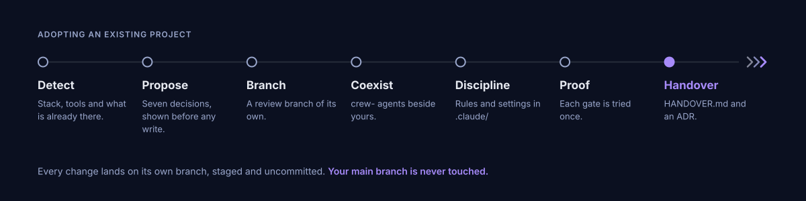
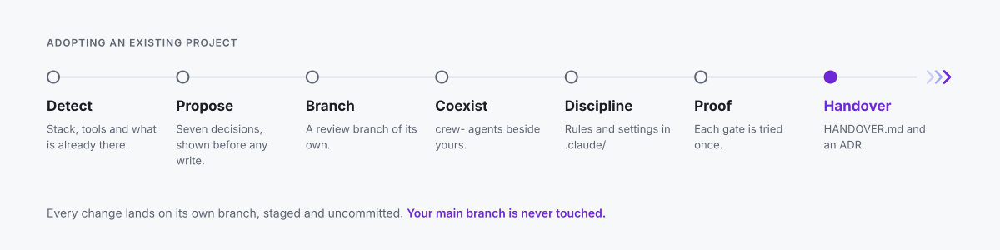

# Install

Two entry points: **`start.sh`** for a new project, **`adopt.sh`** for one already in motion. Every channel runs the same two commands.

**Requirements:** Claude Code 2.1.214 or later (tested on 2.1.282), and Node.js 20 or later for `npx` (22 or 24 recommended).

```bash
# npx — nothing to install
npx crewforth init                  # new project
npx crewforth adopt                 # existing project
npx crewforth@latest update         # refresh an existing install

# Release archive — no Node or npm needed
gh release download --repo Crewforth/crewforth -p '*.tgz' && tar xzf crewforth-*.tgz
bash start.sh               # new project
bash adopt.sh               # existing project (re-run it to update)
```

**Windows:** Crewforth is bash-based. Run it in **Git Bash** ([git-scm.com](https://git-scm.com)); WSL works as a fallback. The gate hooks are shell scripts, so **Git Bash (or WSL) is what makes them run** — on a Windows machine with neither, Claude Code enables its PowerShell tool automatically and the hooks cannot execute, which means no gates. That configuration is not supported by the gate layer, and the installers cannot run there either. With Git Bash present the gates cover **both** shells: the PowerShell tool is on by default for claude.ai and Console accounts, and its commands go through the same rules (`Remove-Item -Recurse -Force`, `… | iex`, `Get-Content .env`, and the rest).

**Plugin edition** — the agents, skills, commands, gate hooks and Studio inside your existing Claude Code, no scaffolding:

```bash
/plugin marketplace add Crewforth/crewforth
/plugin install crewforth@crewforth
```

An installed plugin stays on the version you installed until you ask for a newer one, so run `claude plugin marketplace update crewforth` then `claude plugin update crewforth`, and restart to apply.

**Coming from the 2.x plugin?** The plugin and its marketplace were renamed, so a 2.x install does not update to 3.0 on its own. Switch once:

```
/plugin uninstall claude-starter-kit
/plugin marketplace add Crewforth/crewforth
/plugin install crewforth@crewforth
```

## New project

```bash
bash start.sh [--private|--shared] [--lang tr|en] [--yes] [--version] [-h]
```

The wizard first asks for its language (English or Turkish), then who the install is for, and ends with a summary you approve before anything is written. Every prompt and message follows the language you pick; the files it installs stay English.

**Every install carries the same team** — all 12 agents and all 40 skills. Backend, web and mobile (React Native/Expo) come together. A project that starts as an API and grows a web client is already equipped for both.

| Asked at install | Options | What it changes |
|:--|:--|:--|
| Language | `--lang en` · `--lang tr` | what the installer prints — nothing it writes |
| Who it is for | `--private` · `--shared` | whether `.claude/` and `CLAUDE.md` are gitignored or committed for the team |

**The backend is stack-agnostic.** The installer does not ask for a stack. On the first backend task the `backend-architecture` skill resolves it — your request, then the `## Stack` section of `CLAUDE.md`, then the repo's manifests (`package.json`, `go.mod`, `pyproject.toml`, `*.csproj`, …) — and only in an empty repo asks at most four multiple-choice questions, each with a recommended answer and a "Decide for me" option. The answer is written to `## Stack` and recorded as an ADR, so it is asked once. Node, Go, Python, .NET and the JVM are supported alike, and a project that ships its own pattern skill under `.claude/skills/` has it applied instead.

## Existing project

```bash
bash adopt.sh    # at the root of the target project
```

<div align="center" class="cf-diagram">
  
  
</div>

Crewforth arrives the way one team hands a project to another: nothing is broken, decisions already made are not lost, and it does not sit there passively.

Every change lands on a separate branch, **staged and not committed** — so each added and changed file appears in your editor's Source Control panel. You review it there, then `git commit` to accept or `reset` to discard. `main` stays untouched. Its agents install side by side without colliding, the discipline binds through one `@import`, `settings.json` is merged schema-aware, and existing husky or lefthook chains keep running through a shim. It closes with a durable `docs/HANDOVER.md` and an ADR, so the decisions live in version control rather than in a chat log.

## Updating

```bash
npx crewforth@latest update    # or /crew-update inside a session
```

When a new version is published, Claude asks once, at the start of a session, whether to update now, later, or skip that version. It never updates on its own.

At install time Crewforth stamps `.claude/kit.conf` with which installer ran, plus `.claude/VERSION`. A project installed before 3.0 with the .NET pattern **keeps its `cqrs-aop-module` skill** as a project skill that the backend expert goes on applying; the update says so and never deletes it. Any missing component is restored, and every one it adds is **named in the output** rather than appearing silently.

| | On update |
|:--|:--|
| `.claude/` agents · skills · commands · hooks · eval · studio | refreshed from the new version |
| `.claude/DISCIPLINE.md` | **overwritten** — Crewforth owns it, so keep nothing of your own in it |
| `./CLAUDE.md` | never touched — your project rules stay exactly as written |
| `.claude/settings.json` | merged schema-aware; your own hooks and permissions survive |
| your own agents and skills (no `crew-` prefix) | untouched |

Where the change lands is a choice. A first adopt opens a `kit-adopt-<timestamp>` review branch. A routine update whose `.claude/` is gitignored applies on your current branch. An update with a **tracked** `.claude/` asks. Force it with `--here` or `--new-branch`, and skip the prompts with `--yes`. Either way the change is staged and uncommitted. A tracked `.claude/` also gets eol pins in `.gitattributes`, so the hooks stay LF for a teammate whose git has `core.autocrlf=true` — the Git for Windows default. Git Bash runs a CRLF hook anyway (measured); the pin is for a bash that does not, WSL being the documented case, and for keeping the working tree identical to what was committed.

Inside a session, **`/crew-update`** does the version check, runs the updater, verifies with `/crew-doctor`, then prompts `/clear` so a new session loads the refreshed discipline. **`/crew-doctor`** checks a live install at any time — hooks executable, `core.hooksPath` set, gates wired, the discipline actually imported — and prints an advisory readiness score for the project itself.

If a project's `CLAUDE.md` carries the discipline **inline** instead of importing it, updates cannot reach it. The updater detects this, shows the affected lines, and offers to replace them with the single `@.claude/DISCIPLINE.md` import — writing a backup first, on a branch you review. Decline and nothing is touched.
