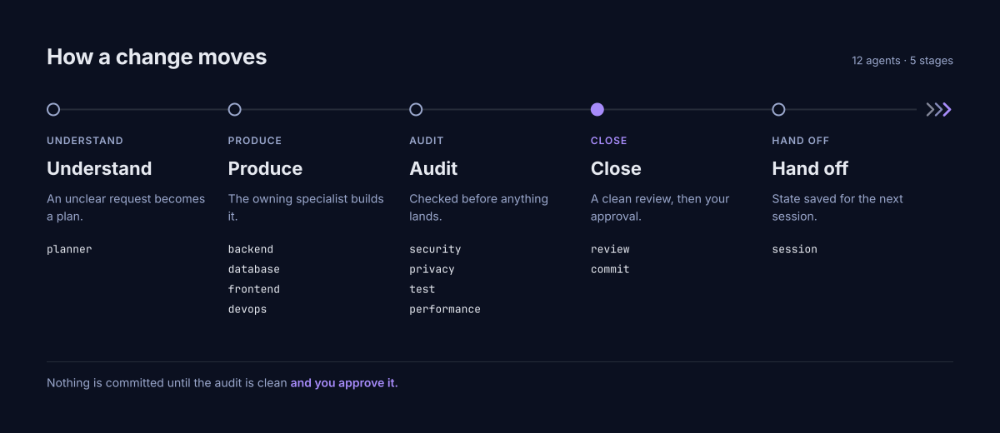
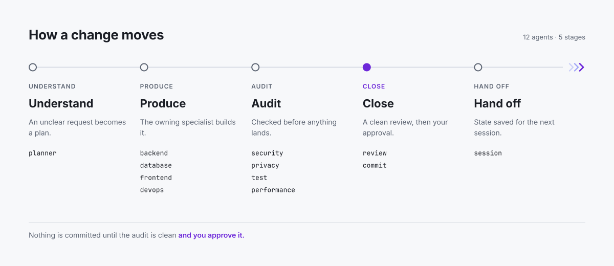
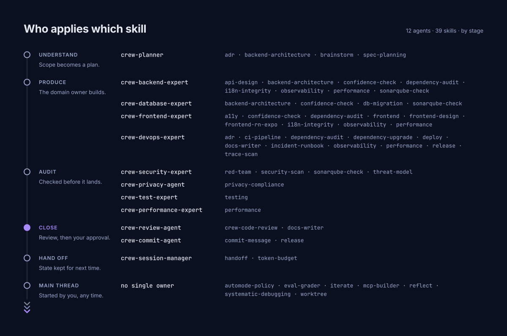
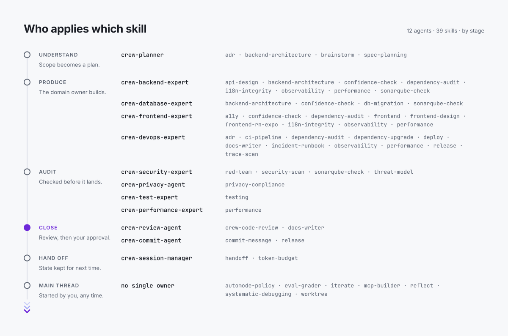

# Agents and skills

**{{AGENT_COUNT}} specialist agents** across five stages, so quality escalates before anything is committed.

  
  

| Agent | Stage | Fires when |
|:--|:--|:--|
| `crew-planner` | Understand | scope is ambiguous |
| `crew-backend-expert` | Produce | server / API / business logic |
| `crew-database-expert` | Produce | schema, migration, index, cache |
| `crew-frontend-expert` | Produce | UI, component, client work |
| `crew-devops-expert` | Produce | deployment, CI pipeline, incident |
| `crew-security-expert` | Audit | auth / IDOR / injection / secret · **mandatory if security-critical** |
| `crew-privacy-agent` | Audit | personal data — KVKK/GDPR, plus any regime the project declares |
| `crew-test-expert` | Audit | tests, coverage, regression |
| `crew-performance-expert` | Audit | hot path, query/loop, render, payload |
| `crew-review-agent` | Close | pre-commit code-health review |
| `crew-commit-agent` | Close | proposes the commit, waits for approval |
| `crew-session-manager` | Hand off | context fills / phase boundary |

**Models are not pinned.** Every agent runs on the model you chose for the session, so a review that clears a change is never weaker than whatever wrote it. Two exceptions earn their keep: `crew-security-expert` buys extra rigour with `effort: high`, and `crew-commit-agent` runs on `haiku` because turning a staged diff into a Conventional Commit is mechanical. Change any of it in the agent's frontmatter if your project wants something else.

## All {{SKILL_COUNT}} skills

  
  

The catalogue below is generated from each skill when the site is built; do not edit it by hand.

<!-- CATALOGUE -->
