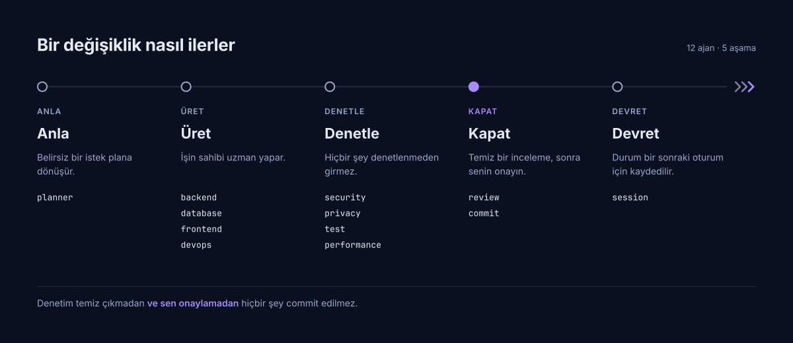
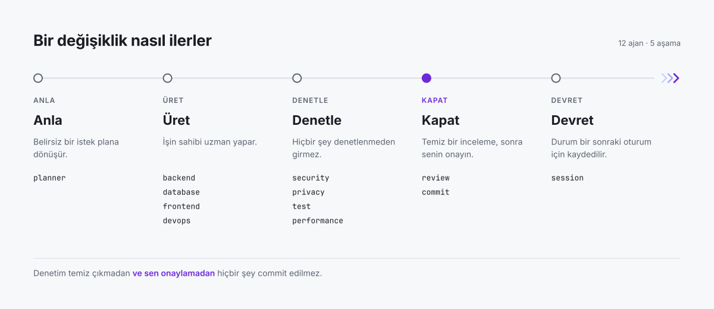
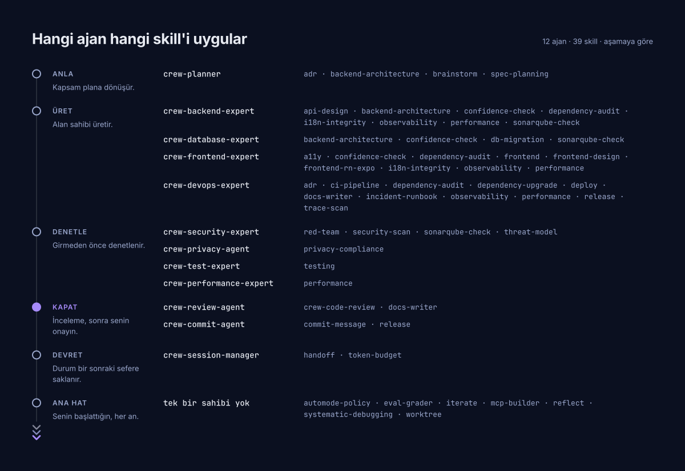
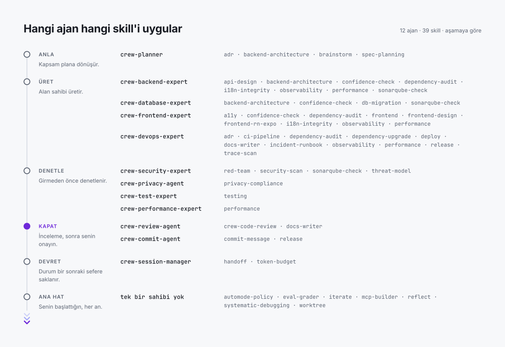

# Ajanlar ve skill'ler

Beş aşamaya yayılmış **{{AGENT_COUNT}} uzman ajan** var. Kalite, hiçbir şey commit edilmeden önce basamak basamak yükseliyor.

  
  

| Ajan | Aşama | Ne zaman devreye girer |
|:--|:--|:--|
| `crew-planner` | Anla | kapsam belirsizse |
| `crew-backend-expert` | Üret | sunucu / API / iş mantığı |
| `crew-database-expert` | Üret | şema, migration, indeks, önbellek |
| `crew-frontend-expert` | Üret | arayüz, bileşen, istemci işi |
| `crew-devops-expert` | Üret | dağıtım, CI hattı, olay müdahalesi |
| `crew-security-expert` | Denetle | auth / IDOR / injection / sır · **güvenlik kritikse zorunlu** |
| `crew-privacy-agent` | Denetle | kişisel veri: KVKK/GDPR ve projenin beyan ettiği diğer rejimler |
| `crew-test-expert` | Denetle | test, kapsam, regresyon |
| `crew-performance-expert` | Denetle | sıcak yol, sorgu/döngü, render, payload |
| `crew-review-agent` | Kapat | commit öncesi kod sağlığı incelemesi |
| `crew-commit-agent` | Kapat | commit'i önerir, onayı bekler |
| `crew-session-manager` | Devret | bağlam dolduğunda / aşama bittiğinde |

**Modeller sabitlenmiyor.** Her ajan, oturum için seçtiğiniz modelde koşuyor; böylece bir değişikliği onaylayan inceleme, o değişikliği yazandan hiçbir zaman zayıf olmuyor. İki istisna var: `crew-security-expert` fazladan titizliği `effort: high` ile alıyor, `crew-commit-agent` ise `haiku` kullanıyor, çünkü staged bir diff'i Conventional Commit'e çevirmek mekanik bir iş. Projeniz başka bir şey istiyorsa ajanın frontmatter'ından değiştirebilirsiniz.

## {{SKILL_COUNT}} skill'in tamamı

  
  

Aşağıdaki katalog, site derlenirken her skill'in kendi dosyasından üretilir; elle düzenlemeyin.

<!-- CATALOGUE -->
