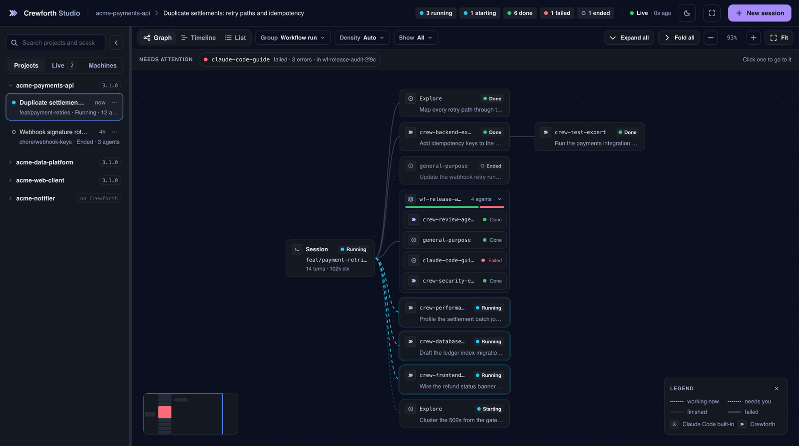
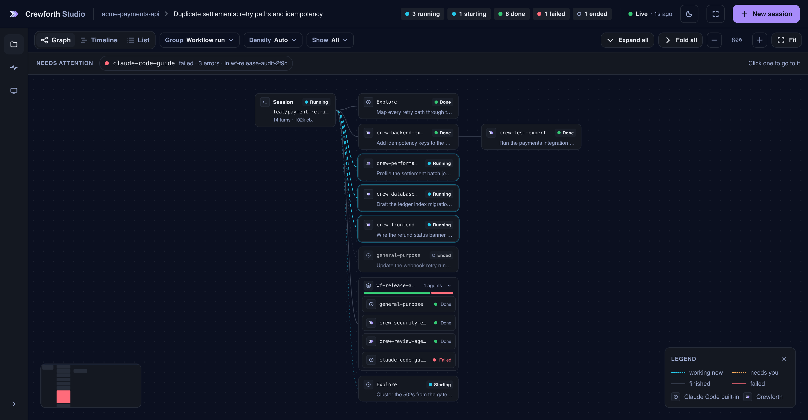

# Studio

Üç kademe derine inen bir delegasyon, terminalde çoktan kaybettiğiniz bir kaydırma geçmişidir. **Crewforth Studio** onu çizen yerel bir panel: her ajana bir kart düşüyor; kart, ajan doğduğu anda beliriyor ve ajanın durumunu ve aldığı görevi taşıyor. Karta tıklayınca ajanın en son hangi aracı kullandığı, ne harcadığı ve geri ne bildirdiği açılıyor. Aynı oturum üç biçimde okunuyor: kimin kimi başlattığını gösteren bir grafik, saate karşı bir zaman çizelgesi ve kime ihtiyaç olduğuna göre sıralı bir liste.

Panel `~/.claude/projects` dizinini okuyor; Claude Code bu makinedeki bütün oturumları orada tutuyor. Dolayısıyla çalışan tek bir panel hepsini birden görüyor: projede Crewforth kurulu olsun ya da olmasın, panelin o projenin içinde başlatılmış olması da gerekmiyor.

```bash
/crew-studio                                       # Crewforth kurulu her projede
node .claude/studio/server/index.js --open        # aynısı, komut menüsü olmadan
npx crewforth studio                              # hiçbir şey kurmadan
```

| Panelde ne var | Neye dayanıyor |
|:--|:--|
| Herhangi bir oturumun delegasyonu, canlı; **Graph**, **Timeline** ya da **List** olarak (`g`, `t`, `l`) | diskteki transcript ağacı; 700 ms'de bir boyut imzası okunuyor, imza değiştiyse ağaç yeniden kuruluyor. Üç görünüm de bu tek okumadan çiziliyor |
| Panelin başlattığı oturumlar, konuşma panelinden sürülüyor | stream-json biçiminde bir `claude -p`; komut da cevap da alt sürecin stdin ve stdout'undan geçiyor |
| O oturumlardaki her araç çağrısı siz cevaplayana kadar onay dock'unda bekletiliyor | panelin kendi ayar dosyası üzerinden enjekte edilen ve `*` ile eşleşen bir `PreToolUse` hook'u. Harness'ın 90 sn'sine karşılık 45 sn'de karar veriyor; **sessizlik ret demek**, yani kapalı bir panel izin yerine geçmiyor |
| Oturumu kopyalamak yerine gerçekten sürdürmek | oturumu tutan bir süreç yoksa çıplak `--resume`; oturumun kimliği korunuyor, yazılanlar aynı transcript'in sonuna ekleniyor. Tutan bir süreç varsa fork ediliyor, çünkü tek bir transcript'e iki yazar onu bozar |
| Kapı kaydı, oturum istatistikleri ve pano | Crewforth'un mevcut script'leri; hiçbiri yeniden hesaplanmıyor, hepsi okunuyor. Kapı kaydı satırları "zaman damgası taşımıyor" diye etiketleniyor, çünkü o biçimde zaman damgası yok |

<div align="center">
  
  <br><sub>Aynı panel, kullanılırken: grafik ve bir ajanın inspector'ı, Timeline, List, dock'ta cevaplanan bir istek, New session paneli.</sub>
</div>

## Tek oturum, üç görünüm

- **Graph**: delegasyon kendi biçimiyle. Oturum solda, başlattığı ajanlar sağında; bir workflow koşusu, katlanabilen tek bir grup. Tuvalin üstündeki şerit ilgi isteyeni adıyla yazıyor, tıklayınca oraya gidiliyor.
- **Timeline**: aynı ajanlar saate karşı, her birine bir satır; seçili ajanın son hatası alttaki çekmecede. Bir ajanın sizi beklediği süre yalnızca Studio'nun başlattığı oturumda ve yalnızca panel açıldığından beri çiziliyor, çünkü o kayıt bellekte tutuluyor. Başka her oturumda Timeline, kimsenin beklemediği bir oturum çizmek yerine `Not measured: this session's approvals are not seen by Studio` yazıyor.
- **List**: ajanlar, kime ihtiyaç olduğuna göre sıralı. Önce sizi bekleyen istekler, sonra düşenler ve çalışanlar; bitenler ve sona erenler katlı duruyor.

Hangi görünümde olursa olsun bir ajanı seçmek inspector'ı açıyor. Dört sekmesi var: **Overview** (araç çağrıları, token, geçen süre, hatalar, son araç, uyguladığı skill'ler, onu kimin görevlendirdiği ve raporu), **Conversation**, **Gates** ve **Stats**.

## Onay dock'u

Studio'nun başlattığı bir oturumdaki araç çağrısı, ekranda hangi oturum ve hangi görünüm olursa olsun, panelin altındaki dock'ta bekliyor. Dock isteyen ajanı, aracı ve girdisini gösteriyor; üç cevap var: **Allow once**, **Allow _araç_ this session** ve **Deny** (`a`, `s`, `d`). Cevap gelmezse çağrı 45 saniyede reddediliyor. Oturum izni inspector'ın Gates sekmesinde listeleniyor ve oradan geri alınabiliyor.

Allow, Claude Code'a verilen bir cevap. Hiçbir şeyin etrafından dolanmıyor:

- Accept edits ve Default kiplerinde Allow, Claude Code'a açık bir izin veriyor. Plan kipinde hiçbir şey söylemiyor; kararı Claude Code'un kendi plan kuralları veriyor.
- Bir Crewforth kapısı ya da projenin ayarlarındaki bir `deny` kuralı, siz izin verseniz de çağrıyı reddediyor (Windows'ta, gerçek oturumda ölçüldü). Konuşmada o zaman çağrıya burada izin verildiğini ve kimin reddettiğini söyleyen bir satır çıkıyor.
- Studio'nun hook'u projenin diğer hook'larından sonra değil, onlarla yan yana koşuyor. O yüzden dock, başka bir kapının zaten reddedeceği bir çağrıyı da sorabiliyor. Bu bilinen bir sınır.

## Oturum başlatmak

**New session** sağda bir panel açıyor: oturumun koşacağı proje, izin kipi ve isteğe bağlı ilk mesaj. Üç kip sunuluyor. **Plan** varsayılan: okuyor ve planlıyor, dosya değiştiremiyor. **Accept edits** ve **Default** dosya düzenliyor ve komut koşturuyor; her çağrı, siz dock'ta izin verdikten sonra. Crewforth'un kapılarını atlayan kipler sunulmuyor. Böyle bir oturum koşarken Studio kapalıysa istekleri reddediliyor.

## Dar pencere

640 px'in altında panel tek sütun. Gezgin bir çekmeceye dönüşüyor, inspector ve konuşma sahnenin tamamını alıp dock'un üstünde bitiyor ve panel List ile açılıyor; orada bir isteğin üç cevabı alt alta duruyor. Graph ve Timeline yine açılıyor ve `Best on a wider screen` diyor. Telefon boyutundaki bir pencerenin aldığı düzen bu. Dar bir masaüstü tarayıcı penceresinde denendi, telefonda ölçülmedi; panel yine yalnızca `127.0.0.1`'i dinliyor.

**Studio, Crewforth ile birlikte kuruluyor.** `start.sh` ve `adopt.sh` `.claude/` altında altı dizin açıyor, Studio da altıncısı. Yani Crewforth kurulu her projede **`/crew-studio`** ile açıyorsunuz; komut menüsü olmadan `node .claude/studio/server/index.js --open`. Hiç npm bağımlılığı yok, Node 18+ istiyor, yalnızca `127.0.0.1`'e bağlanıyor ve her API yolunda o koşuya özel bir token arıyor. **Makinede Node yoksa Crewforth onu kendi getiriyor.** `.claude/studio/ensure-node.sh --plan` ne indireceğini olduğu gibi gösteriyor: nodejs.org'daki güncel LTS, yayımlanmış SHA-256'ya karşı doğrulanıyor ve `~/.claude/studio-runtime` altına açılıyor. Siz evet demeden hiçbir şey kurmuyor. Yönetici hakkı istemiyor, paket yöneticisine dokunmuyor, PATH'i değiştirmiyor; o tek dizini silmek yaptığı her şeyi geri alıyor.

| Kanal | Studio |
|:--|:--|
| `npx crewforth` · sürüm arşivi · git clone | `.claude/studio/` altına kuruluyor |
| Claude Code plugin | plugin'in içinde geliyor; `/crewforth:crew-studio` ile açılıyor (plugin komutları ad alanlı) |

Üç kanal da paneli taşıyor. Tek bir komut dosyası iki edisyona birden hizmet ediyor: Claude Code plugin'in kendi kurulum yolunu o metnin içine yazıyor, dolayısıyla panel gerçekte neredeyse orada bulunuyor. Davranış iki edisyonda aynı; tek dürüst boşluk şu: panelin telemetrisi açıldığı projeyi okuyor ve plugin kurulumu projeye Crewforth dosyası koymuyor. O yüzden Gates ve Stats sekmeleri ile pano yanıltıcı bir sıfır yerine "ölçülmedi" diyor, sebebiyle birlikte. Gates sekmesi yine de plugin'in kapılarının o projenin `.claude/gate-log.tsv` dosyasına kaydettiği kapı kararlarını listeliyor.

Panel `~/.claude/projects` dizinini okuyor; orada bu makinedeki **her** Claude Code oturumu duruyor. Proje kökünden başlatmak yalnızca hangi projeyle açılacağını belirliyor.

<div align="center">
  
  <br><sub>Kim çalışıyor, kim bitirdi, kim düştü. Düşen ajan tuvalin üstündeki şeritte adıyla yazılı; bir tıkla ona gidiliyor.</sub>
</div>
